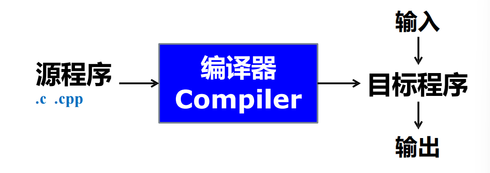
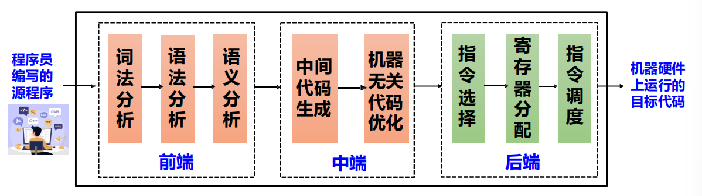
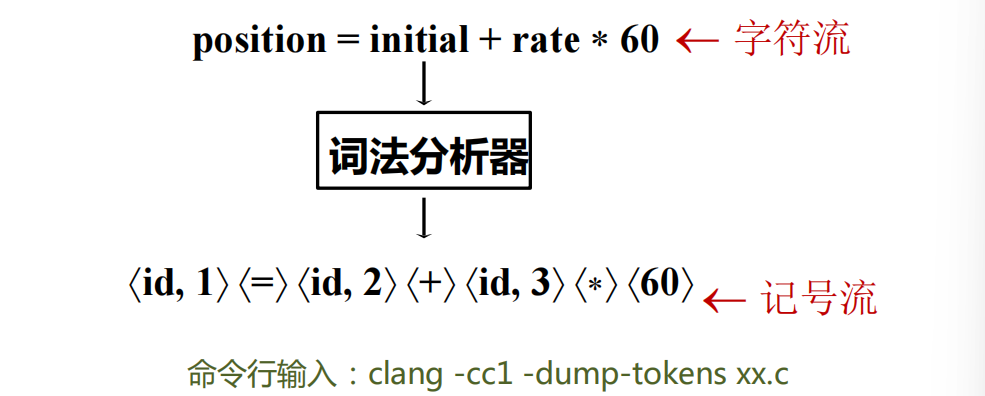
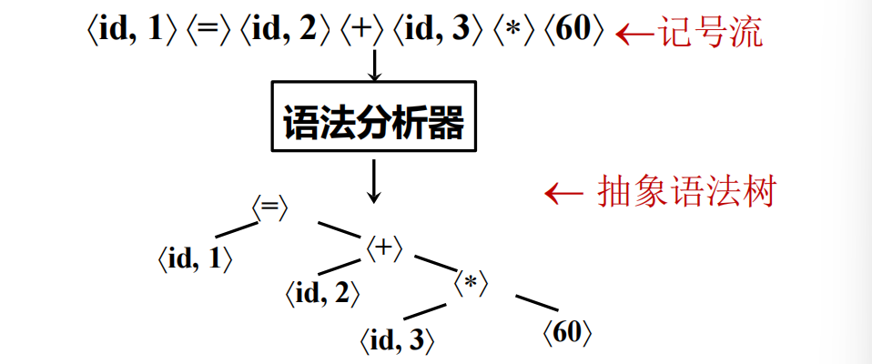
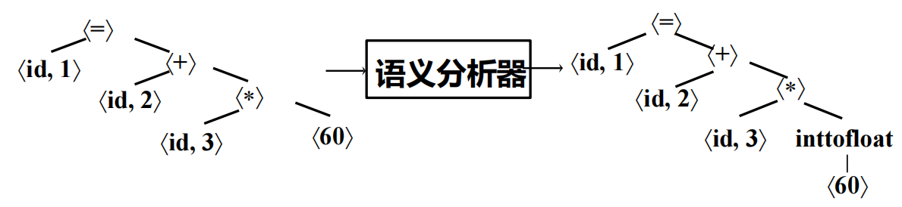
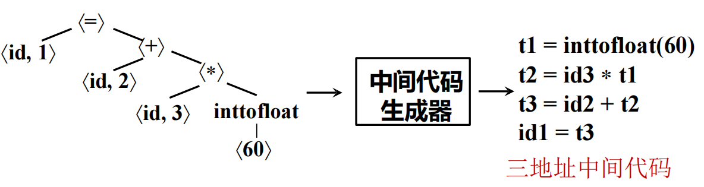
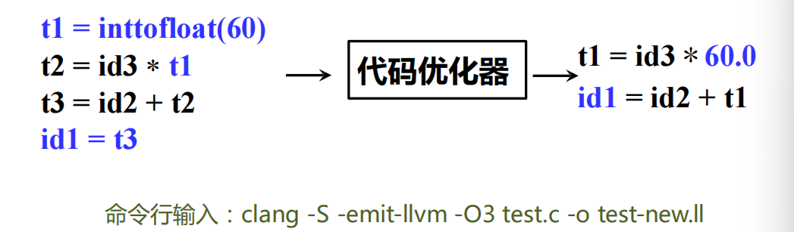
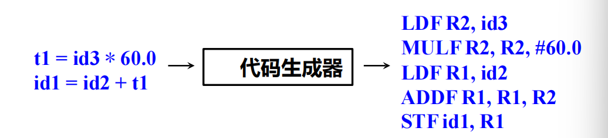
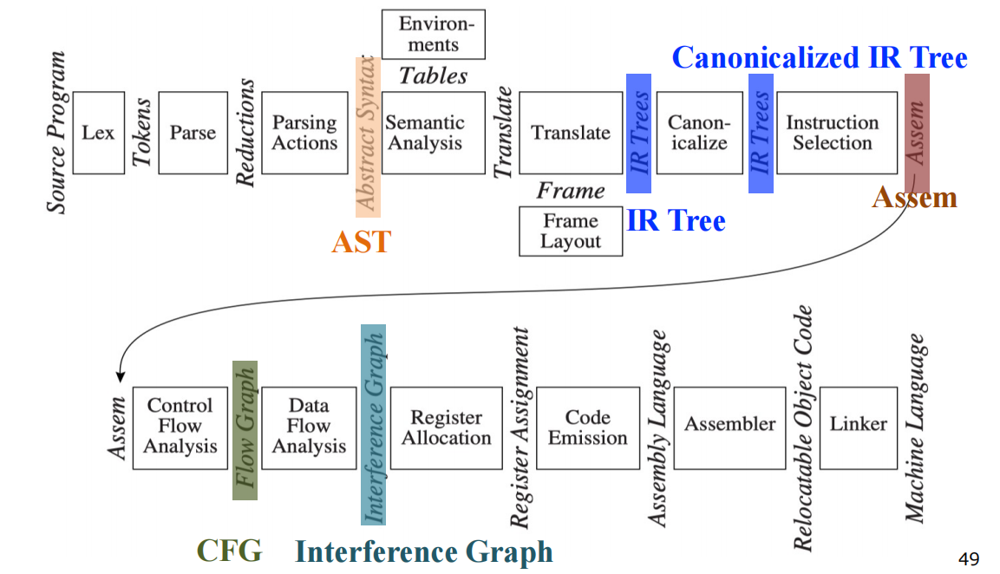

# Introduction

### 什么是编程语言

A programming language is a notation for **describing computations** to people AND to machines

不同的编程范式 (Paradigms)：

- **过程式**(Procedural): C, Fortran, Pascal,…
- **函数式**(Functional): Lisp/Scheme, Haskell, …
- **逻辑式**(Logic): Prolog, Datalog, …
- **面向对象**(Object-Oriented): Smalltalk, Java, Eiffel, …

### 编译器及其形式

编译器是一个程序，读入源程序并将其翻译成语义等价的目标程序

### 编译器的阶段

- 词法分析: 将程序字符流分解为记号 (Token)序列

  

- 语法分析: 将记号序列解析为语法结构

  

- 语义分析: 收集标识符的类型等属性信息

  

- 中间代码/表示: 源语言与目标语言之间的桥梁

  

- 机器无关代码优化：基于中间表示进行分析与变换

  

- 指令选择、寄存器分配、指令调度：把中间表示形式翻译到目标语言

  

### 案例: Tiger编译器

- AST(抽象语法树): 语法分析 + “Semantic Actions”生成、
- IR Tree: 语义分析后按一定规则生成(树型中间表示)
- Canonicalized IR Tree: 对IR Tree做变换所得(方便生成汇编)
- Assem: 指令选择器生成(一种特殊的汇编)
- CFG(Control Flow Graph) 控制流图: 方便进行数据流分析（如活跃变量分析(Liveness Analysis)）
- Interference Graph: 从活跃变量分析的结果构造，用于指导
  寄存器分配
