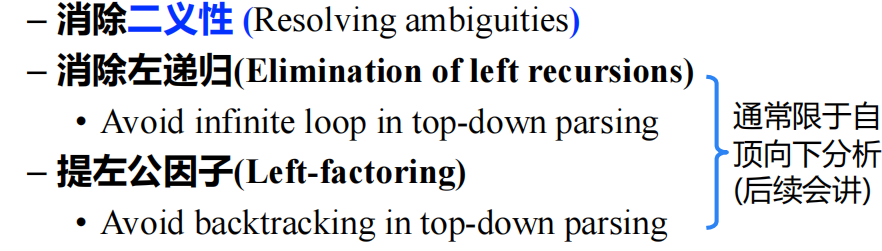
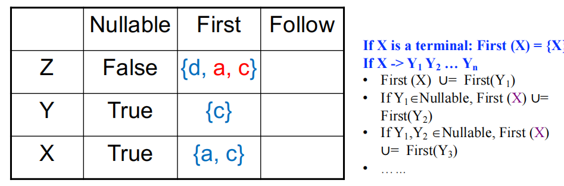

# Parsing

## 1. 语法分析概述

语法分析器的作用：从词法分析器获得Token序列，确认其是否可以由语言的文法生成。

- 对于语法错误的程序，报告错误信息

- 对于语法正确的程序，生成语法分析树 (简称语法树)，通常产生抽象语法树AST

  

如何判定输入合法性 & 生成语法树

- 首先在词法分析部分规定合法的基本单元 **Token**
- 其次要理解算术表达式的构成
  
  - 大表达式可拆为子表达式
  
  - 直至看到的都是基本单元

## 2. 上下文无关语法

### 2.1 CFG简介

- Terminals 为组成串的基本符号(Token)，如 `num,+,-`

- Nonterminal 是表示串的集合的语法变量，如 `expr,stmt`

- Productions 左边为非终结符，右部为一个符号串，可缩写

  

- Start Symbol：一个被指定的非终结符号，由其开始解析

在虎书上介绍了 ‘$’ 符号，用于表示 `end of file(EOF)`：

### 2.2 推导和规约

给定文法 $G = (T,N,P,S)$

**直接推导**：把产生式看成重写规则，把符号串中的非终结符用其产生式右部的串来代替。

- if $A \rightarrow \gamma \in P$ ，且 $\alpha,\beta\in(T\cup N)^*$  ，称串 $\alpha A\beta$ **直接推导**出 $\alpha \gamma \beta$，并记作 $\alpha A\beta \Rightarrow \alpha \gamma \beta$.

**直接规约：** 如果 $\alpha A\beta \Rightarrow \alpha \gamma \beta$ ，则 $\alpha \gamma \beta$ **直接规约**到 $\alpha A\beta$

**多步推导**

**最左推导Left-most Derivation** ：每步代换最左边的非终结符，从下往上看就是最右规约

**最右推导**：每步代换最右边的非终结符

总的来说，句子的推导是从生成语言的角度，句子的归约是从识别语言的角度

**句型、句子和语言概念**

### 2.3 CFG的Parse Tree

#### 2.3.1 Parse Tree

- 根节点为文法的初始符号
- 每个叶子节点是一个终结符
- 每个内部节点是一个非终结符
- 每个父节点及其子节点构成一条产生式

#### 2.3.2 语法分析

语法分析：对于一个终结符号串x, 从S推导出x(top-down)或者将x归约为S(bottom-up)。

语法分析复杂度：

 

语法分析算法分类

- 自顶向下 Top-down

  - 从开始符号S出发，尝试根据产生式规则推导 (derive)出x

  - Parse Tree的构造方法：从根部开始

- 自底向上 Bottom-up
  - 尝试根据产生式规则归约(reduce)到文法的开始符号S
  - Parse Tree的构造方法: 从叶子开始

## 3. 设计编程语言文法

### 3.1 RE与CFG语言对比

其中，正则语言表达能力有限，难以刻画编程语言的语法。

- 如: 不能用于描述配对或嵌套的结构

### 3.2 CFG改造/限制

为了高效语法分析，可能对文法做处理/限制（如上面提到的降低复杂度），有如下方法：

#### 3.2.1 消除二义性 

二义性: 如果文法的某些句子存在不止一棵 Parsing tree，则该文法是二义的。

二义性会给语法分析带来不确定性，程序设计语言的文法通常都应该是无二义性的

这个例子中，表达式会有多种”正确“的解释。

通过 ”分层“ 技术来消除二义性：

- 规定符号的优先级
  - 根据算符不同的优先级，引入**新的非终结符**
  - 越接近开始符号 S 的文法符号优先级越低
- 规定符号的结合性
  - 递归非终结符在终结符左边，运算就左结合

如何证明“二义性” --- 举反例，给一个表达，写出它的两个parse tree

这里 else E4到底是 if E1的还是 if E2的，存在 ambiguity。

消除上面文法的二义性：

## 4. 递归下降分析

递归下降分析(Recursive-Descent Parsing)是自顶向下分析的通用形式

### 4.1 回溯

但复杂的回溯会导致代价太高：

- 非终结符有可能有多个产生式，由于信息缺失，无法准确预测选择哪一个
- 考虑到往往需要对多个非终结符进行推导展开，因此尝试的路径可能呈指数级爆炸

## 5. LL(1)和预测分析法

Predictive Parsing 预测分析法用于解决复杂回溯的问题，该方法接受 LL(k) 语法

### 5.1 LL(1)文法

LL(k) 文法：

#### 5.1.1 First，Follow集

First和Follow集涉及 **空串** ，故引入Nullable概念：

**First集归纳定义**

**Follow集归纳定义**

例：

接着观察是否有符号为Nullable：

计算完Nullable后计算First，首先将First集初始化为空集，接着填充：

计算Follow，也是先初始化为空串再填充：

#### 5.1.2 LL(1)文法定义：

### 5.2 LL(1)预测分析

#### 5.2.1 构造预测分析表

预测分析表定义：

如何构造预测分析表-例：

因 $Z\rightarrow XYZ$ 满足上面的两个if条件：

- $a \in First(X)$
- $c \in First(X)$
- $XY \in Nullable$，且$d \in First(Z)$

最后得到：

- $d\in First(d),a\in First(a),c\in First(c)$
- $Y \rightarrow \epsilon$  Follow(Y) = {a,c,d}
- $X\rightarrow Y$ ，Y 为空串，且Follow(X) = {a,c,d}

不过，LL(1)的预测分析表中，每个单元格最多只能有一个元素，如果多余就不符合文法（选择不唯一，无法Parsing）。

#### 5.2.1 递归下降实现

LL(1)递归下降实现-例1：

该例中由于每个non-terminal规则生成的第一个symbols都是不同的，所以不需要Follow。

例2：

用一个比较简单的文法来展现预测分析表的用途：

$$
S\rightarrow ES' \\
S'\rightarrow \epsilon|+S\\
E\rightarrow num|(S)
$$

Parsing table 如下：

所以当input为 $(1+2+(3+4))+5$ 时，初始为S状态，检测到 '(' ，使用rule $S\rightarrow ES'$ ，再由 $E\rightarrow(S)$匹配'('; 匹配前一个后输入num '1'，根据预测表选择对应rule…… ：

## 6. 文法改造

### 6.1 提左公因子

有左公因子(left-factored) 的文法(存在共同前缀)会导致回溯，增加时间复杂度，所以需要提左公因子：

### 6.2 消除左递归

解决：

## 7. 错误恢复

错误类型如下：

- 词法错误，如标识符、关键字或算符的拼写错

- 语法错误，如算术表达式的括号不配对

- 语义错误，如算符作用于不相容的运算对象

以下程序没有词法错误，但是有多个语法错误：

……例子待补充

