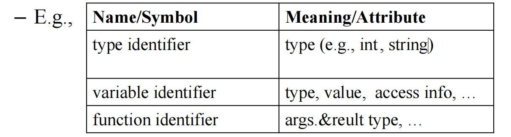

# ch5 - Semantic Analysis

**广义**

- Analyze the semantics of programs (usually) through various program representations
  - Control flow graph (CFG)
  - Static Single Assgnment (SSA)
  -  Program dependence graph (PDG)
  -  …

- Sample semantic analysis
  - Type checking
  -  Dead code elimination
  -  Code generation.. etc 

**狭义** -- 编译原理相关课程默认的语义分析，编译器的一个步骤

- Determine some static properties via AST（type检查、scope检查）
- Translate the AST into some intermediate code

## 1. Symbol table

**Binding** : 赋予 symbol meaning，用 $\rightarrow$ 表示，如 $g\rightarrow string$ ，表示 g 的 type 为 string。

**Environment** ：Binding 的集合。

**Symbol table** ：the implementation of environment。

**Semantic analysis:** traverse the abstract syntax tree (AST) in certain order while maintaining a symbol table

### 1.1 Symbol Table

假设最开始的环境为 $\sigma_0$ ，定义的 function 的环境为 $\sigma_1$ （update a,b,c 变量，所以要更新），line2通过在环境1中查询a，c实现。

下表作了一个总结：

### 1.2 Efficient Implementation

符号表一般有四个 interfaces：

- **insert**: 将名称绑定到相关信息(如类型), 如果名称已在符号表中定义，则新的绑定优先于旧的绑定
- **lookup**: 在符号表中查找特定名称绑定的信息
- **beginScope**: 进入一个新的作用域
- **endScope**: 退出作用域，将符号表恢复到进入之前的状态

实现非常重要！两种方法 -- 命令式 & 函数式

#### 1.2.1 Imperative Style

有许多策略来实现命令式：

1. **A stack of hash tables**：每一个 scope 都有自己的 hash table，查找时从最里的作用域向外查找，简单但是可能会造成 memory-intensive
2. **A single hash table + a stack of scope markers**:  一个统一的表，带有跟踪作用域边界的 markers，Memory efficient but requires cleanup when exiting scopes。
3. **Flat namespace with name mangling**：直接在符号名中编码作用域信息，No explicit scope tracking needed

第二种方法重点介绍（栈既存symbols，又存作用域开始标记marker）：

- 唯一的表用于store all active bindings across all scopes；
- stack用于跟踪每个作用域中添加的symbols；

- 当进入一个新的作用域时，一个 marker 被压入堆栈；
- 当添加一个符号时，它既被添加到哈希表中，又被记录在堆栈上；
- 当退出一个作用域时，自最后一个 scope marker 以来添加的所有符号都将从哈希表中删除

用python实现，bindings为一个字典，表示变量与其在作用域的所有值的对应：

一个演示：

使用 end_scope() 结束嵌套作用域。栈中元素会被弹出直到遇到ScopeMarker。首先弹出 'x'，移除其值 100；然后弹出 'z'，完全移除；最后弹出 ScopeMarker 本身。

最终状态：嵌套作用域已关闭，只剩下全局作用域中的变量 x = 10 和 y = 20。

#### 1.2.2 Functional Style

函数式方法就比较复杂了，更多考察的是一种思想：

通过 binary search trees (BSTs) 实现，每一个node包含从 identifier (key) to 

binding 的mapping：

#### 1.2.3 两种Style对比

两者的对比可以记一下。函数式的更好调试，因为保存了状态，不像命令式在退出作用域后就全部清空了。

## 2. Type Checking

### 2.1 类型及其作用

作用：编的快、跑得快、信得过。

一个 expression 的 type 决定其赋值类型和操作。Type checking 确保了每个 operations 都被正确应用。

- **Soundness:** If the type system accepts a program, then the program will not encounter type errors at runtime
- **Completeness:** If a program would not encounter type errors at runtime, then the type system accepts it

有关 type checking 的关键问题：什么是 **valid type expressions** ？如何定义两个 types 是相同的？typing rules 是什么？

### 2.2 Tiger 类型系统

Type Equivalence：

- Name equivalence (NE)：T1 and T2 are equivalent iff T1 and T2 are identical type names defined by the exact same **type declaration** . 通过完全相同的类型声明定义的相同类型的名称
- Structure equivalence (SE)：T1 and T2 are equivalent iff T1 and T2 are composed of the same constructors applied in the same order

Tiger 使用 name equivalence，如下图，虽然 type a,b的结构相同，但由于名字不同，仍然是两个不同的 type，不同 type 的变量不能赋值，所以 `i:=j` 报错。

而下图是合法的，使用 type aliases，b 指向 a type。 

上面的例子只讲了赋值时的类型检查，下述为更完整的 typing rules：

- No implicit conversions 无隐式转换

- All variables must be initialized at declaration 声明时初始化

- Function call: the types of formal parameters must be equivalent to the types of actual arguments. 参数类型与调用时的要一一对应

- Array subscript must has integer type

- The expression **nil** has the special type **NIL** ？？什么是record type

  - **NIL** belongs to every record type
  - It is equivalent to any record type

- Recursive types allowed through records and arrays？？

  

- Every cycle in a set of mutually recursive type declarations **MUST** pass through a record or array declaration！ ？？

  

Tiger 有两套命名空间，由于Functions and variables 在同一个命名空间，如果函数中变量与函数名相同，函数名会被覆盖，导致无法递归函数：

### 2.3 Tiger 类型检查

#### 2.3.1 Formalization

这部分无需掌握.

Typing Context：

Typing Rules：

- **Typing judgments:** statements about the types of expressions (Γ ⊢ e : τ)

- **Typing rule**: Each typing rule takes the form of

  

  

  

- **Type Derivations**：A type derivation is a proof tree showing how a typing judgment is derived from the rules.

  

  - **(T-Var)** : 如果变量声明在上下文中存在，那么我们可以使用这个声明的类型。因为 x:int 在上下文 Γ 中，所以可以使用这个事实作为推导的起点
  - 接下来我们处理数字 2。根据 **(T-Int)** 规则，整数常量的类型为 int
  - 最后，我们应用 **(T-Plus)** 规则。

  

#### 2.3.2 Type Checking

Environments（类似两套命名空间，这里也有两套类型检查环境）：

- **Type** **environment**：Maps type symbol to type that it stands for
- **Value** **environment**：Maps variable symbol to its type；Maps function symbol to parameter and result types

类型系统: 用推理规则来确定有哪些类型、不同符号(如变量、函数)的类型是什么。

Main Idea：Type checking is done **compositionally**

- Break down expressions into their subexpressions
- Type-check the subexpressions
- Ensure that the top-level compound expression can then be given a type itself

例：先向下确定subexpression无误，再将信息向上传递来确定expression的type，将其加入环境

