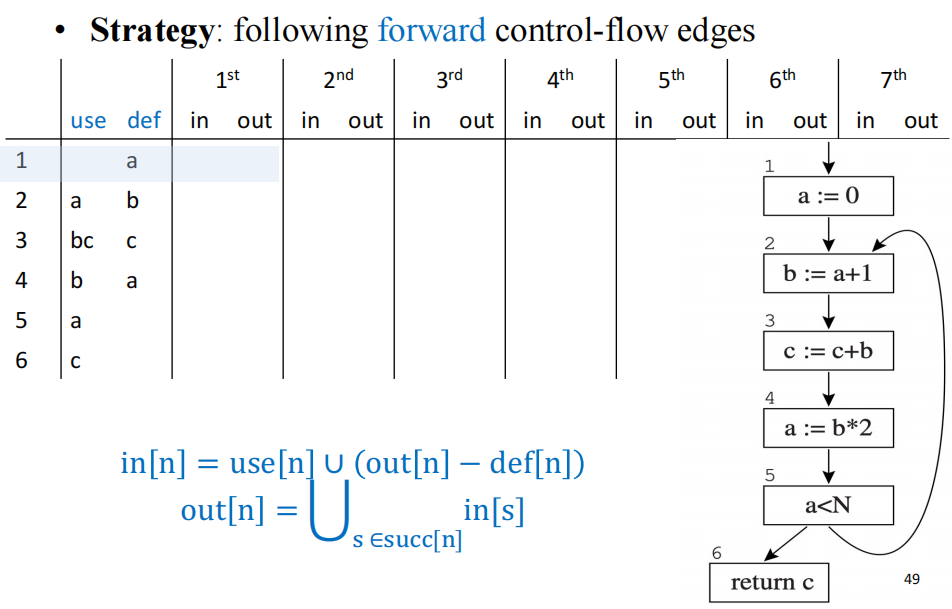

# Liveness Analysis

活跃变量分析属于数据流分析的一种，在寄存器分配和代码优化等方面有广泛应用。

## Dataflow Analysis

数据流分析是一种在不实际运行程序的情况下，推断程序动态行为信息的方法。它通过分析程序的中间表示（IR），如控制流图（CFG），来收集“Dataflow facts”，例如变量的Liveness、type等。这些事实对于编译器优化、程序验证等都至关重要。

### Compiler Optimization

**粒度**

- Local ：在单个 basic block 内优化，或者多个 blocks 但是不能是整个 procedure
- Intraprocedural (or “global’) ：在 整个 procedure 内进行优化
- Interprocedural (or “whole-program”) ：在 >1 个 procedure 甚至整个 program 内优化；有时会在link time进行优化

无论优化粒度如何，编译器优化通常遵循两个步骤：

- Analyze program to gather “facts” ：在 program 的 IR 上执行 “Program analysis”，收集到的 fact 例：

  

- Apply transformation (e.g., optimizations) ：根据收集到的 fact 进行优化，例如：Constant folding, dead code elimination... & Loop-invariant code motion, register allocation,…

在不同的优化粒度范围，编译器会使用不同的中间表示，例如 Local 时使用 dependence graph；Intraprocedural (or global) 时使用 control-flow graph for dataflow analysis ；Interprocedural (or who-program) 时使用 Call graph, ICFG, SDG

### Dataflow Analysis

**Control Flow Graph** ：有向图，表示程序的控制流程

- Nodes：represent statements
- Edges：represent control flow

基本块：a sequence of instructions with unique entry and exit。在活跃变量分析中，每个basic block都只有一个 statement（single-statement basic blocks）。

Dataflow Analysis：A framework for deriving information about the dynamic behavior of a program **without running it**. 

## Liveness Analysis

为什么要有 Liveness analysis？

- 在指令选择后的 low level IR 上，我们假设 “abstract registers” ，导致了 infinite variables
- 在 register allocation 时，我们需要将 infinite variables 放进 finite machine registers，这就需要Liveness analysis

### Live Variables

变量 x live at statement s if：

- There exists a statement s’ that uses x
- There is a path from s to s’
- That path has no intervening assignment/definition to x（这条路径上没有对 `x` 的赋值（定义））

例：假设只有一个 register

### Dataflow Equations for Liveness

#### 前置知识

CFG 相关概念：

**framework**： 为了计算 “dataflow facts” ，对于每个 CFG node，定义 local equations ：

- `in[n]` : facts that are true on all in-edges to the node
- `out[n]` : facts true on all out-edges
- **transfer functions** ：transfer information from one node to another

将方程求解（一般是迭代），直到到达不动点。

#### 相关定义

接着回到 Liveness Analysis ，对每个 node n in the flow graph，定义：

- `Def(n)` : Set of variables defined at n ，只要 variable 在赋值语句左边就算定义
- `use(n)` : Set of variables used at n

变量 live on an edge : 从该 edge 出发，有一条有向路径指向 a **use** of the variable that does not go through any **def**. （指向use(n)的有向路径上经过的结点无 def (v)）

- **Live-in** : a variable is **live-in** at a node if it is live on any of the in-edges of that node
- **Live-out**: A variable is **live-out** at a node if it is live on any of the out-edges of the node

由此可定义：

- `in[n]` : the live-in set of node n
- `out[n]` : the **live-out** set of node n

计算规则：

**Rule 1** ：If a ∊ in[n], then for ∀m ∊ pred[n], a ∊ out[m] （也就是说，如果变量 a live in node n ，那么其 live out at pred[n] 中所有nodes）

**Rule 2** : If a ∊ use[n], then a ∊ in[n] (如果变量在 n 中被使用而非被定义，那么它 live-in at n)

**Rule 3** : If a ∊ out[n] and a ∉ def[n], then a ∊ in[n] （变量没有在n中被定义，但是又属于 out[n]，那肯定就从 in[n] 里进来的）

- 运用 rule 1 ，得到 out[n] = {d, e}
- 因为Use(n) = {b, f}，由 rule 2 得到 in[n] = {b, f}
- 又因为 out[n] = {d, e} 且d,e在node n中未被定义，所以 in[n] = {b, f, d, e}
- 运用 rule 1, 得 out[p] = {b, f, d, e}
- 最后由rule 3 得 in[p] = {c, f, d, e}

综上，我们得到 in & out 的公式：

**in[n] = use[n] ∪ (out[n] - def[n])**

**out[n] = $⋃_{s ∈ succ[n]} in[s]$**

### Solving the Equations

通过迭代算法求解，直到达到不动点（fixed point），即所有 in[n] 和 out[n] 集合不再发生变化。

**Step 1** : 将所有 `in[n]` 和 `out[n]` 集合初始化为空集。

**Step 2** : 保存当前 `in[n]` 和 `out[n]` 的副本（`in'[n]` 和 `out'[n]`）。对于每个节点 `n`，根据上述数据流方程计算新的 `in[n]` 和 `out[n]`。~由于活跃变量分析是反向流动的，从控制流的相反顺序（从程序出口到入口）计算会更快收敛。~

**Step 3** : 当所有 `in[n]` 和 `out[n]` 集合在一次迭代中都没有发生变化时，算法停止。

例：正向算很慢

反向算，速度增快（算一个 in，再算一个 out，接着再算in，如此交替）：

## More Discussions

### Improvements

可做如下改进来优化迭代计算过程：

- Ordering the nodes ：按照控制流的反向顺序（例如，从程序出口到入口）进行计算，可以更快地收敛。
- Use variants of Control-flow graph (CFG) ：例如，使用基本块作为CFG的节点，可以减少图的大小，从而加速数据流分析。
- Once a variable：逐个变量计算其活跃性，对于生命周期很短的临时变量尤其有效。
- Careful selection of set representation
  - **位数组（Bit Arrays）** ：当变量数量不多且集合密集时（大部分变量都活跃），使用位数组表示集合效率更高。集合的并集和差集操作可以通过位运算快速完成。
  - **排序列表（Sorted Lists）** ：当变量数量很多但集合稀疏时（只有少数变量活跃），使用排序列表表示集合效率更高。
- Use other intermediate representation (IR)

如：

### Theoretical Results

**时间复杂度**：对于一个大小为 `N` 的程序（最多 `N` 个节点和 `N` 个变量），每次集合操作的时间复杂度为 `O(N)`。最坏情况下，迭代算法的时间复杂度为 `O(N^4)`。但在实际应用中，由于合适的计算顺序，通常在 `O(N)` 到 `O(N^2)` 之间。

**最小不动点（Least Fixed Point）**：活跃变量的数据流方程可能有多个解。但迭代算法总是能计算出**最小不动点**，这个解是所有其他解的子集。这意味着它提供了最精确的过近似。

### Static vs. Dynamic Liveness

- **静态活跃性（Static Liveness）**（过近似）：一个变量 `a` 在节点 `n` 处是静态活跃的，如果存在从 `n` 到 `a` 的某个使用点的一条控制流路径，且该路径上没有对 `a` 的定义。这是编译器在编译时可以确定的活跃性。
- **动态活跃性（Dynamic Liveness）**（欠近似）：一个变量 `a` 在节点 `n` 处是动态活跃的，如果程序的某个执行路径从 `n` 到 `a` 的使用点，且该路径上没有对 `a` 的定义。这是程序实际运行时才能确定的活跃性，通常难以精确计算。

**重要关系**：如果一个变量是动态活跃的，那么它也一定是静态活跃的。

