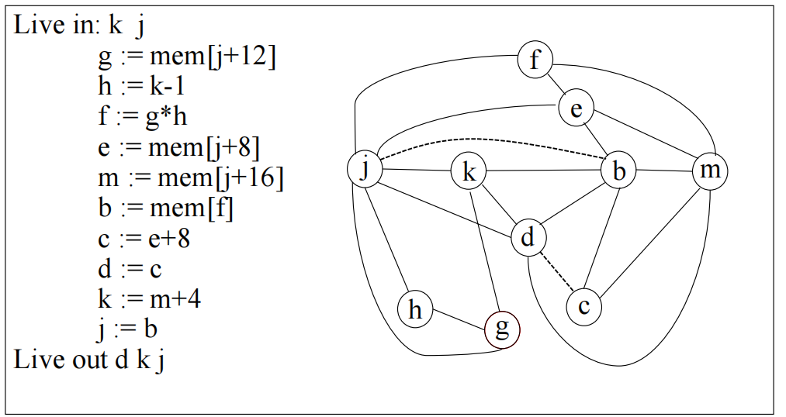

# Register Allocation

**The Problem**

- Programs use unlimited temporary variables (temps)
- Real machines have a limited number of registers
- Need to map temporaries to registers (efficiently)

**The Goal**

- Map temporaries to registers
- Preserve program semantics
- Optimize performance

## Graph Coloring: Overview

### Interference Graph

Key insight : 如果两个临时变量 not live at the same time ，那么它们可共享一个寄存器。

将想法建模为 Interference Graph(用 k 个 color 涂色， k 代表可用寄存器数量) ：

- Nodes represent **temporaries** or **visual registers**
- Edges connect temporaries that are live at the same time
- Colors represent physical registers

如果两个变量之间没有 edge，说明它们可以共享一个寄存器。

**构建** ：

对于定义变量 `a` 的指令，如果其出口活跃变量为 `b1, ..., bj`（即 `out[n] = {b1, ..., bj}`），添加干扰边的方式如下：

- **指令为 non-move 指令**：添加干扰边 `(a, b1), ..., (a, bj)`。
- **move 指令 `a ← c`**：对于任何与 `c` 不同的 `bi`，添加干扰边 `(a, b1), ..., (a, bk)`。这允许**移动合并（move coalescing）**，即消除不必要的拷贝指令（不需要构建 `(a,c)` 干扰边，因为两个变量值相同）。
  - **何时不添加干扰边**：如果 `t := s` 是一个拷贝指令，通常会创建 `(s, t)` 的干扰边。但如果 `s` 和 `t` 包含 **相同的值** ，且之后没有对 `t` 的 non-move 定义，则不需要为 `s` 和 `t` 分配不同的寄存器，因此不添加 `(s, t)` 边。
  - **何时仍需添加干扰边**：如果 `t := s` 是一个拷贝指令，但之后在 `s` 仍然活跃的情况下，`t` 又被非移动指令重新定义，那么仍然需要创建 `(t, s)` 的干扰边。

左为不需要，右为需要：

### Register Allocation

两种着色方法：

- Vertex Coloring : 为每个顶点分配一种颜色，使得没有边连接的顶点具有相同的颜色。
- K-coloring : 使用最多 `K` 种颜色进行着色。
  - 找到最小的 k 使得图是 k 可着色的：这是一个 NP-hard 问题
  - K-着色（给定一个常数 k，判断图是否 k 可着色）：这是一个 NP-complete 问题，也是寄存器分配中通常需要处理的问题。

## Coloring By Simplifications

**Kempe’s Theorem** ：

假设 graph G 中有一个 node n，degree(n) < K(邻居少于K个)，那么移除 `n` 及其所有连接的边得到图 `G'`。如果 `G'` 可以被着色，那么 `G` 也可以被着色。

### Simplify & Select

这是一个简单的启发式算法，包含三个主要步骤：

1. **构建干扰图**：从程序中构建冲突图。
2. **简化（Simplify）**：
   - 当图 `G` 中存在度数小于 `K` 的节点 `N` 时，将其从 `G` 中移除，并将其推入栈 `S`。
   - 重复此过程直到图 `G` 中所有节点的度数都大于等于 `K`，或者图为空。
   - **原理**：度数小于 `K` 的节点总是 `K` 可着色的。
3. **选择（Select）**：
   - 如果所有节点都被移除（图为空），则图是 `K` 可着色的。
   - 从栈 `S` 中弹出一个节点 `N`，将其添加回图 `G`，并为其分配一个颜色。由于是逆序添加，当添加 `N` 时，其所有邻居都已着色，且其邻居数量小于 `K`，因此总能找到一个可用颜色。
   - 重复此过程直到栈为空。

K=2 例，先 Simplify （c->e->a->b->d）：

再 Select （d->b->a->e->c）

但是，算法是一种快速启发式算法，可能会失败。当算法失败时，并不意味着图不可 `K` 着色，只是该启发式算法无法找到着色方案。

### Simplification, Select, Spilling

当上面的启发式算法失败时，可以用 Spill 来解决：选择图中的某个节点，并决定将其数据存储在内存中，而不是寄存器中。

#### Optimistic Coloring

Optimistic Coloring 是对 Spill 效果的一种乐观近似。被溢出的节点被假设不与图中剩余的任何其他节点干扰，因此，它可以被移除并推入栈中，简化过程可以继续进行。

流程：

例：将b作为 candidate for spilling，做乐观假设，”照常”把节点删除、放栈上

最后全部放入栈中：

接着开始 Select （即着色）操作，会有一些问题：当在 simplify 阶段被标记为“可能溢出”的节点在 select 阶段被弹出时，如果其所有邻居都已经被 `K` 种不同的颜色着色，那么该节点将无法被着色。（如果所有邻居被少于 K 种 color 着色，那么optimistic coloring works!）

上例就可以 work：

#### Do the Actual Spill

在 optimistic coloring 失败情况下，我们要执行实际的溢出操作。

Actual Spill：

- 选择一个实际的溢出节点（通常根据启发式选择溢出代价最低的）。
- 为其分配一个内存位置（例如，在当前栈帧中，称之为 `ba`）。
- 在每次使用 `b` 的操作之前，插入 `bi := load ba` 指令。
- 在每次定义 `b` 的操作之后，插入 `store bi, ba` 指令

例 K=4 （比较简单）：

入栈顺序：g-h-k-d-j-e-f-b-c-m，最后涂色：

## Cont

### Coalescing

定义：给定一个 MOVE 指令： `move a,b` ，如果变量 `a` , `b` 互不干扰在，那么：该移动指令可以被**消除**。`a` 和 `b` 可以被**合并**成一个新的节点，新节点的边是 `a` 和 `b` 原有边的并集。

合并可以**提高图的可着色性**。通过减少节点数量和边数，有时可以使原本不可着色的图变得可着色。但是合并也可能增加干扰边的数量，使得图不可着色。所以要遵循 Conservative coalescing ，启发式规则，避免使图更难着色。

**Heuristic Coalescing** 

下述两种准则都是**安全**的，它们保证不会将一个 `K` 可着色的图变成不可 `K` 着色的图。

- Briggs Criteria ：如果合并 `a` 和 `b` 产生的节点 `ab` 具有的 significant degree neighbors（即 degree ≥ K 的邻居）少于 `K` 个，则 `a` 和 `b` 可以合并。
- George Criteria ：如果对于 `a` 的每个邻居 `t`，要么 `t` 已经与 `b` 干扰，要么 `t` 的度数不显著（即 <K），则 `a` 和 `b` 可以合并。K=3 例（b 与 c 合并）：

加入 Coalescing 后的着色流程 （Build 时除了构造干扰图，还要把每个node 分为 move-related or non-move-related）：

- Freeze ： 没有结点可以简化或者合并，那么寻找一个degree较低的 move-related node u ，将所有与 u 有关的 move 都冻结，使 u 成为一个 non-move-related node，这样 u 就可以被简化。 

例 K=4 ：

先把无需合并的结点入栈：

d 和 c 可以合并，合并后进行 simplify ：

接着将 j 和 b 进行合并，又只有 non-move node ，可以继续 simplify：

最后进行着色：

**Constrained Moves** : 由于 move 指令的 src 和 dest 结点是互相干扰的，导致无法合并。

此时将 (y,z) 的 move 关系冻结。

### Precolored Nodes

Precolored Nodes 代表机器中实际存在的物理寄存器，其确保了寄存器分配时能够遵循硬件约束（如 x86 整数除法要求被除数在 `%eax`，结果在 `%eax` 和 `%edx` ，调用约定规定了哪些寄存器用于参数和返回值。）

在一个 `K` 寄存器机器中，会有 `K` 个 Precolored Nodes ，具有以下属性：

- 所有预着色节点都互相干扰（因为它们是不同的物理寄存器）。
- 在简化阶段不能被简化（移除）。
- 不能被 Spill 到内存。
- 可以将普通临时变量分配与预着色寄存器相同的颜色，只要它们不互相干扰。

Precolored Nodes 处理（目的是 *Simplify, coalesce and spill* until only the precolored nodes remains）：

1. Build the interference graph including precolored nodes
2. simplification: 只简化非预着色结点
3. coloring：预着色结点颜色不改变，在为其他节点选择颜色时，考虑与预着色节点的干扰边。
4. 涉及预着色节点的合并：通常使用 George 准则。
5. Front End 必须保持预着色结点的活跃范围短。因为长的活跃范围可能会阻止其他变量使用这些寄存器。可以生成 `MOVE` 指令，将值移入和移出预着色节点。

fresh temporaries 有两种方法：

### Putting it all Together

首先，我们来看一个简单的C语言函数及其对应的中间表示（IR）代码。

假设 K=3 ，那么 r1 & r2 是 caller-save reg ，r3 是 callee-save reg。

接着构建干扰图，可以看到图中没有可简化或冻结的机会，也无法合并：

那么就只能 Spill 了，计算优先级，选择 c 进行 spill：

现在可以进行合并了（）：

无法合并了，Simplify d，剩下预着色结点：

此时可以进行 Select 了，给 d 选定颜色 r3(step 6)，变量 c 进行 actual spill (step 7).

根据新的代码来重新构建干扰图，重复上述过程：

Select 后，利用 register assignment 重写代码：

将 src 和 dest 相同的 inst 删除：

