# Garbage Collection

## Introduction

**Runtime System** : 程序运行时语言隐式依赖的一些机制，例如:

- Handling of POSIX signals  信号处理
- Virtual machine execution 虚拟机执行
- Class loading 类加载
- **Automated memory management** 自动内存管理

接下来介绍内存管理，手动内存管理容易出现 Double frees, use-after frees,  Memory leak, fragmentation, … 存储错误难以排除，为了 performance, productivity, safety & security，使用自动内存管理。

Memory 主要区域：

- Static area：Allocated at compile time
- run-time stack ：存储 Activation records ，managing function calls and returns
- **Heap** ：Dynamically allocated objects，垃圾回收主要关注对象

那么，Gaebage 的定义为：Allocated but no longer used heap storage 。例如一个对象被分配了内存，但是没有任何指针指向它：

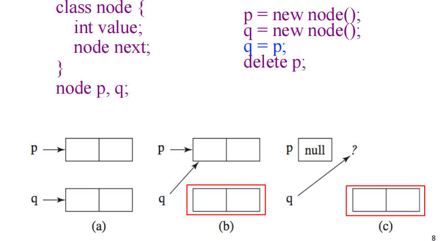

Garbage Collection：automatically frees storage which is not used by the program any more。

- phase 1：Garbage detection，找出哪些对象 alive，哪些对象 dead
- phase 2：Garbage reclaimation，deallocates dead objects

判断 memory cell 是否 “not any longer used”是 undecidable 的问题（halting problem相关），需要用到 conservative approximation 来保证 GC 的安全性。

其中，**reachability** 作为近似标准，如果 Heap-allocated records，从程序变量出发，通过任何指针链都是 unreachable 的，那么认为该 record 为 garbage。

所以： $unreachable \rightarrow not~live(no~longer~used)$

**GC Techniques** 

- Reference counting : 直接跟踪存活单元，GC在堆块分配时发生，但不能检测所有垃圾（如循环引用）.
- Tracing : 当内存请求失败时，GC启动并识别存活单元。
  - Mark-sweep
  - Copy collection

- Modern techniques : generational GC, etc.

**Basic Data Structure : Directed Graph** 

- **nodes** : program variables and heap-allocated records
- **edges** : pointers (p points to a record y means value of p is the address of y， 即指针 y == *p)
- **Root** : program variables
  - Registers
  - Local vars/formal parameters on stack
  - global variables
- **reachable** : 如果存在从某个根 r 到节点 n 的有向路径 (r→⋯→n)，则节点 n 是可达的。

**Additional Basic Data Structures: Freelist**

- memory manager 需要知道堆的哪些部分是空闲的
- Freelist 则将所有空闲堆块链接 (linked list) 起来，供 GC 算法使用

**Different Ways for Allocation**

memory manager 知道堆的哪些部分是空闲的，哪些被分配。

- **Linear allocation** ： 连续内存区域中依次分配
- **Freelist allocation** ：从空闲链表中取用适合块

## Mark-and-Sweep

### Overview

**Mark phase** : 从 roots 开始进行图搜索，被搜索到的node被标记(mark)

- depth-first search，标记所有 reachable nodes

  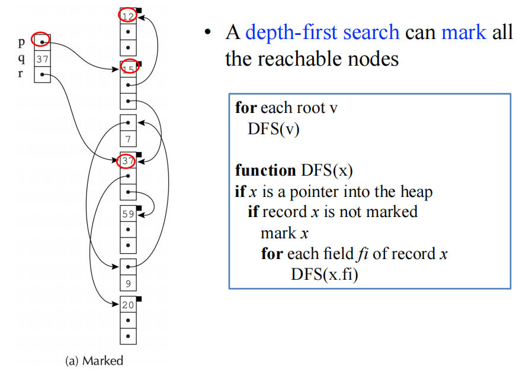

  x的值是某record的地址，换句话说它指向该record。

**Sweep phase** : 线性扫描整个堆，将未被 mark 的 nodes （garbage）放入一个 freelist，然后 Unmark marked nodes （为下一次 GC 做准备）

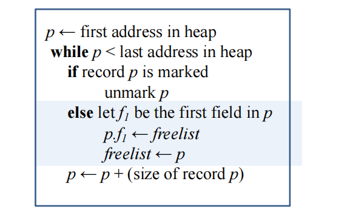

GC 以后，程序恢复执行，当需要分配新纪录时，从 freelist 中获取，当 freelist 为空时，触发 GC。

例：

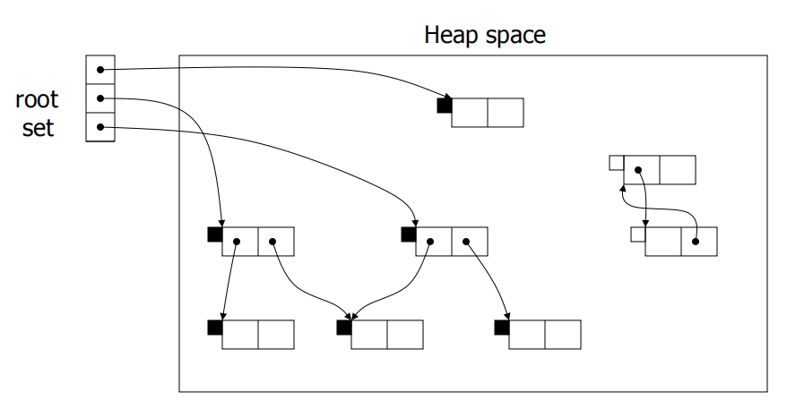

**Cost of Mark-and-Sweep**
R = words of reachable data; H = total heap size (in words); 
c1 = marking cost per word; c2 = sweeping cost per word
总时间：$c_1R+c_2H$ ; 每分配一个 word 的成本 ：$(c_1R+c_2H)/(H-R)$

- 当 R 很接近 H 时，cost 会非常昂贵
-  If H is much larger than R, cost approaches $c_2$
- If R/H > 0.5 after collection, heap should be enlarged

### Explicit Stack

**递归DFS的栈溢出**：如果递归深度过大，可能导致 DFS 函数的栈溢出。

使用 **Explicit Stack**

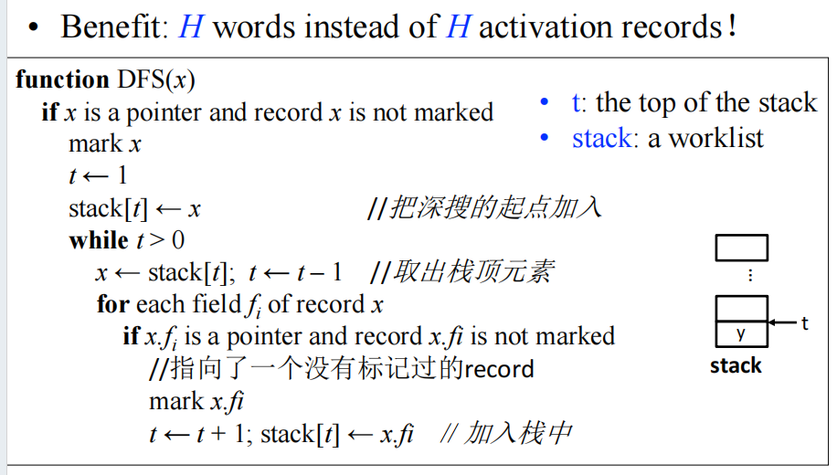

但是 Explicit Stack 最坏情况下可能和堆一样大，仍然不可接受。（？为什么不能一样大，好吧确实有点太大了）

### Pointer Reversal

DFS 遍历过程中，不使用 Explicit Stack ，而是使用 Pointer reversal 方法，即 Deutsch-Schorr-Waite (DSW) algo，利用被遍历对象自身的指针字段来存储返回路径（父节点信息）。

当 search 时遇到 new record ，首先 mark；然后修改 record 中的一个指针，使其指向父 record；当无法再深入时，沿着反转指针返回，并恢复原始指针。

例：

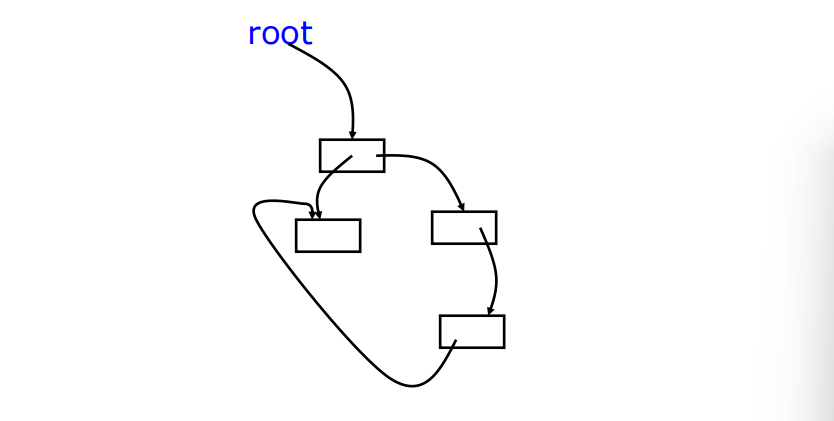

一条路 search 到 deepest，return：

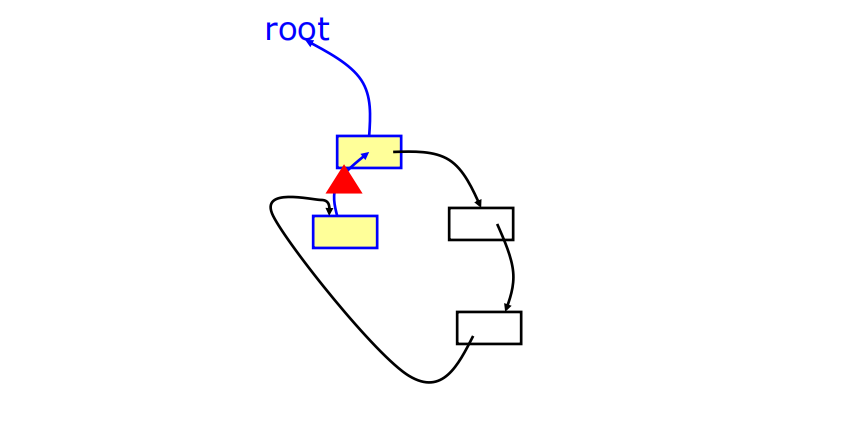

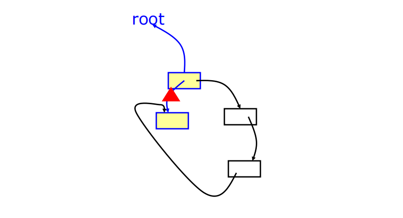

探索另一条 path：

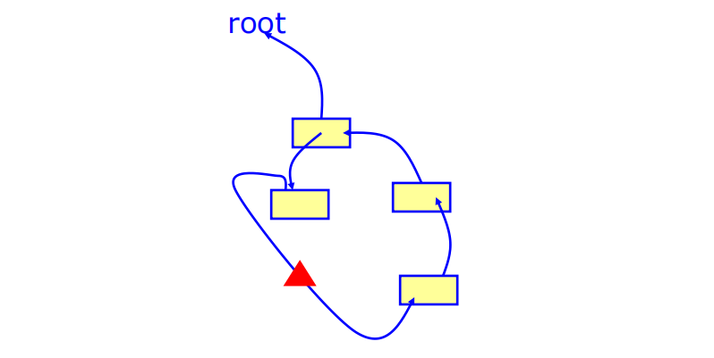

return：

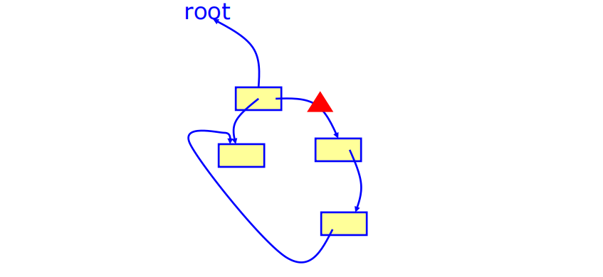

总结算法：

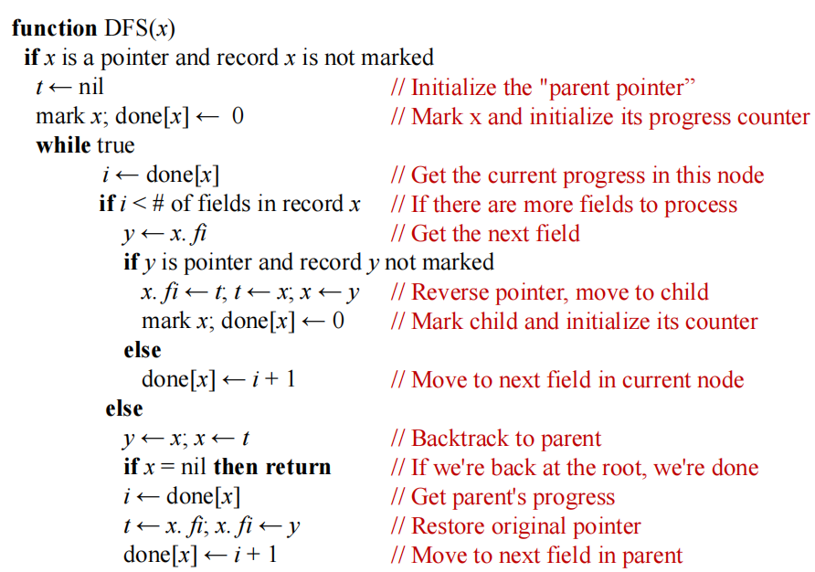

- `x`: 当前处理的节点。
- `t`: 父节点，用于回溯。
- `done[node]`: 记录节点中已处理的字段数量。
- `y`: 临时存储子节点或字段值。

例：

首先 mark A，Set done[A] = 0，Set t = nil

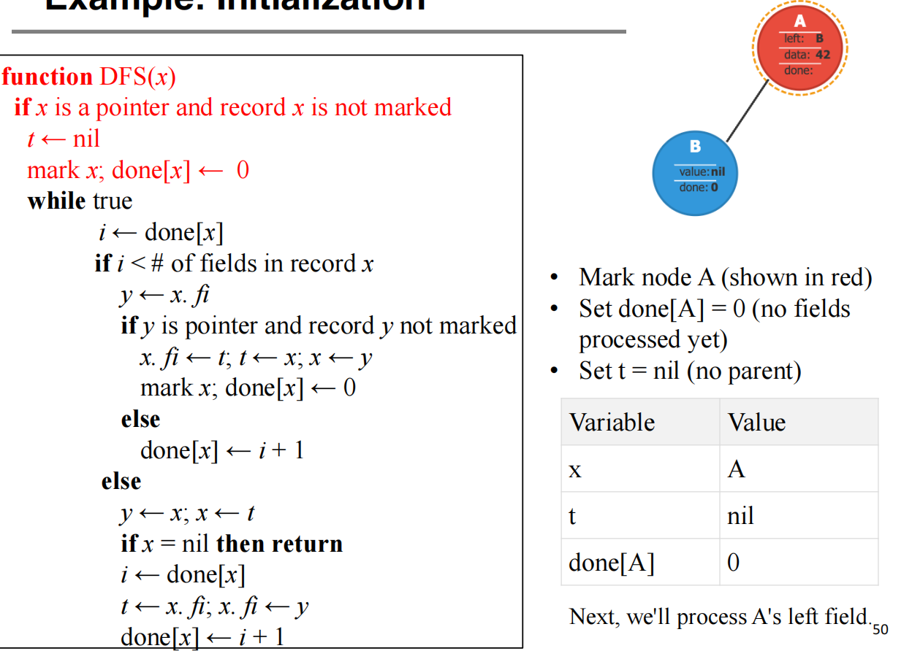

然后处理 A 的 left field，将A’s left pointer替换为 t = nil，并将 A 放在 t 中，标记 B，此时 `x=B,t=A,i=0,y=B,done[A]=0,done[B]=0`

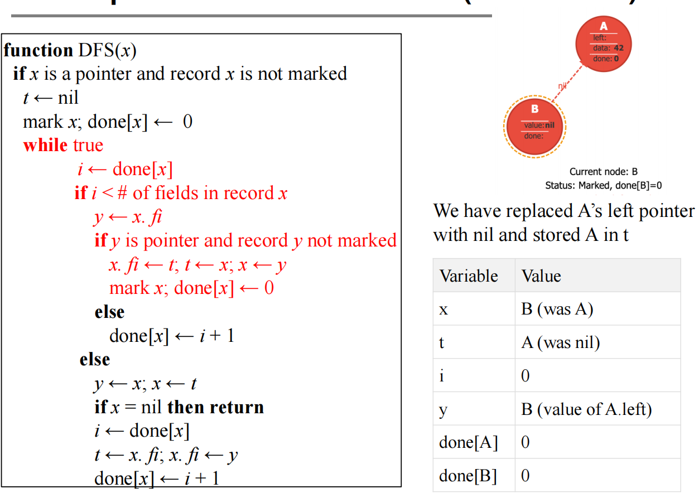

接着处理 B 的 value field，处理完后返回 A , 返回执行最后一个 else （得 `x=A,t=A,i=0,y=B,i=0,done[A]=1,done[B]=1`）

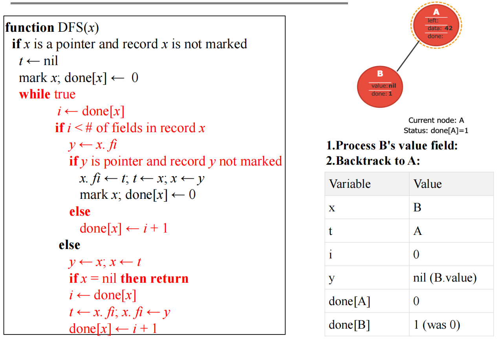

最后处理 A 自身的 data field：

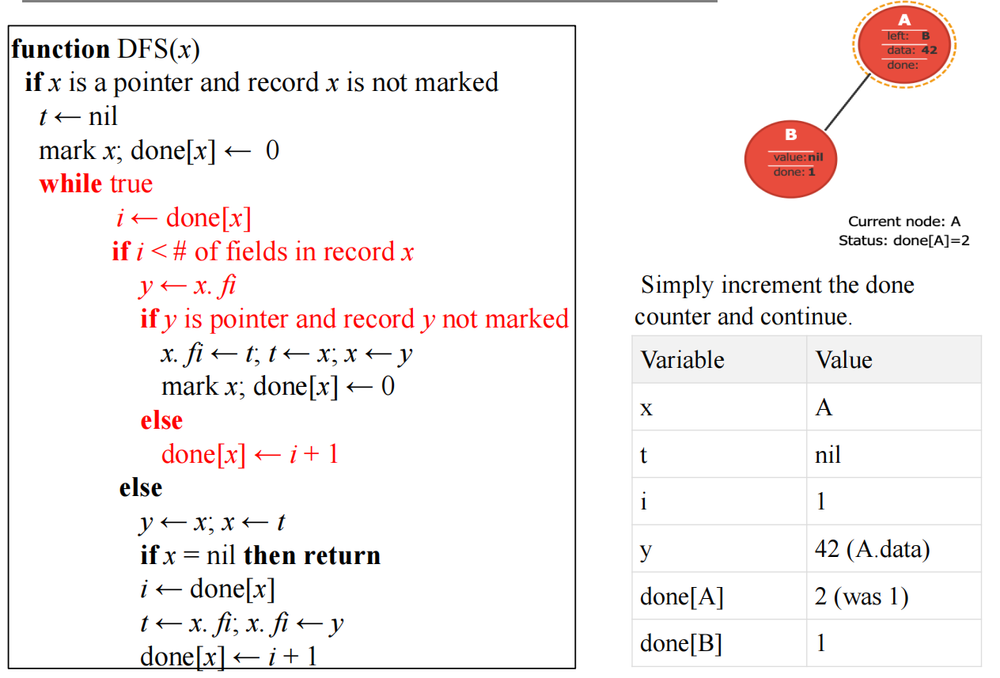

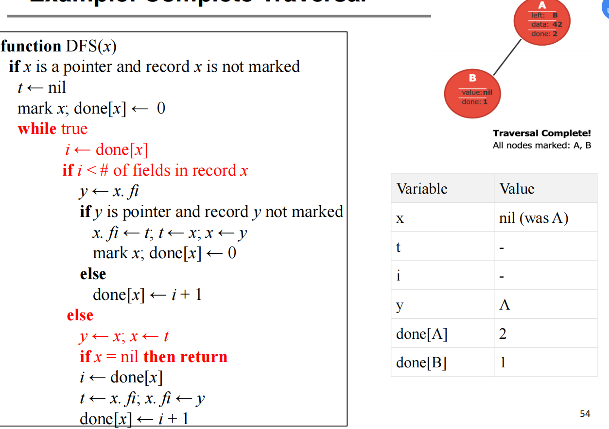

### Memory Fragmentation

**External fragmentation** ：堆中有足够的空闲总空间，但没有一块连续的空闲空间能满足当前的分配请求。

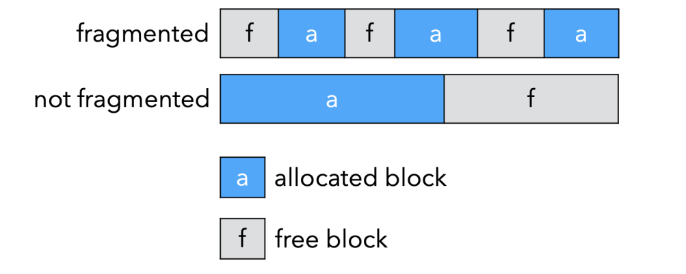

**Internal fragmentation** ：分配给对象的内存块大于对象实际需要的大小，导致对象内部存在未使用的内存。

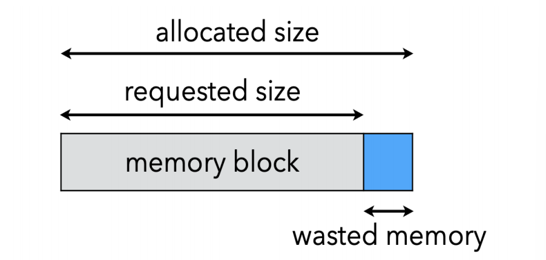

Mark-and-Sweep 倾向于产生外部碎片。

**Summary：**

*Pros* ：

- High efficiency if little garbage exist.
- Be able to collect cyclic references.
- Objects/records are not moved during GC

*Cons* ：

- Low efficiency with large amount of garbage
- Normal execution must be suspended
- Leads to fragmentation in the heap (Cache misses, page thrashing, complex allocation, etc.)

## Reference Counting

为堆中的每个记录维护一个 **reference count** ，表示有多少个指针指向该记录。当一个记录的引用计数值变为0时，说明该记录不再被任何指针引用，即成为垃圾，可以被回收。

比 mark-and-sweep 更渴望回收：一旦不可达立即回收，而 $reference\_count(x)=0\rightarrow$ x is unreachable

赋值操作操控 reference count :

- Whenever p is stored into x.fi (i.e., x.fi = p) : p 的 reference count 自增，x.fi 之前指向的对象的 reference count 自减
- If the reference count of some record r reaches zero : 将 r 放入 freelist , r 指向的所有 records 的 reference count 自减（可能导致连锁回收） 

**Strength** ：

- Incremental overhead: 单元管理与程序执行交错进行，没有明显的 “stop-and-collection” 效应。
- 与手动内存管理共存
- 可以立即重用释放单元

**Limitations** ：

- 无法回收循环引用 Cycles of garbage ： 如果一组对象形成循环引用，即使这组对象整体已经不可达，组内对象 reference count 不为0，无法回收)。可用混合 GC 解决（定期运行标记-清除回收循环引用）

  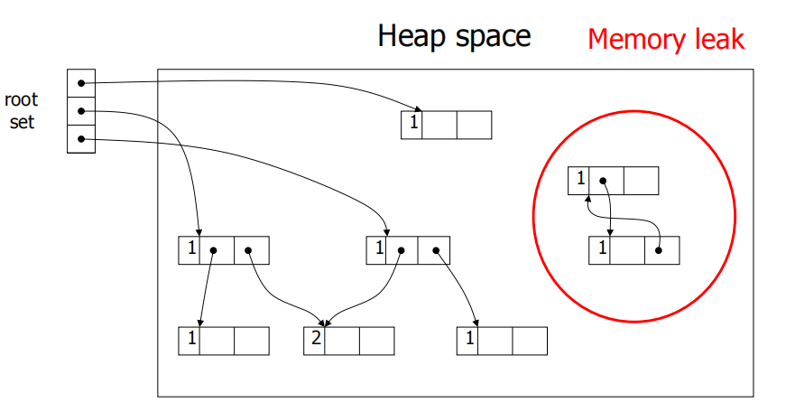

- 性能开销大 (Performance overhead)：每次指针赋值操作都需要执行多次读写内存来更新引用计数，开销远大于简单的指针赋值指令

  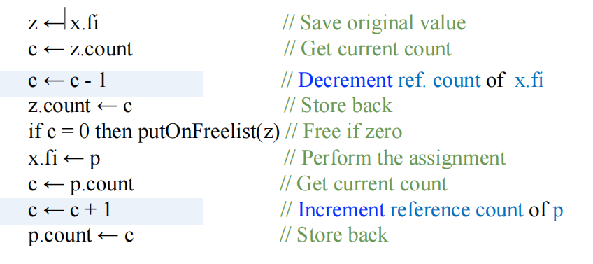

## Copying Collection

将 Memory 分为两个 heaps

- from-space: the one used by program
- to-space: the one unused until GC time

当 from-space 满后，GC 启动，将 from-space 中的可达对象复制到 to-space；接下来，from-space 中的所有对象可被认为是 garbage，全部清理；Swap roles of from-space and to-space for next collection

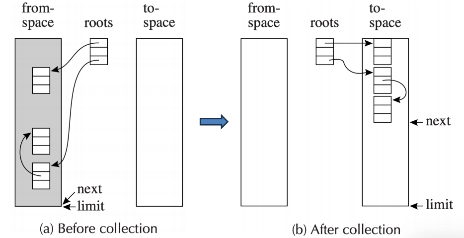

- **Very fast allocation** (因为新的 from-space 是连续的空闲空间，just increment pointer): p=next, next=next + n
- **No fragmentation**: 所有存活的对象都被紧凑地排列在 to-space 的开始部分，消除了外部碎片问题。

该方法需要解决的关键问题是：复制所有可达对象、保持对象间的指针关系并避免多次复制同一个对象。

### Cheney 算法

对于复杂的嵌套数据结构以及很长的指针链，如果只是简单的 recursive copying ，会导致 stack overflow. 

**Cheney’s insight** ：在 to-space 中使用 work queue，避免了 BFS queue 的额外内存开销

将 to-space 分为三块连续的 region：

- **Copied**: the record is copied, but we haven’t yet looked at pointers inside the record（已复制但未扫描），BFS queue
- **Copied and scanned**: the record is copied, and we have processed all pointers in the record
- **empty** ：空闲区域

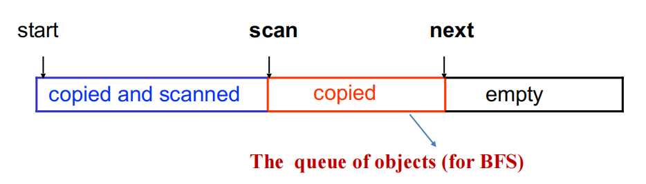

- scan 指针指向下一个需要被扫描处理的对象: 在to-space中、已经被复制但其内部指针字段还没有被处理的对象。对象被扫描时，scan++。
- next指针指向to-space中的**空闲位置**，也就是下一个要被复制到to space的对象将存放的位置，对象被 copy 时，next++。
- 当最终 scan == next 时，说明所有 reachable objects 都被复制且扫描了，BFS queue 为空，遍历完成。

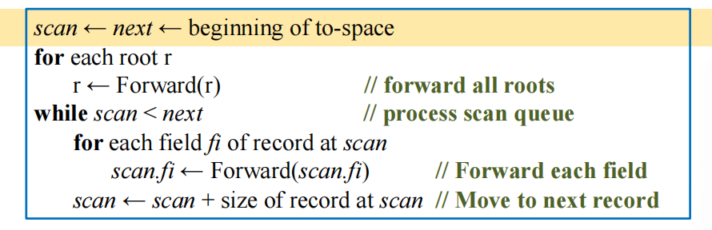

- 初始化 `scan` 和 `next` 指针都指向 to-space 的起始位置
- 遍历所有根集合中的指针。对于每个根指针 `r` ，调用 `Forward(r)` 函数，将 `r` 指向的对象从 from-space 复制到 to-space (如果尚未复制)，并更新 `r` 指向 to-space 中的新地址。`next` 指针相应移动。
- 当 `scan < next` 时，循环执行：
  - 获取 `scan` 指针指向的对象（设为 `current_obj`）。
  - 遍历 `current_obj` 中的所有指针字段 `fi`。
  - 对每个字段 `fi`，调用 `scan.fi = Forward(scan.fi)`，将其指向的对象复制到 to-space (如果需要)，并更新 `scan.fi` 指向 to-space 中的新地址。体现了一个 BFS 思想。
  - 将 `scan` 指针移动到 to-space 中的下一个已复制对象 ( `scan = scan + size_of_record_at_scan`)。
- 当 `scan` 追上 `next` 时，表示所有可达对象都已复制并扫描完毕，GC完成。

例：

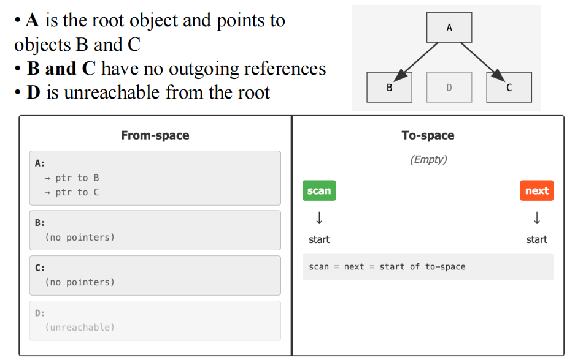

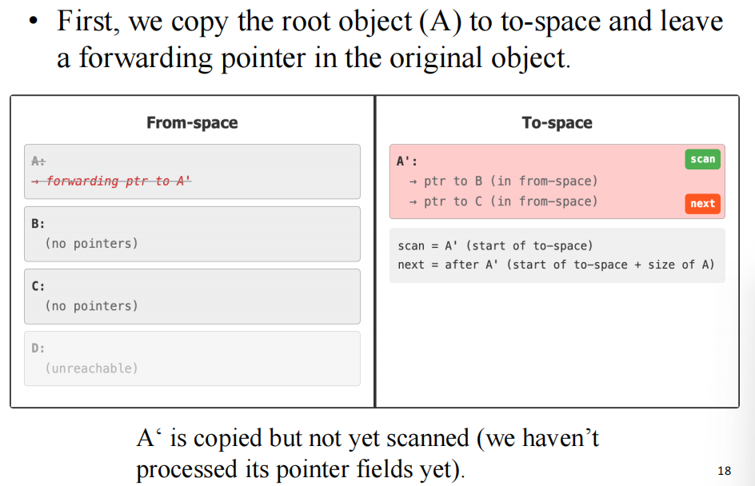

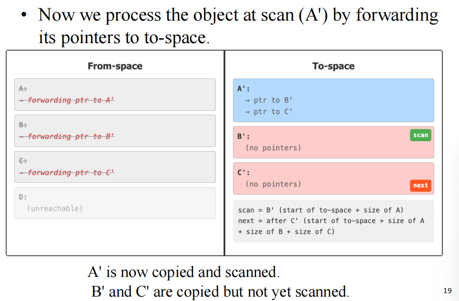

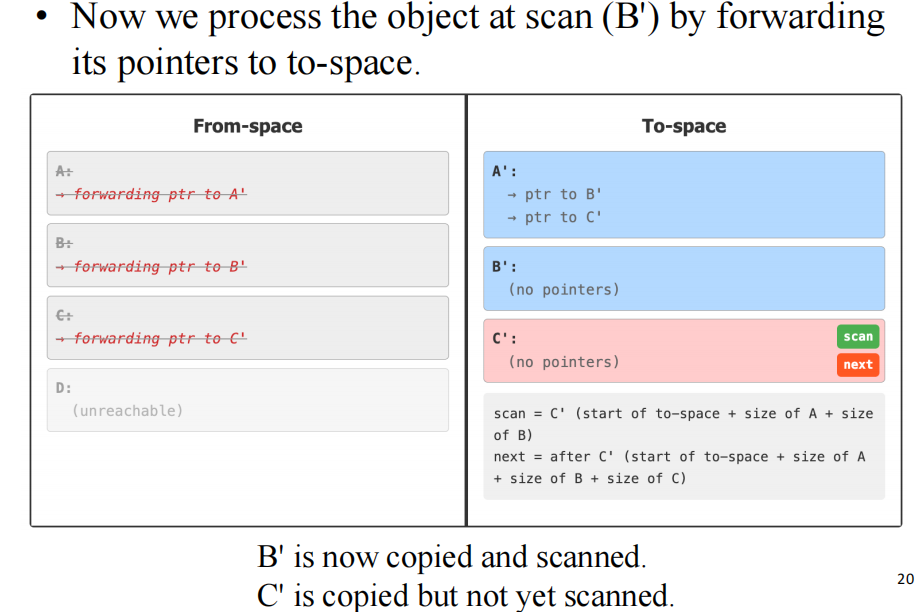

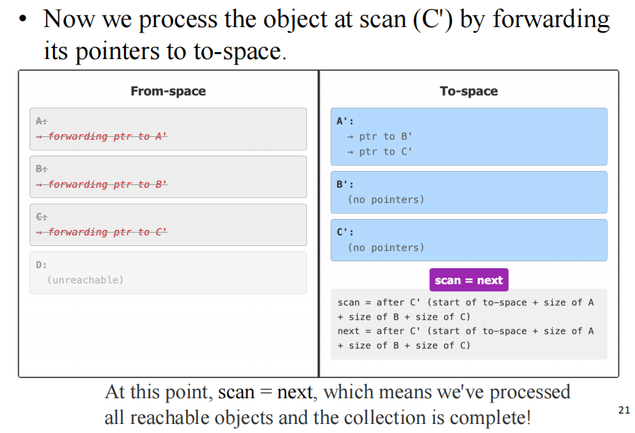

### Pointer Forwarding

Cheney 算法中的关键辅助函数 --  `Forward(p)` 

- **Goal** :  Locate an object's new position; Ensure all pointers correctly reference the new copies

在 copy 一个 obj 后，把 obj 的 first field 改为指向 new location 的 pointer（ **forwarding pointer** to the new copy），通过寻找 forwarding pointer 来确定 ojb 是否被 copy。

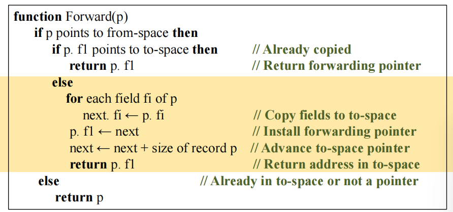

- 如果 `p` 指向 from-space 中的对象：检查该对象是否已经有一个指向 to-space 的转发指针（即 `p.f1` 指向 to-space）。已复制可直接返回 `p.f1`
- 未复制则在 to-space 的 `next` 位置为该对象分配空间，并将对象内容从 from-space 复制过来。`p.f1` 存 to-space 中的新位置的转发指针；更新next指针，返回 `p.f1`
- 如果 `p` 不指向 `from-space` （already in to-space or isn't a pointer） ，直接返回 p

例：

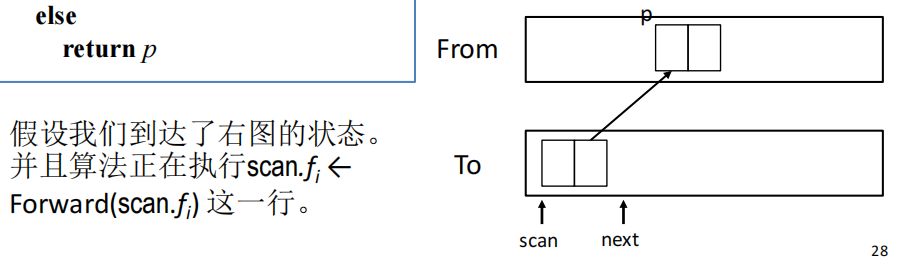

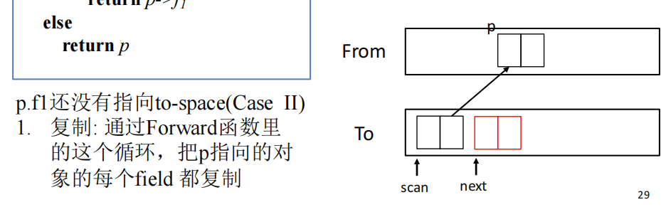

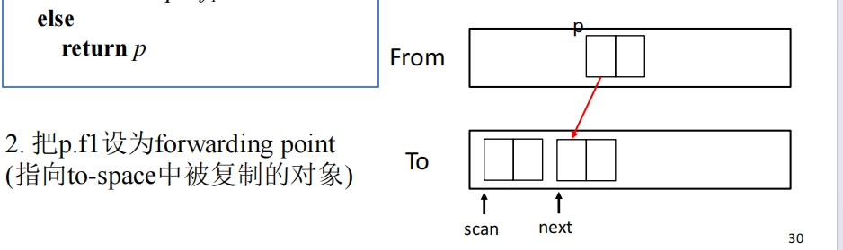

next *←* next *+size of record p*

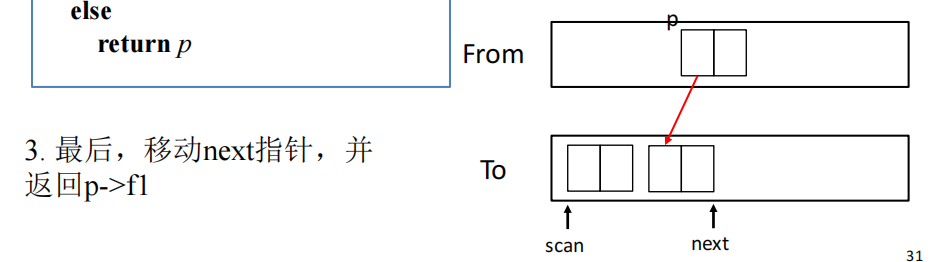

scan ← scan + size of record at scan：

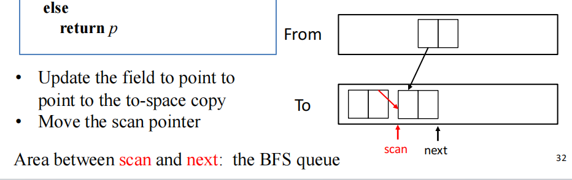

例：

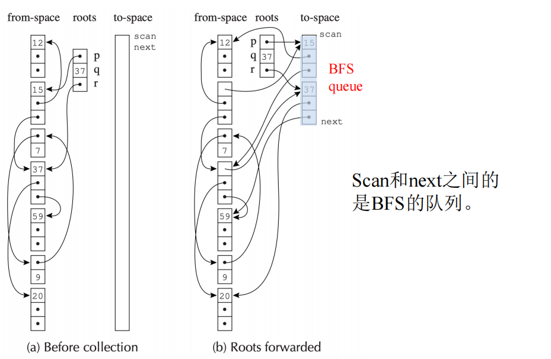

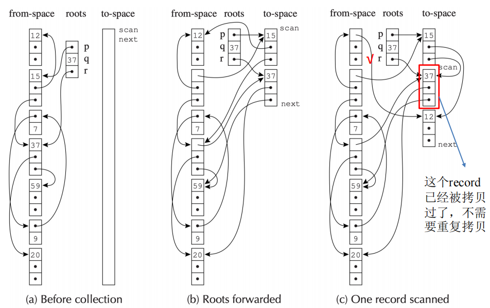

### Locality

BFS has poor locality : BFS会导致逻辑上相关的对象（如树的父子节点）在物理内存中可能相距较远，影响缓存性能。而 DFS 的复制策略有更好的 locality : 它倾向于将数据结构中通过指针链紧密相连的对象放置在内存中相邻的位置。

可以混合 DFS 和 BFS 进行复制来改善 Locality。算法不考，但会涉及 locality 概念。

思路：复制一个对象时，尝试立即复制它的一个子对象，并尽可能沿着这条路径进行 DFS 复制。当深度优先路径中断（例如遇到null指针或已复制对象）时，算法回退到广度优先扫描（类似Cheney算法的`scan`指针推进）来处理剩余的已复制但未扫描的对象。

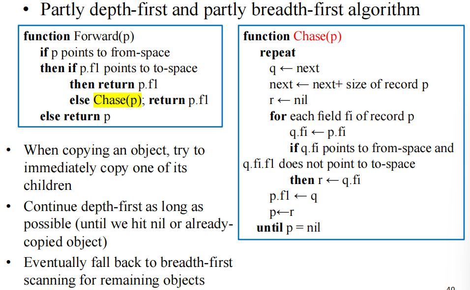

**Summary**

优点：

- 简单，不需要栈或指针反转。
- 运行时间与存活对象数量成正比（不扫描整个堆）。
- 自动整理内存，消除碎片。

缺点：

- 浪费一半的内存空间。
- （Cheney算法）局部性可能较差。
- 需要精确的类型信息来区分指针和非指针数据。

总的来说，copy collection 适合那些可以容忍较高内存开销，但对分配速度和避免碎片有高要求的系统，例如许多函数式语言的运行时环境。

## Interface to the Compiler

编译器在支持垃圾回收时，需要与GC机制进行交互。虎书介绍了如下几个方面：

- Generating code that **allocate** **records**
- Describing locations of **roots** **for each garbage collection cycle**
- Describing the **layout** **of data records** on the heap
- Generating instructions to implement a read or write barrier

### Fast Allocation

对象分配是程序运行过程中的高频操作，其效率直接影响整体性能，对于 Functional languages（鼓励创建新对象而非修改旧对象）和 Memory-intensive applications 尤其如此 。而且，某些程序中多达 1/7 的 inst 是存储指令，这意味着分配操作的频率可能相当高。

由于 Copying Collection 不产生碎片，内存分配可以非常高效。allocation space（即 to-space） 是一块连续空闲区域，`next`指针指向下一个可用内存的起始位置，`limit`指针指向该区域的末尾 .

给大小为 N 的 record 分配流程：

1. Call the allocate function 
2. Test *next + N < limit* ? (If the test fails, call GC)
3. Move *next* to *result*
4. Clear *M[next],* *M[next+1],* ..., *M[next + N - 1]* 将分配区域清0
5. next $\leftarrow$ next + N ，更新 next
6. Return from the allocate function

A. Move result into some computationally useful place

B. Store useful values into the record

为了进一步降低分配开销，使用 inline expanding 消除 step1&6；将 step A与3结合起来；step B 可覆盖 step 4；step 2&5不可消除，但可以通过将 `next` 和 `limit` 指针保存在寄存器中，以减少指令数至 3条。

最终 内存分配指令数可只用 4 条。

### Describing Data Layouts

GC 需要能够处理不同数据类型的 records，也就是需要能够理解对象的内部结构。具体来说，需要知道：

- Different length: used when adding scan 
- Field type: used by Forward （Only pointers need to be processed）

编译器通常会为程序中定义的每种对象类型生成 **Type Descriptors** 。每个对象实例在内存中会包含一个指向其类型描述符的引用（通常在对象头中）。

- 面向对象语言中，对象通常已经拥有指向其类对象的指针，该类对象可以充当或包含类型描述符，因此可能没有额外开销。
- Statically typed language 中，如果原生不支持此类元数据，则可能需要为每个对象增加 one-word 的开销来存储 Type Descriptors 指针

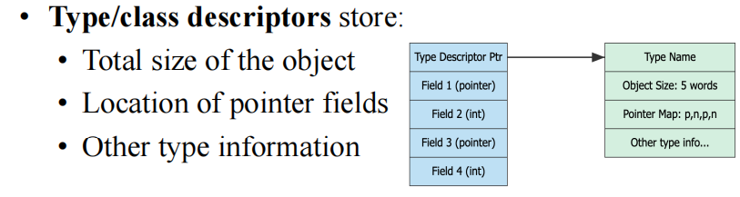

### Describing Roots (Pointer Map)

由于 GC 需要从 roots 开始，所以 GC 必须准确识别所有 root，才能追踪到所有存活对象。roots 可以是：

- Registers
- Local variables in stack frames
- Temporary variables
- Global variables

中存储的指针，指向 heap。

利用 Pointer Map 识别指针：编译时识别出哪个 temp 是 pointer、Stack slot 中是否有指针、寄存器分配时指针属性也会传递给 register，由此构造 map。

但是由于 Live temporaries change at every program point，为每一条指令生成一个 map 又不现实，所以选择在 specific program points where garbage collection can occur 时生成 pointer map：

- When allocation: inserting before alloc_record
- Any function call (which might indirectly call alloc_record)

接下来介绍查找 root 的算法：

1. Start at the top-most stack frame and current PC
2. Look up return address in pointer map 
3. Mark(mark-and-sweep)/forward(copy collection) pointers in current frame using the map
4. Move to caller's frame
5. Repeat until all frames are processed

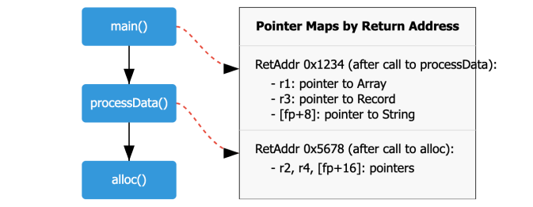

callee-save regs 需要特殊处理 ： 当函数`g()`调用函数`h()`，而`h()`内部触发了GC时，`h()`可能已经将其自身使用的一些被调用者保存寄存器（其原始值属于`g()`或更早的调用者）保存到了自己的栈帧中。`h()`本身可能不知道这些保存的寄存器值哪些是指针。

所以，函数的 Pointer Maps 还需要含关于它在调用其他函数时，哪些 callee-save regs 中仍然持有从其调用者（caller）传来的、且仍然活跃的指针的信息。这些信息需要沿着调用链传播。例如，如果`f()` 调用 `g()`，`g()`将一个指针存入被调用者保存寄存器 `r_callee_save`，然后`g()`调用`h()`。在`g()`调用`h()`的那个点的指针映射中，必须指明`r_callee_save`包含一个指针。这样，如果`h()`（或`h()`调用的任何函数）触发GC，GC在扫描`g()`的栈帧（或处理`h()`保存的`r_callee_save`副本）时，就能知道`r_callee_save`的内容需要作为根来处理

### Derived Pointers

Derived Pointers 指那些不直接指向堆对象起始地址，而是指向 middle, start, end of object 的指针。

在 Copying Collection 中，**when** base pointers are updated to point to new locations, derived pointers need different adjustment logic. 如果 GC 不知道这些派生关系，或者不知道如何计算这个调整，就会导致 derived pointers 失效

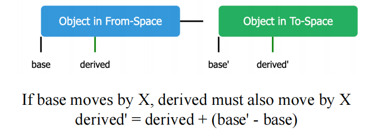

例：

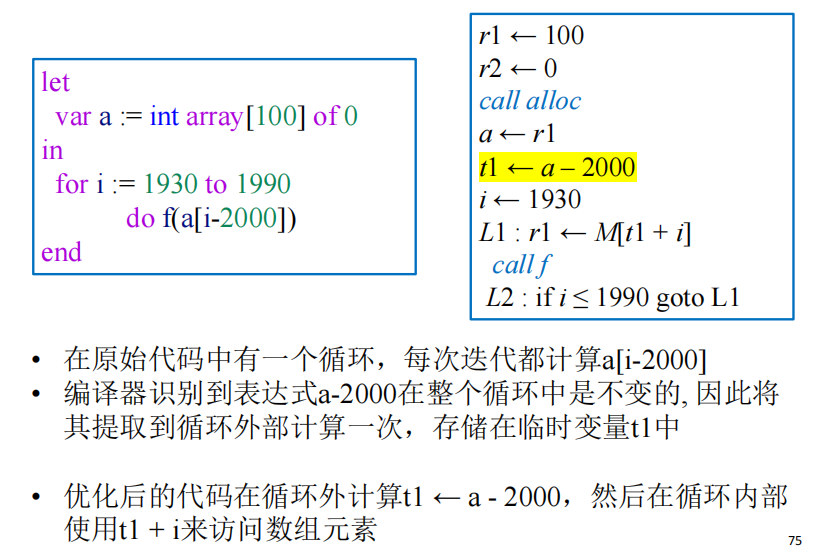

从活跃性分析的角度看，一旦a的值被用于计算t1，后续没有对a的其他引用，a似乎就"死亡"了，然而，对于GC来说，必须保持a存活，因为t1是从a派生的，在GC过程中需要知道a的新地址来正确更新t1。

Solution：

- **Pointer map**  ：for each derived pointer, specify which base pointer it's derived from
- **Liveness** ：a derived pointer implicitly keeps its base pointer live!

