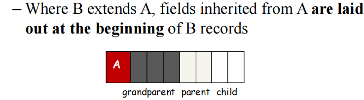
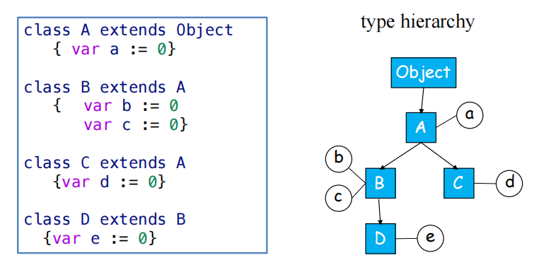
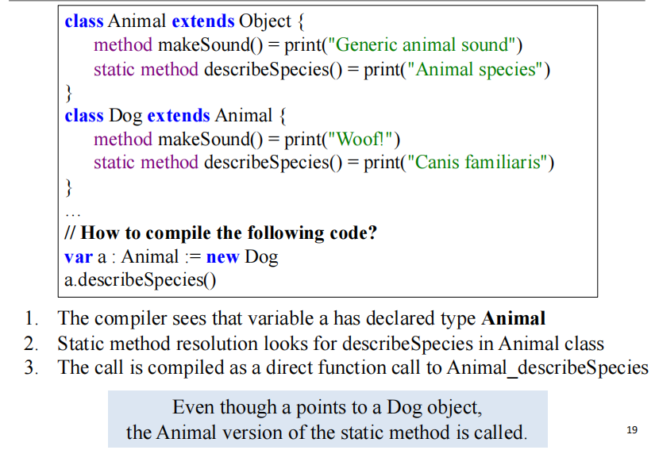
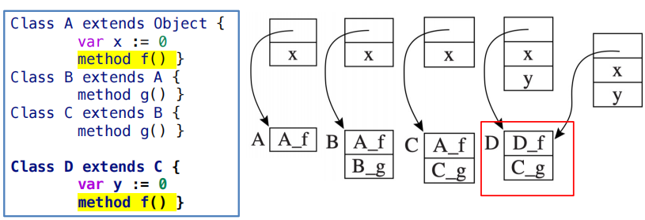
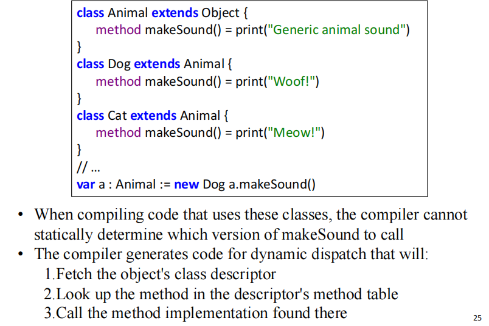
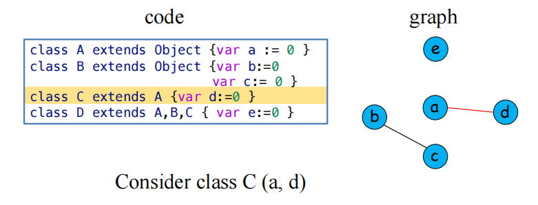
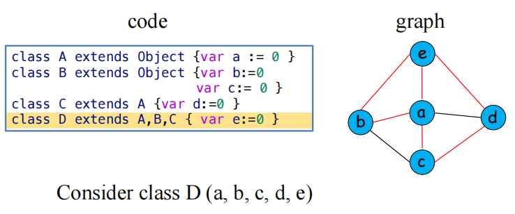
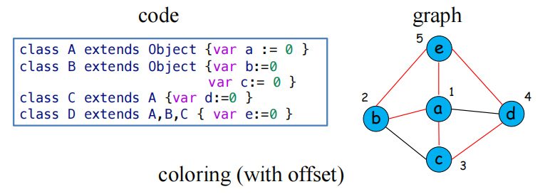
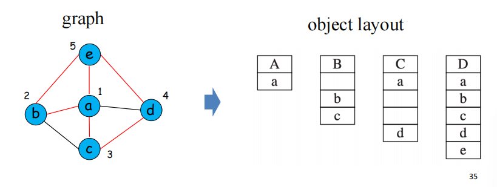

# Object-oriented Language

什么是面向对象语言：

- All (or most) values are objects
- Objects belong to a class
- Encapsulate state (fields) and behavior (methods)

特性：Inheritance，Encapsulation，polymorphism

## Classes

编译器如何处理类相关的构造？“Object-Tiger” 语言将探讨类定义和使用的语法和语义。

**Class Declarations** 

- 类声明：dec → classdec
- 类声明结构：classdec $\rightarrow$ class B extends A { classfield }
  - B 是类的名称，A 是父类，表明继承关系，编译器的语义分析阶段必须严格执行继承的基本规则：
    - All fields and methods of A implicitly belong to B
    - **Methods** may be overridden in B, **fields** may not
    - Parameter and result types of overriding methods must match those of overridden methods
  - {...} 中包含零个或多个 classfield

- 类字段可以是变量声明或方法定义：classfield → vardec & classfield → method
- 方法定义的语法：method → method id(tyfields) = exp & method → method id(tyfields) : type-id = exp . `tyfields` 代表类型化的形式参数列表。

There is a predefined class identifier Object with no fields or methods. 如果声明类时未明确指定父类，编译器必须隐式地将该类作为 Object 的子类。

**Method and Self Parameter**

Methods are like functions with formal parameters and bodies. Each method within class B has an implicit formal parameter **self** of type B (class B 是子类)。self 并非 keyword，而是 Automatically bound to the object during runtime

```c++
Class Car extends Vehicle {
 ...
  method await(/*self: Car,*/ v: Vehicle) {
    if (v.position < position) // 此处的 'position' 隐式代表class Car类的'self.position'
    then v.move(position - v.position)
    else self.move(10)       // 此处显式使用 'self'
  }
}

var c := new Car
c.move(60); // 这在底层可以被认为是调用 move(c, 60);
```

**Object Creation and Method Calls**

- 对象创建：`exp → new class-id`；例如 `new B`.
- 字段访问：`exp → lvalue.id` ; 例如 `b.x` 表示访问对象`b`的字段`x`
- 方法调用：
  - `exp → lvalue.id()` (无参数方法调用)
  - `exp → lvalue.id(exp{, exp})` (带参数方法调用)
  - 例：`b.f(x,y)`

实现 “Object-Tiger” 需要考虑几个方面：

- Field layout ：Arrange object fields in memory
- Method dispatch ：Find which concrete implementation of a method to call
- Membership test ：Test whether an object is an instance of some type

## Single Inheritance

### field layout

在单一继承模型下，编译器如何组织对象的内存以及如何确定调用哪个方法实现。

一个简单而有效的 **字段布局** 策略是“前缀法”（prefixing）：

- 从父类继承而来的所有字段，按照它们在父类中声明的顺序，被放置在子类对象记录的起始部分。
- 子类自己新定义的字段则紧随其后排列。



例：



layout：

- A: [a]
- B: [a, b, c]
- C: [a, d]
- D: [a, b, c, e]

### method dispatch

每个 method instance 在编译后都会成为一段机器码，存储在特定的内存地址. 编译器的语义分析阶段，会为每个类维护一个 class descriptor，其包含：

- A pointer to its parent class
- A list of method instances
- Each method instance has a **machine-code label** ，即入口地址

**Static Methods**

当编译器遇到一个静态方法调用，如 `c.f()`，执行哪个方法的代码取决于变量`c`的**声明类型**（declared type），而不是`c`在运行时实际指向的对象的类型 。调用过程如下：

1. Search in class C for method f
2. If not found, search the parent class of C
3. Continue up the inheritance hierarchy
4. When found in ancestor class A, compile a **function call** to label A_f

由于这种解析完全在编译时完成，静态方法调用速度快，没有运行时的额外开销。

例：由于声明类型是 `Animal` ，所以调用Animal_describeSpecies



**Dynamic methods**

需要根据对象在 **运行时的实际类型** 来确定具体执行哪个方法实现，这是实现多态的关键。

编译器会为每个包含动态方法的类（或可能被继承且其方法可能被覆盖的类）创建一个dispatch vector 或更通俗地称为 virtual table, vtable 的数据结构。构建规则如下：

- When class B inherits from A，类`B`的虚函数表会首先复制类`A`虚函数表的所有条目。这意味着`B`的vtable中，对应于从`A`继承而来的方法的条目，其位置（偏移量）与在`A`的vtable中完全相同。
- 如果类`B`定义了新的动态方法（即在`A`中不存在的方法），这些新方法的指针将附加在`B`的vtable中，位于继承条目的后面。
- 如果类`B` override 了从类`A`继承的某个方法`m`，那么在`B`的vtable中，对应于方法`m`的条目将指向`B`自己实现的方法`m_B`的代码地址。如果`B`没有覆盖`m`，则该条目将继续指向`A`的方法`m_A`的代码地址。



当执行一个动态方法调用，如 `c.f()` 时，编译生成的代码会执行以下运行时步骤：

1. Fetch the class descriptor *d* at offset 0 from c
2. Fetch the method-instance pointer p from the (constant) *f* offset of d
3. Call p (Jumps to address p, saving return address)




## Multiple Inheritance

在**多重继承**中，一个类可以同时继承多个父类。这会使得对象内存布局时出现冲突。

### Graph Coloring

编译器需要对整个程序的类层级结构进行 **全局静态分析** ，为每一个不同的字段名找到一个 **全局唯一且一致的偏移量** 。这个过程可以被巧妙地建模为一个经典的计算机科学问题： **图着色问题** 。

如果两个不同的字段需要在某一个类的实例中同时存在，那么它们就不能被分配相同的内存偏移量。

- node: a distinct field name
- edge: two fields coexist in a class
- colors: offsets (0, 1, 2 ...)!

首先构建干扰图：(b, c) 在 B 类冲突，(a, d) 在 C 类冲突





接着着色：



最后决定 layout （会存在 wasted empty slots，如 B 和 C 中的）：




