# Loop Optimizations

程序的大部分执行时间（通常是90%以上）都消耗在循环中。因此，优化循环是提升程序性能最有效的方法之一。

## Loops and Dominators

### Loops

A **loop** in a control-flow graph is a set of nodes *S* including a header node *h* such that : 

- header node 唯一，所有从循环外部进入循环的路径都必须首先经过这个 header node
- 循环内的所有结点，都必须能通过某条路径回到首结点。
- 首结点必须能到达循环内的所有其他结点。

例：

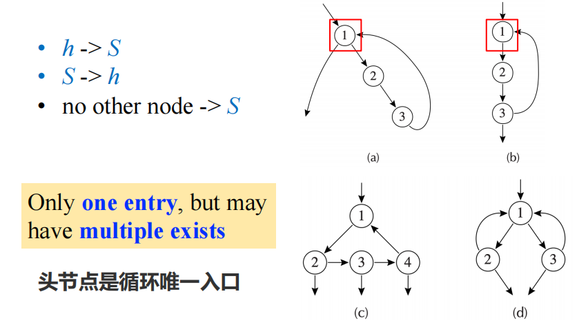

一个 loop 只能有一个 entry，但可以有多个 exits ：

- A **loop entry** node is one with predecessor outside the loop.
- A **loop exit** node is one with a successor outside the loop.

有时候， CFG 中存在 cycle，但该 cycle 不一定是 loop ：

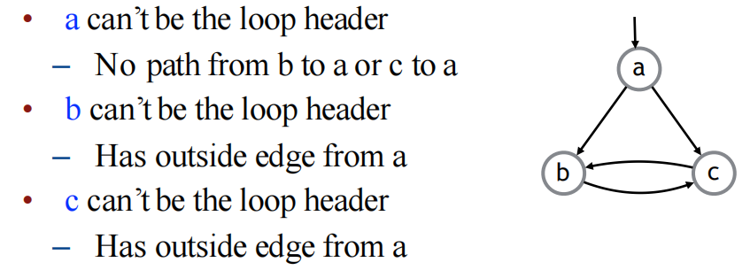

为什么 loop 的定义要这么严格呢？

- 提供 handle : 在进行循环不变式外提时，可以将不变计算的结果放置在循环开始前执行
- Structured control-flow only produces **reducible graph** ：在可归约图中，所有的环结构都天然符合上述编译器的循环定义。相比之下，像C/C++这样的语言，如果使用了`goto`语句，则可能产生**不可归约图**。在不可归约图中，可能存在一些环不符合这种严格的循环定义（例如，环可能存在多个入口点），这会给分析和优化带来额外的复杂性甚至不可行性。

### Finding Loops

#### Dominance

**Dominator**

A node d dominates a node n ( **d dom n** ) if every path of directed edges from the start node to n must go through d. 如果从 CFG 的 start node(程序或函数的第一个基本块) 到达 node n 的每一条可能的路径都必须经过 node d，那么就称 d dom n.

Some properties of dominator :

- Every node dominates itself
- *n* can have more than one dominators

**Finding Dominators**

 D[n] : 表示支配结点n的结点的集合。

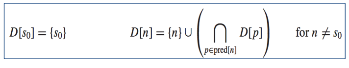

- 初始化：首先假设 D[n] = all nodes ，对图中所有结点 except s0 -- D[s0] = {s0}
- 迭代更新：pred[n] 表示结点n的所有直接前驱结点的集合，取其 Dominator 集合交集

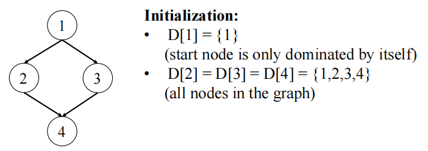

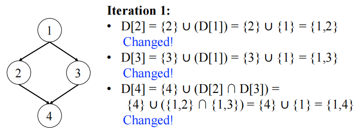

最后no change，停止迭代。

**Immediate Dominators**

除入口结点 s0 外的所有结点 n 都有一个唯一的 Immediate Dominators，记为 `idom(n)` ，满足：

- idom(n) is not the same node n 
- idom(n) dominates n （`(idom(n) dom n)`）, and idom(n) does not dominate any other dominator of n

从入口结点到达n的任何路径 (不含n) 中，idom 是路径中最后一个支配n的结点

> **Theorem**: Suppose *d* and *e* dominate *n*, it must be that either *d* dominates *e* or *e* dominates *d*.

**Dominator Tree**

直观且高效地表示整个图中所有支配关系。在Dom tree中,节点的父节点是其idom，祖先是其所有支配者。

例：

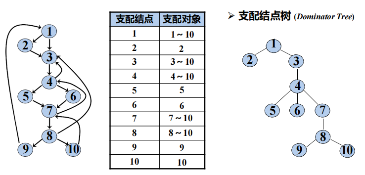

#### Loop

**Natural Loops**

**Back Edge**: an edge from *n* to *h* when *h* **dominates** *n* (h dom n). 即控制流图中存在一条从结点n指向结点h的有向边记为 $n\rightarrow h$ ，并且结点h **支配** 结点n (h dom n)

每条 Back Edge 都唯一地确定一个 Natural Loops，The natural loop of a back edge n → h
is the set of nodes x such that：

- *h* dominates *x* and
- there is a path from x to n not containing h
- h 是 loop header

所以，为了识别 loop，首先计算图中所有结点的支配关系，然后，找出所有的回边，最后识别 loop。

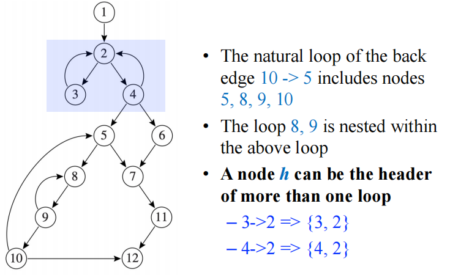

**Nested Loop**

If loops A and B have distinct headers and all nodes in B are in A (i.e., B⊆A), then we say B is nested within A. B is an inner loop, A is an outer loop. 

**Innermost Loops** : 不包含其它循环的循环。

除非两个自然循环的首结点相同，否则，它们或者互不相交, 或者一个完全包含(嵌入)在另外一个里面.

**Loop-Nest Tree**

每个结点代表 a loop or a collection of loops。The parent-child relationship indicates nesting.

- 首先计算 CFG 中所有结点的支配关系。
- 接着构建 dominator tree
- 用支配关系和回边，找出所有的自然循环及其对应的首结点。
- 对于每一个首结点h，如果它对应多个自然循环（例如，多个不同的回边都指向同一个首结点h），则将这些以h为首结点的自然循环合并视为一个单一的逻辑循环，表示为 loop[h]。
- Construct the tree of loop headers (and implicitly loops), such that h1 is above h2 in the tree if h2 is in loop[h1] （处理嵌套loop）

例：

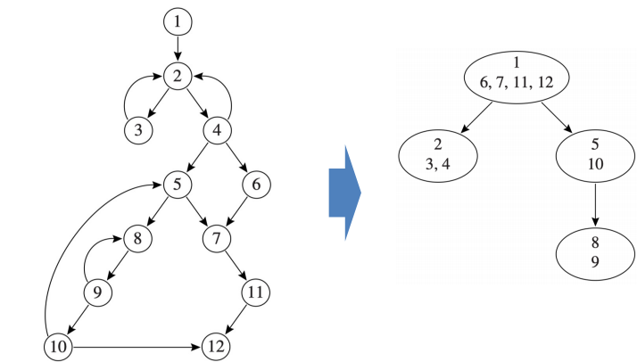

- 每个结点的上半部分标示 loop header 结点，如 nodes 1，2，5，8
- The leaves of the loop-nest tree are the innermost loops，如循环{2，3}，{2，4}，{8，9}
- 可以认为整个过程（或函数）体本身构成一个最大的、伪循环，它位于循环嵌套树的根部 root

### Loop Preheader

A pre-header is a basic block inserted immediately before the loop header.

- 只有一个 successor，即 loop header
- All paths to the loop header pass through the pre-header

有时候需要为循环创建一个前置首结点：

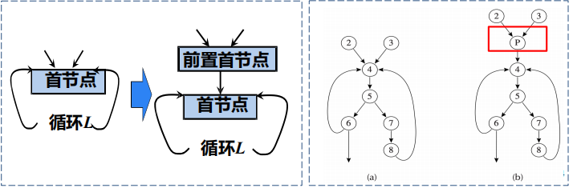

## Loop Invariant Hoisting

核心思想是识别出那些在循环的多次迭代中计算结果始终相同的表达式，并将这些计算移到循环体之外，从而避免重复劳动。

先 Analysis，再 transformation.

### Loop Invariant

定义：循环中，某些代码 computes same result each time evaluated

如何 identify：

考虑一个形如 `x := v1 op v2` 的赋值语句（其中 `op` 代表某种运算符）。该语句对于其所在的循环来说是循环不变的，当且仅当它的每一个操作数（operands）`v1` 和 `v2` 都满足以下条件之一：

- The operand is constant
- All of the definitions that reach the assignment are outside the loop. 这意味着操作数的值在进入循环之前就已经确定，并且在循环内部不会被重新定义
- Only one definition reaches the assignment and it is a loop invariant. 这允许不变性通过依赖关系在循环内部传播

**Can use an iterative algorithm to compute !!!**

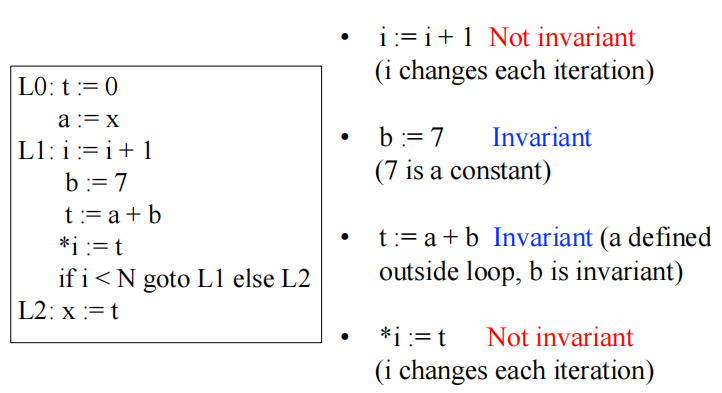

### Loop Invariant Hoisting

Valid/Safe Hoisting :

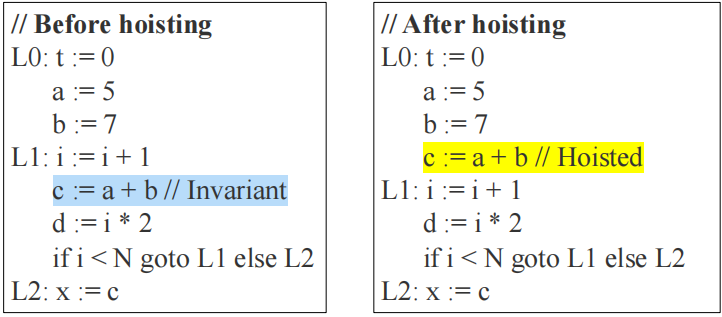

Invalid/Unsafe Hoisting:

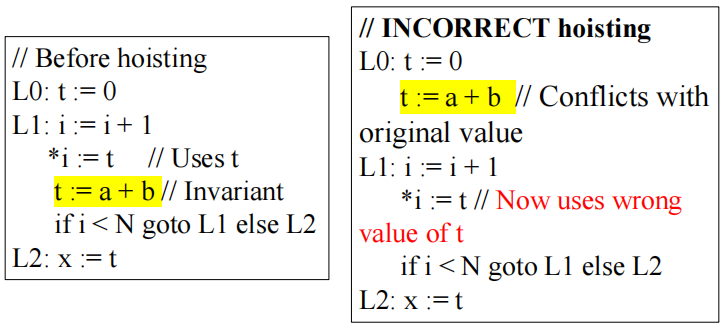

表达式是 loop Invariant 不意味着可以外提，需要满足一系列严格条件。对于一个 invariant assignment $d:t\leftarrow a\bigoplus b$ , 能够安全地将其外提到循环前置首结点的三个核心准则 ：

- **Dominance condition** : d dominates all loop exits where t is live-out. 
- **Uniqueness condition** : There is only one definition of t in the loop
- **Pre-header condition** : t is not live-out of the loop preheader 
  (that is, t is not live before the loop)

