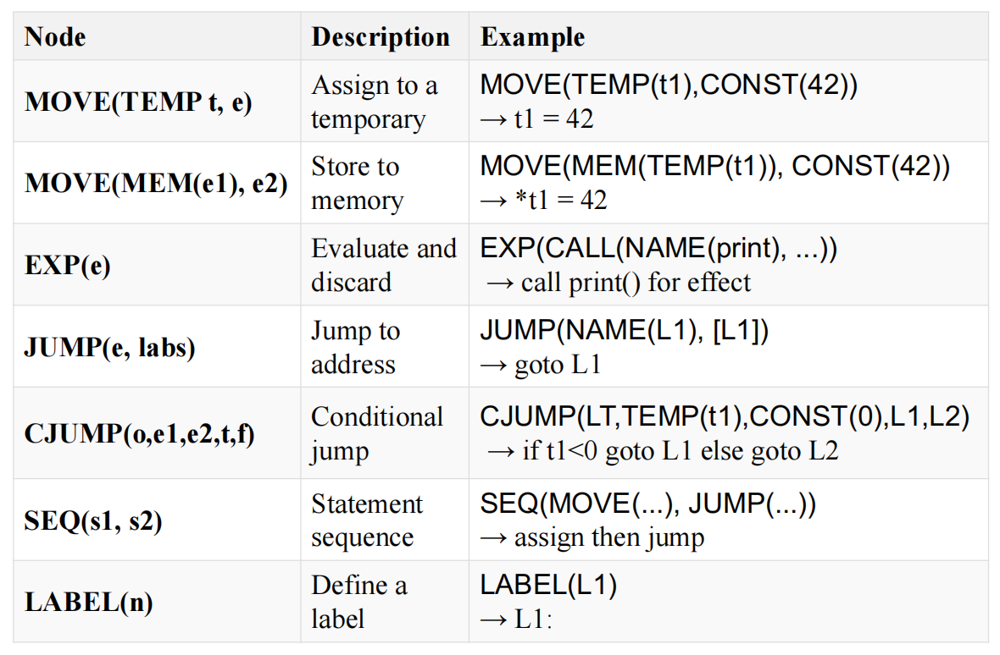

# Translating into Intermediate Representation

## 1. 中间表示概述

- 前端：从源码到IR生成
- 中端：基于IR的分析与变换（可能生成新IR）
- 后端：(机器相关优化)；从IR 到目标代码

### 1.1 为什么需要中间表示(IR)

直接翻译成机器码的危害：

- hinders **modularity**
- hinders **portability**

### 1.2 IR 分类（不要求掌握）

根据抽象层次( 实际编译器可能采用多层IR )：

- 高层中间表示 High-level IR: 贴近输入语言，方便由前端生成

  

- 低层中间表示 Low-level IR: 贴近目标语言，方面目标代码生成

- 中层中间表示 Middle-Level IR

根据结构特征：

- 结构化表示 Structural

  - Graphically oriented (e.g., tree, DAG,...)
  - Heavily used in source-to-source translators

  

- 线性表示 Linear：存储布局是线性的

  

- 混合表示 Hybrid：Combination of graphs and linear code

  

### 1.3 三地址码(Three-Address Code)

一般形式：$x = y ~op ~z$

- 每个指令最多1个算符，最多3个操作数(三地址)

- 例：

  

实现：

- The entire sequence of three-address instructions is implemented as **an array of linked list**

- implement three-address code as **quadruples**（四元组）

  - one field for the operation
  - three fields for the addresses

- 对于 fewer than three addresses 的指令，一个或多个地址字段被赋予 null 或“empty”值。

  

- Other implementation: **triples, indirect triples**

Static Single Assignment (SSA) 不考

- 特殊的三地址代码，其所有变量在代码中只被赋值一次

  

- 方便了编译器中的很多分析和优化

## 2. IR Tree 

虎书只用一层 IR，即 **IR Tree**，介于 AST 和 assembly 之间

### The Expressions

ESEQ(s, e)：The statement s is evaluated for side effects, then e is evaluated for a result.

- 假设s是statement a=5, e是expression a+5
- Statement (如a=5)不返回值,但是有副作用
- 表达式ESEQ(a=5, a + 5)最终的结果是10

关于副作用(Side effects)

- 副作用意味着更新存储单元 memory cell 或临时寄存器 temporary register 的内容

### The Statements

## 3. IR Tree 的生成

### 3.1 Translation of expressions

Mapping AST Expressions to IR Tree

- Ex: AST Expressions with return values (e.g., a + b)
- Nx: AST Expressions that return no value (e.g., print(x))
- Cx: AST Expressions with Boolean values (conditional jump)

问题：语言结构通常需要在期望不同形式的上下文中使用，所以需要转换

#### 3.1.1 Simple Variables

对于在当前过程的堆栈帧中声明的变量 v ，

