# Basic Blocks and Traces

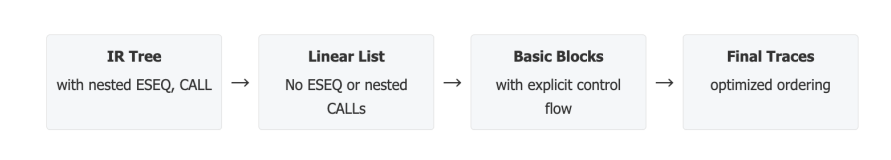

## Canonical Form

动机是 tree 与 Machine Code 之间的 mismatch：

- CJUMP：可跳到两个labels，但是在机器码中，如果条件不符合，那么就不跳转，执行下一条指令

  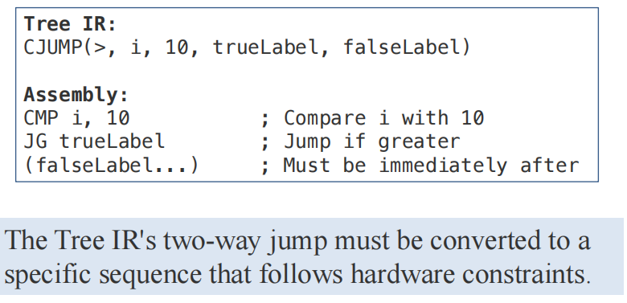

* ESEQ：执行顺序不同，会导致得到结果也不同（下例中，由于 e2 是 TEMP a，而 ESEQ 中的 MOVE 会改变 a 的值）

  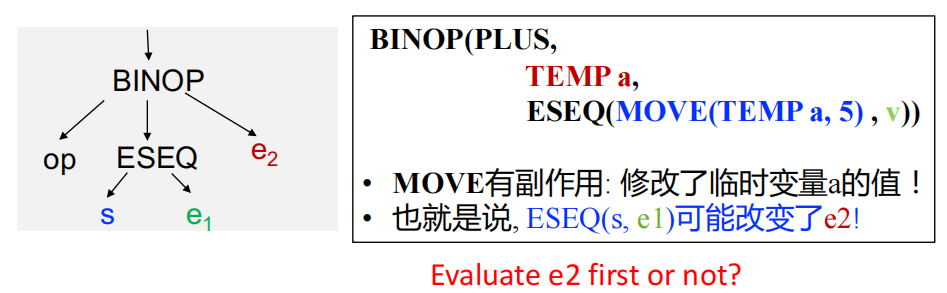

* CALL：嵌套 CALL 情况中，会导致寄存器使用冲突和语句副作用等问题

  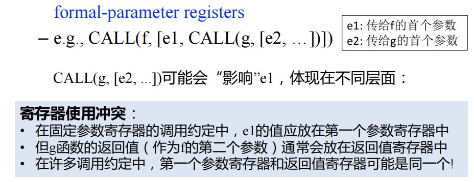

  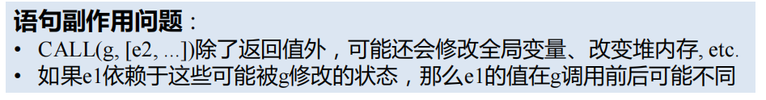

正则形式的特点：

- All statements brought up to top level of tree

  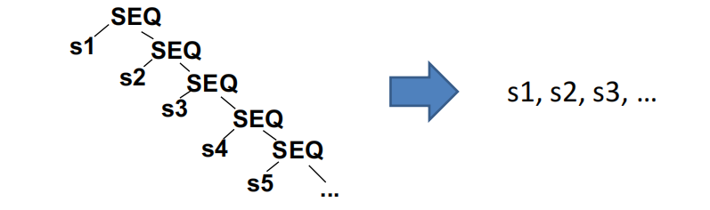

- A function is just a sequence of all statements

  s1, s2,s3,s4,s5...

正则形式可更直接转化为汇编码.

## Step 1: Canonical Trees(Linearization)

### Eliminate ESEQ

**basic rule**：Lift ESEQ nodes higher and higher in the tree, until they can become SEQ nodes。

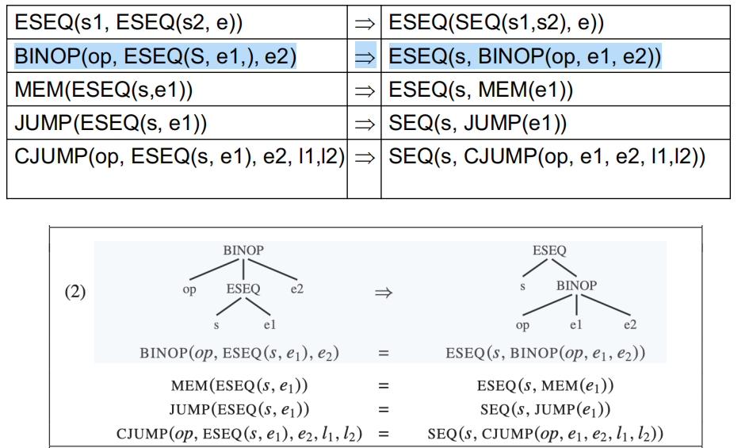

Commutativity (重点)：只有 s 和 e 互不影响才能 commute，否则需要用到 temporary

消除 $BINOP(op, e1, ESEQ(s, e2))$ 中的 ESEQ，由于 e1 必须比 s 先执行，s 又要比 e2 先执行，所以不能简单变换位置（s 可能有 side effect 使得 e1 值变化）

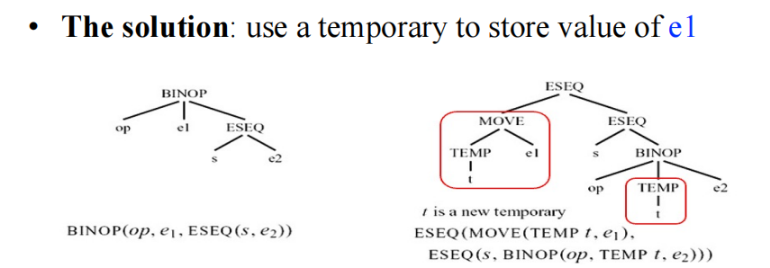

即：

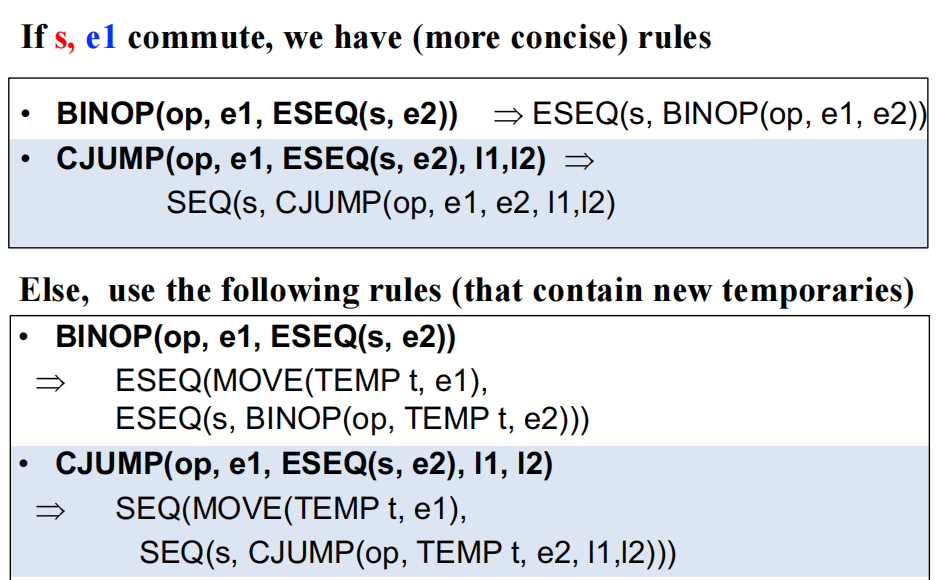

判断 s 和 e 是否可交换(commutativity)：

- 该问题是不可判定问题
- 所以可做近似来求解
  - commute(s, e) = True if they definitely do commute
  - commute(s, e) = False otherwise
- 判断可交换的 naive 策略：
  - A constant commutes with any statement
  - An empty statement commutes with any expression
  - 其它都假设为不可交换
- 一定无法交换的两种情况
  - s 会改变 a 中临时变量的值
  - s 会改变 a 中内存地址

### move CALLs to top level

CALL 的问题：如1中说到，nest 时会导致寄存器冲突和语句副作用问题

解决方法：Function Result Preservation. 即时将 每个 return value 放到 fresh temporary register：

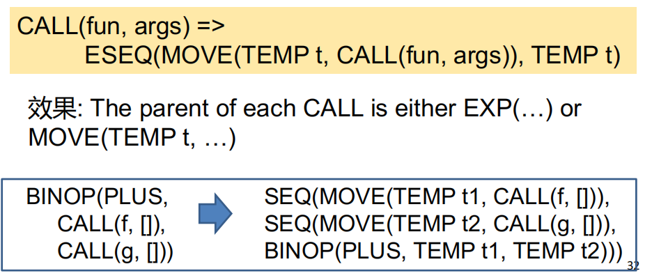

Special Cases：

- 当 CALL 是 EXP 的 direct chidren 时，CALL 已经在 top level，可以不变
- 当 CALL 的返回值直接被赋给一个 temp，就已经符合正则形式了，无需再改

### eliminate SEQs

在完成上述规则后，得到：

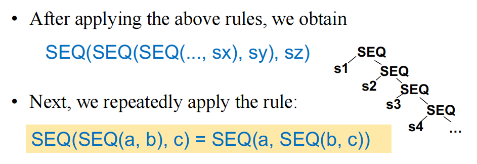

直接提取 s1, s2,s3,s4,s5... 便可（注意 s 不可包含 SEQ/ESEQ nodes）

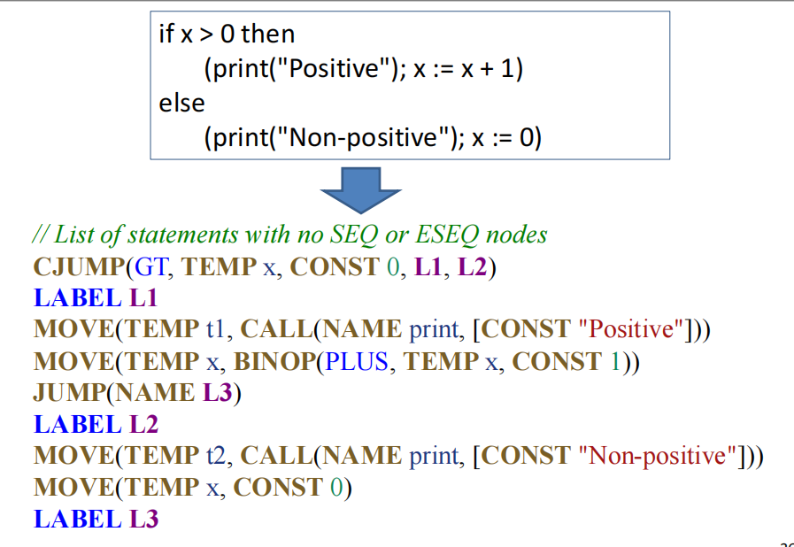

## Step 2&3: Taming Conditional Branches

**CJUMP** 的问题：大多数 machine 都没有 two-way branch counterpart

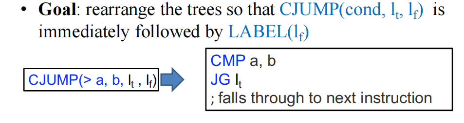

解决方案：

- Form a list of canonical trees into basic blocks
- Order the basic blocks into traces

### Basic Blocks

Group statements into sequences with no internal jumps/labels .

明确 Basic Block 概念：是 a sequence of statements that

- Is always entered at the beginning
- Is always exited at the end
- Has not internal jumps or labels

Control flow graph (CFG)：其结点为 basic blocks，边为 blocks 之间的 jump 关系：

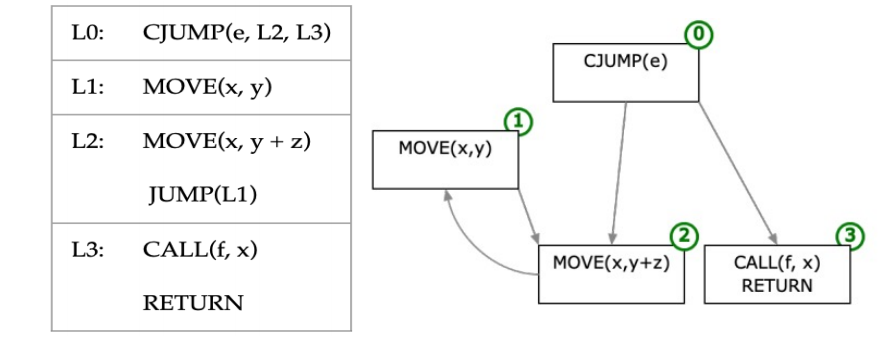

如何构建 basic block 呢？

1. Scan the statement list from beginning to end
2. When a **LABEL** is found, start a **new block**
3. When a **JUMP** or **CJUMP** is found, **end** the current block
4. If a block doesn't end with JUMP or CJUMP, **add a JUMP** to the next block
5. If a block doesn't start with a LABEL, add one

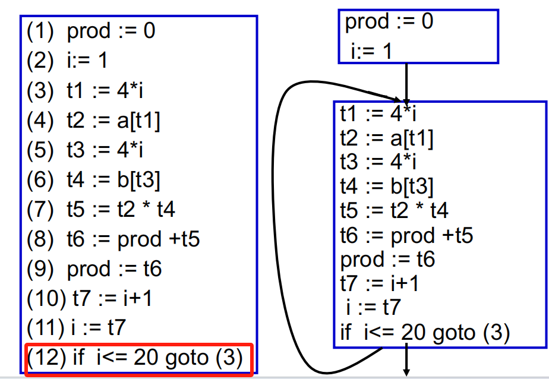

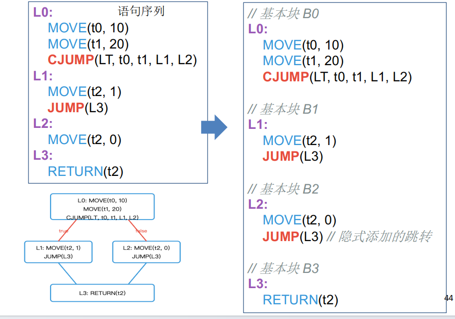

### Traces

Order basic blocks so every CJUMP is followed by its false label 以此解决前面提到的问题。

Trace 意为 **:** A sequence of statements that could be consecutively executed during program execution.

#### Basic Block Reordering

为了更好的 instruction caching 来进行基本块重排：

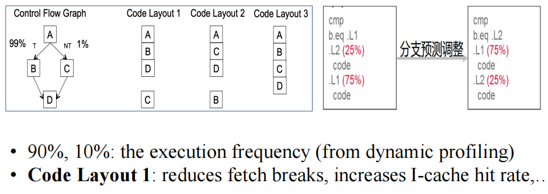

由于 从 A 跳转到 B 的概率更高，所以 layout 1 更利于指令 hit。

#### Trace Generation

目的：generating a covering set of traces

- Each trace is loop free
- Each block must be in exactly one trace

贪心算法：

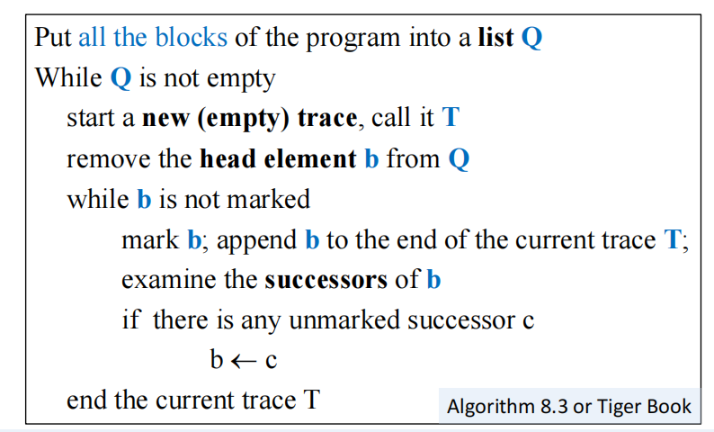

首先是对CFG的深度遍历：

- 从某个basic block开始，往后继节点遍历，标记每个被访问的basic block并将其附加到当前trace中
- 当到达某个basic block, 其后继节点均已标记, 这个trace就算完了
- 选择一个未标记的basic block作为下一个trace的起点

不断迭代，直到所有 basic block 都被标记。

如下：$a\rightarrow b\rightarrow c\rightarrow e$ ，由 e 跳转回 b，发现 b 已被标记，故结束 trace

……

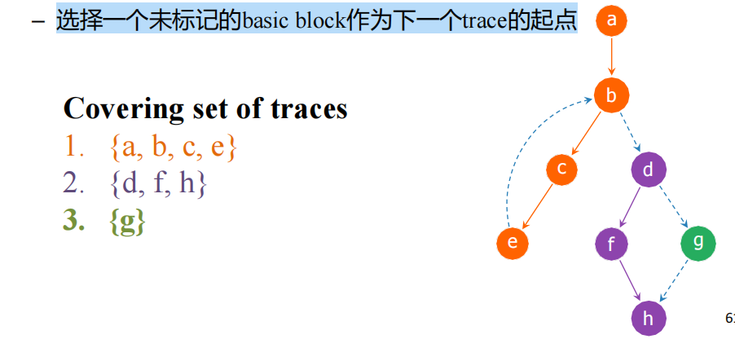

在根据上面的算法构建好 trace 后，许多 CJUMP 后面都会跟着其 false label 了，但是还需要保证所有 CJUMP 都满足该条件：

- CJUMP immediately followed by its false label：不管

- CJUMP followed by its **true label** ：交换 true label 和 false label ，并 negate condition

  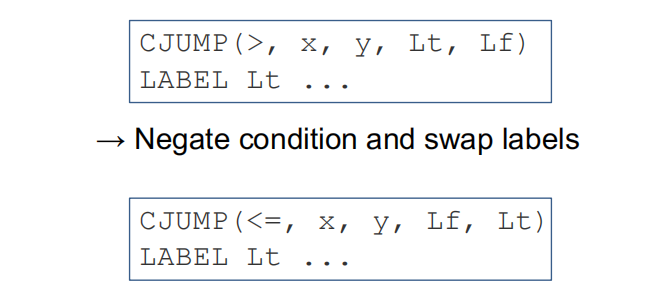

- CJUMP(cond, a, b, lt, lf) followed by neither label

  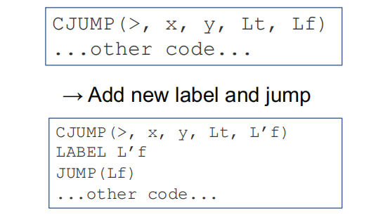

对 Optimal Traces 的讨论：

- Hot Path Prioritization：将频繁被执行的 blocks 放在同一 trace
- Locality Enhancement：Keep related code together in memory
- Jump Minimization：减少无条件跳转的次数

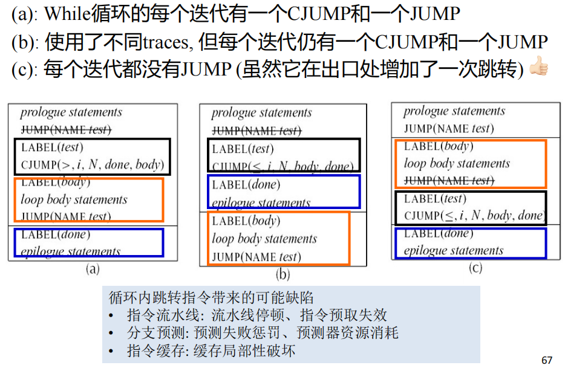

c 是最好的。