# Instruction Selection

指令选择用于将 Canonical IR code 转化成 abstract assembly code

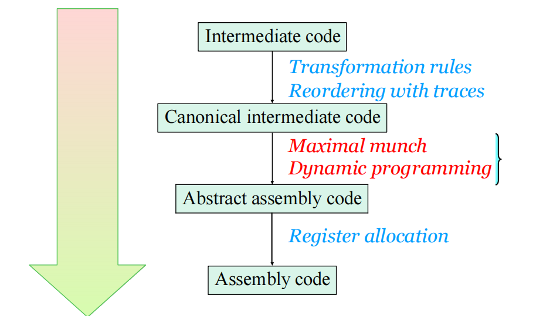

## Overview of  Instruction Selection

什么是 Abstract assembly

- assembly with infinite registers  无限个寄存器
- Invent new temporaries for intermediate results  用临时变量存储中间值
- Map to actual registers later

需要解决的关键问题：

- How do we represent the capabilities of machine instructions?
- How do we cover an IR tree with available instructions?
- How do we find the best (least cost) covering?

指令选择的本质：“pattern matching”

### Tree Covering

**Jouette Instruction Set**

- RISC-style, load/store architecture
- Data or address can reside in registers and Each instruction can access any register
- r_0 寄存器总是存0
- 除 MOVEM 外，所有指令都有 1cycle 的延迟
- 每个 cycle 只执行一条指令

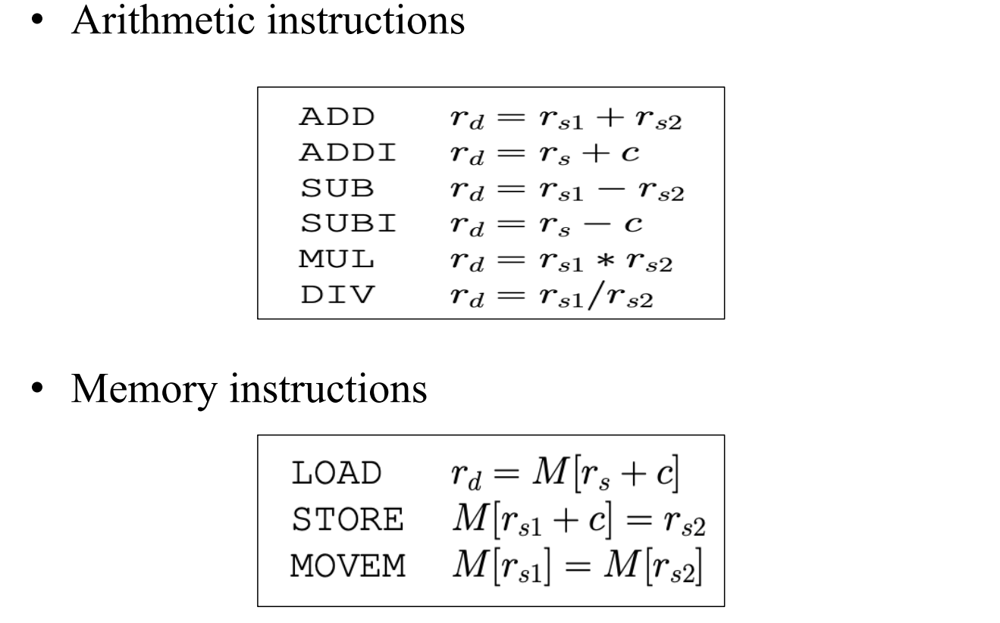

**Tree pattern**

- 可匹配一部分 IR Tree 的一个模板，每个 pattern 对应一条机器指令
- 一个 Tree pattern 也被称为 “a **tile** ”

将IR与后端的机器指令都转换为树结构。这样就把指令选择问题转换为机器指令树覆盖全IR Tree的问题。

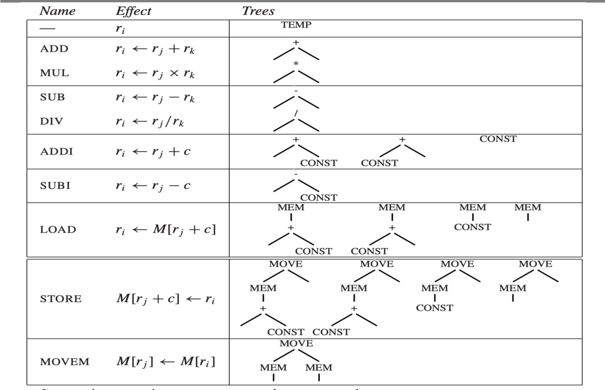

- 有些指令对应不止一个 tree pattern
- 常量（CONST）节点和临时（TEMP）节点的实际值并不总是会显示出来

**Tiling** : 用一组互不重叠的树模式来 cover IR Tree

$a[i] := x$，假设 i 在寄存器中，a 和 x 在栈帧中。即 $M[a + i * 4] := x$，每个元素占用4个存储单元:

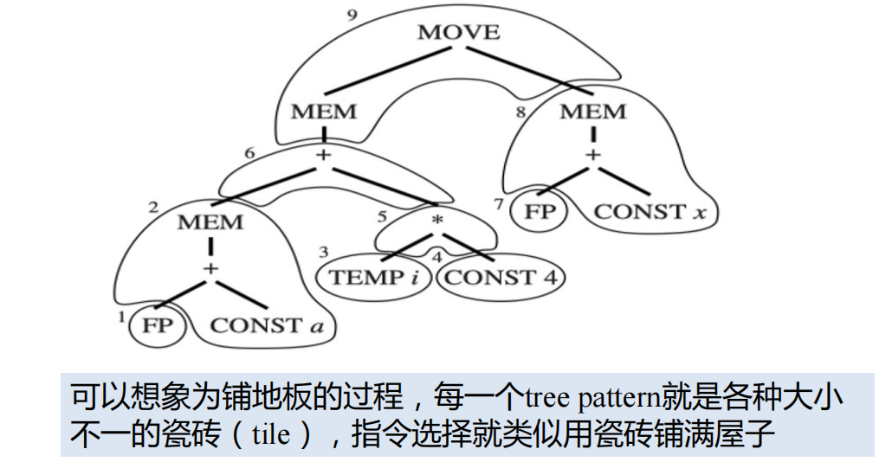

Tile 1, 3, and 7 并不对应任何机器指令，因为它们只是（虚拟）寄存器（临时变量），但是这些 tile 可以帮助覆盖 tree.

中间表示（IR）树在每个树节点中仅表示一种操作（例如，获取、加法），但一条实际的机器指令可以执行几种基本操作。如：memory load

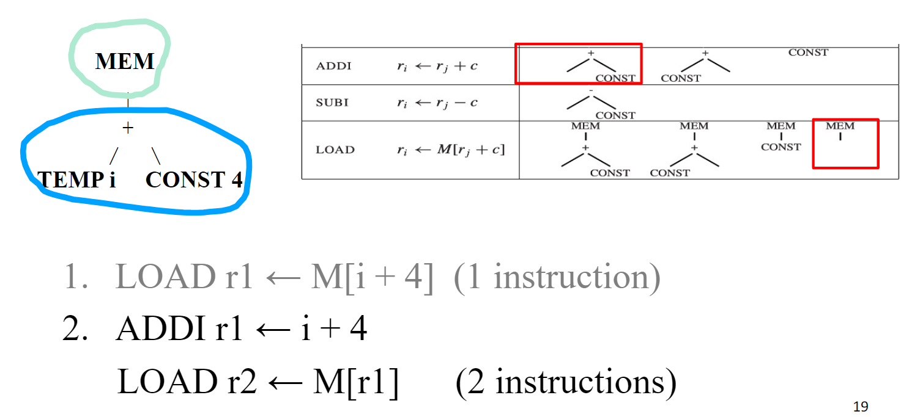

另一种策略：总是可以用微小的 tile 来覆盖这棵树，每个 tile 仅覆盖一个节点。

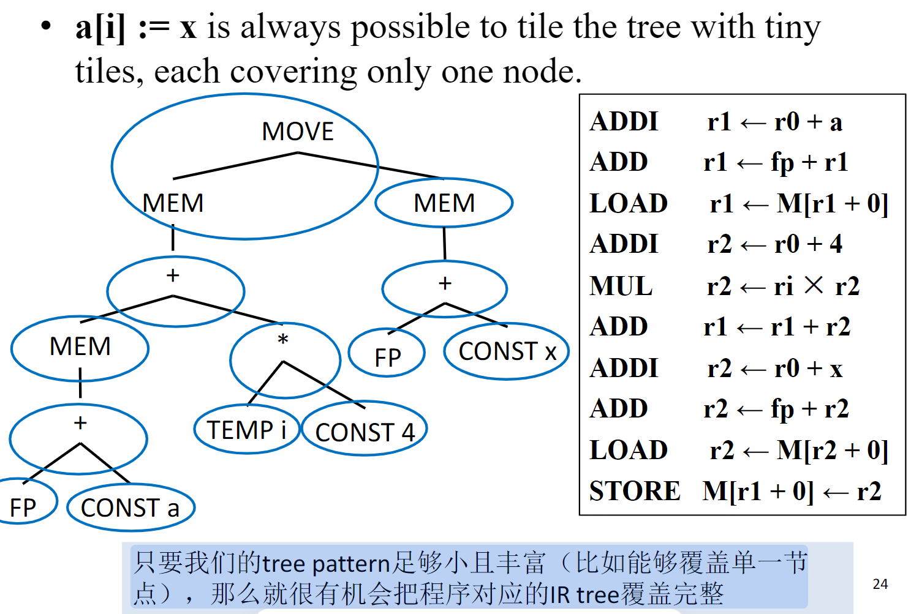

### Optimal and Optimum Tilings

Criteria: 

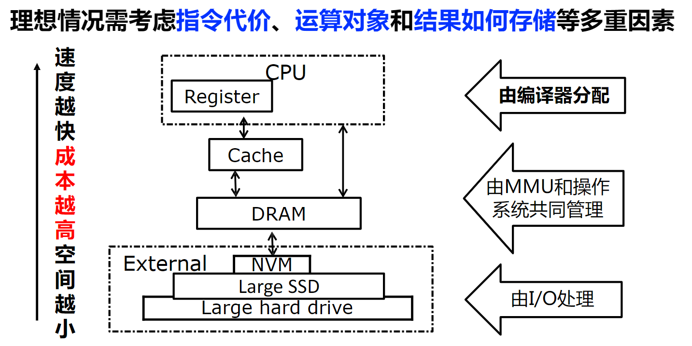

- good selection of tiles
  - tile 越小就越好覆盖树
  - tile 越大所需指令就越少

**Optimum tiling** 是全局最好，**Optimal tiling** 是局部最好。假设除 MOVEM 需要 m 个 units，其它指令都只要 1 个 unit：左边是全局最优，右边是局部最优

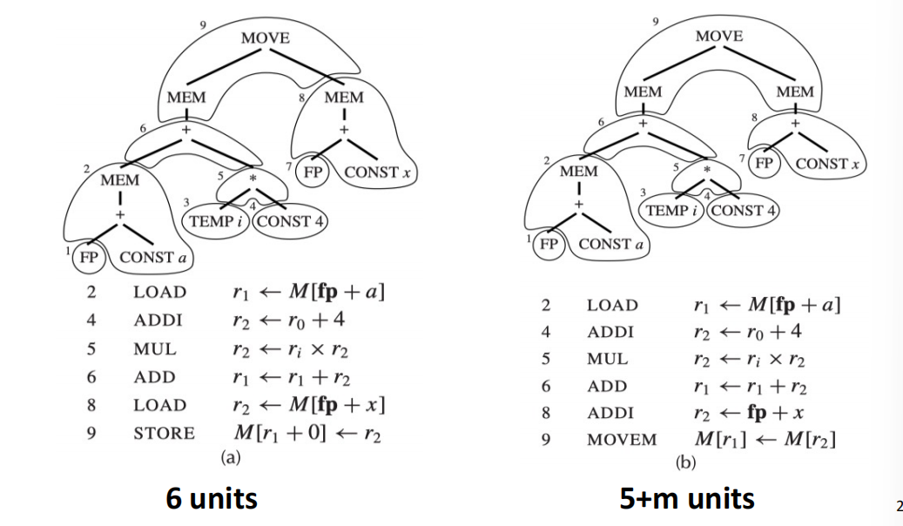

实际上，指令并非是独立存在且具有可单独归属的成本的，如相邻指令可相互作用。而“Optimum tiling” 是一种理想化模型，真实的 cost 影响因素有Pipeline interactions、Register allocation effects、 Cache behavior、 Instruction scheduling opportunities……

## Algorithms for Instruction Selection

### Maximal Munch

- Basic assumption: **larger tiles = better**
- “large” 意味覆盖结点多
- Main idea: Start from **top** of tree，使用与树匹配的最大 tile （如果有两个及以上的相等 size 的 tile，随机选或基于 cost 选）。递归地平铺剩余的子树（同一高度，先左树再右树，高度优先）

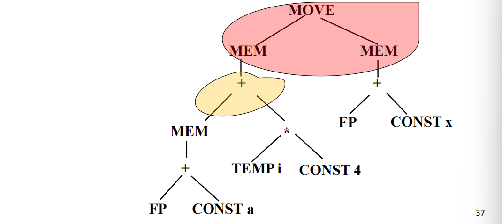

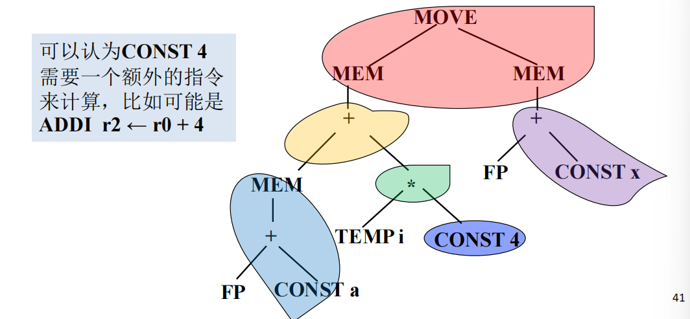

- 进行后序遍历树；按照与节点相关的顺序处理子节点
- 按顺序发出与各个 tile 相对应的代码序列
- 通过使用相同的寄存器名称将边界连接在一起

得到指令码（后序遍历：先左右再根，tree结构按照覆盖以后的来，每个覆盖看作一个node）：

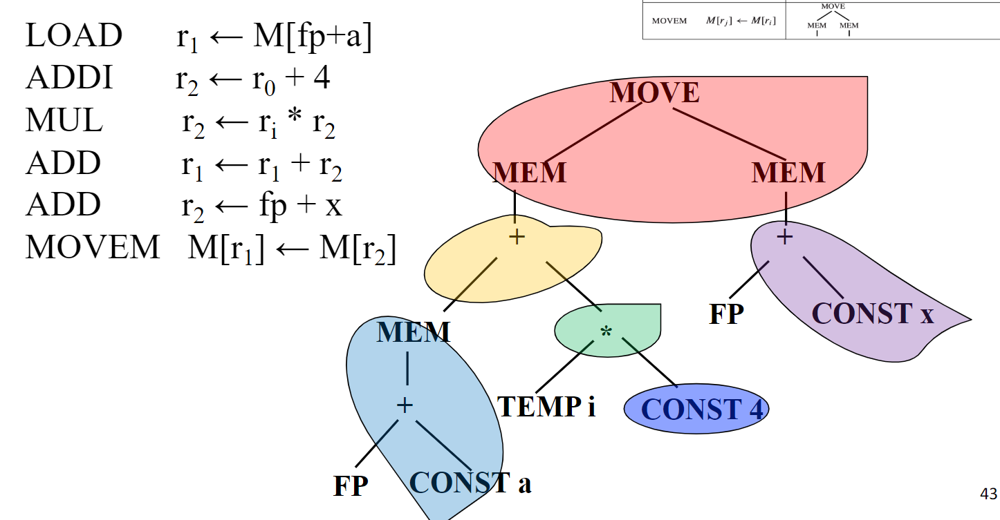

Maximal Munch 是 greedy 的 -- always picks the largest possible pattern at each point

### Dynamic Programming

- Goal: find **minimum** total cost tiling of tree

- IR tree 的每个 node 都有 cost ：对于每个 cost 为 $c_t$ 的 tile t，tile t 匹配结点 n，结点 n 匹配 t 的 cost 为：

  
  $$
  c_t+\sum_{all~leaves~i~of~t}{c_i}
  $$

- Goal: find cost of best instruction sequence that can tile subtree rooted at node

算法：bottom-up 执行

- 递归地计算每个子树的 optimal tiling 的 cost
- 对于每个 node，考虑所有可能匹配的 tile
- 成本计算，选择最小 cost

对每个 node，计算 (a,b) pair:

- a is the minimum cost of a node
- b is the optimal instruction

例：MEM(PLUS(CONST(1), CONST(2)))

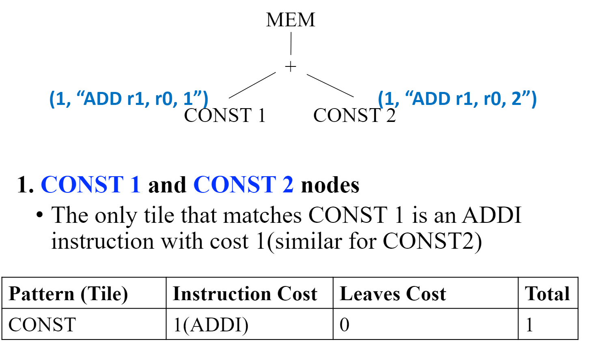

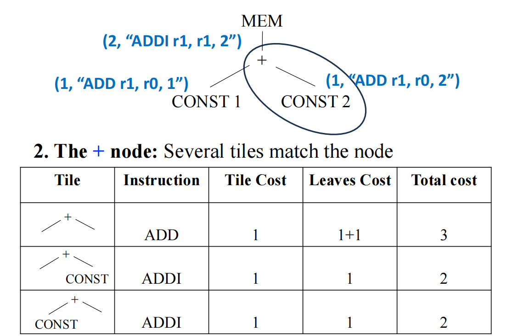

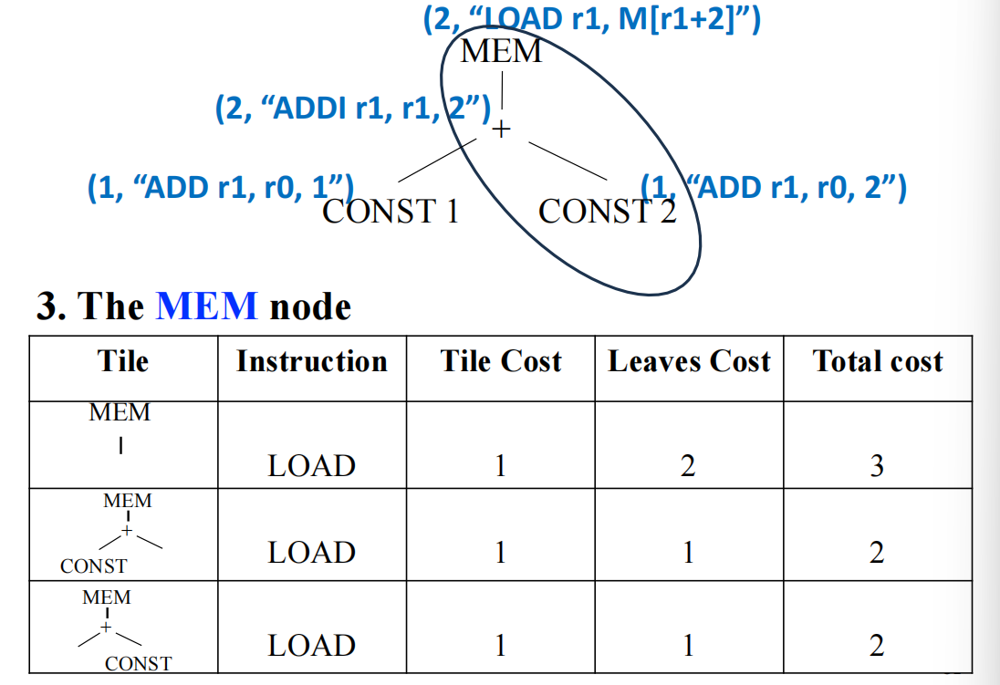

代码生成：一旦 root node 的 cost 被计算出来，代码生成启动

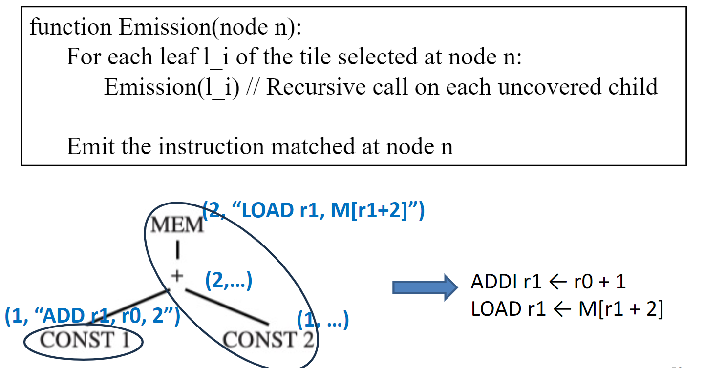

从 root 开始，其有一个 leaf CONST 1，故 Call Emission(CONST 1) ，而 CONST 1 没有 leaf，所以释放其指令，返回函数到 Emission(MEM)，由于其 leaf 结点已被处理， 所以释放其指令。

Tiling Algorithm 的 efficiency 计算：

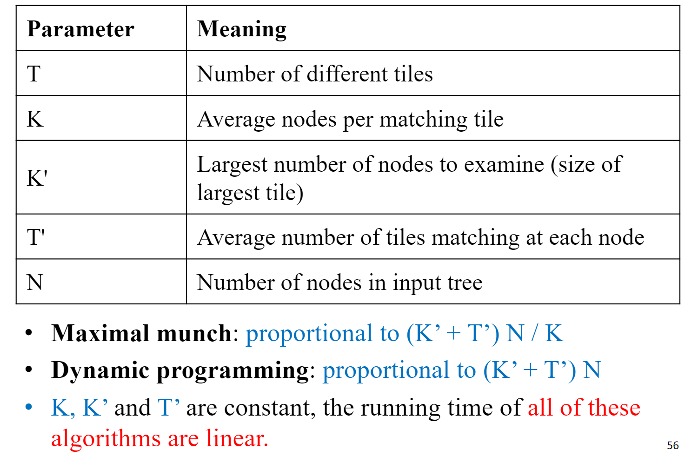

### Tree Grammar

对于具有复杂指令集以及多种类型寄存器和寻址模式的机器来说，很难使用简单的 tree pattern 和 tiling 算法。

**Goal** ：“**instruction selector generators!**”

- Define tiles in a separate specification
- Use a generic tree pattern matching algorithm to compute tiling Motivation

**Solution** ：

- Use a tree grammar (a special context-free grammar) to describe the tiles
- Reduce instruction selection to a **parsing problem**
- Use a generalization of the dynamic programming algorithm for the “parsing” Instruction Selection via Tree Grammars

……待续