# 卷积神经网络

## 1. 多层感知机的限制

- 输入是一维向量 $x \in \mathbb{R}^{1*d}$的情况下，权重 $W\in \mathbb{R}^{h*d}$ (h为向量 $h$ 的大小)只需要为二维张量:

  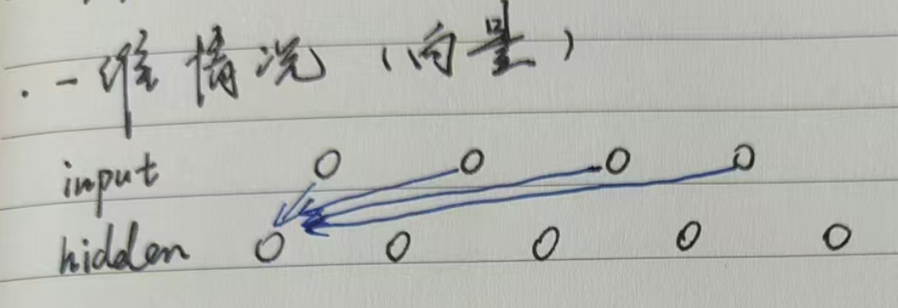

> ​	$h_j = \sum_{j}{W_{i,j}{x_j}} + b_j$

- 在输入是二维图像 $X$ 的情况下，隐藏层表示 $H$ 在数学上是一个矩阵，在代码中表示为二维张量。使用 $[X]_{i,j}$ 和 $[H]_{i,j}$ 分别表示输入图像和隐藏表示中位置 $(i,j)$ 处的像素。此时要求权重 $W$ 为一个四维张量：

  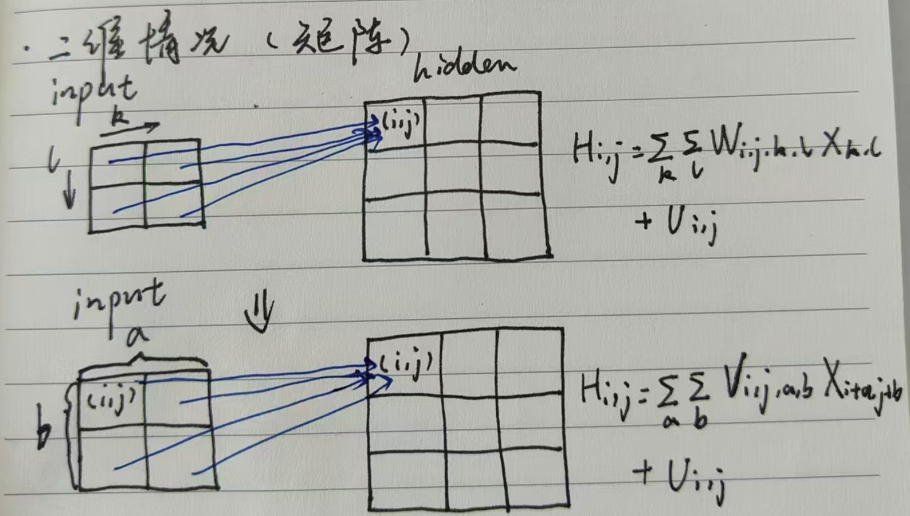

  为了节省参数（避免参数随着输入变大而变得无限多），我们假设有一个”检测器“扫描图像，将图像分割成多个区域(blocks)，并为每个区域包含目标的可能性打分。而索引a和b通过在正偏移和负偏移之间移动覆盖了整个图像，对于隐藏表示中任意给定位置 $( i , j )$ 处的像素值 $[H]_{i,j}$ , 通过对 $X$ 中以 $(i,j)$ 为中心的像素进行加权求和得到，权重为 $v_{i,j,a,b}$ , 实现了 ”检测器“ 功能。

  其中，从 $W$ 到 $V$ 的转化至少形式上的转化，这两个四阶张量的元素之间存在一一对应的关系：
  
  
  
  $$
  [V]_{i,j,a,b} = [W]_{i,j,i+a,j+b}
  $$


### 1.1 平移不变性 Translation Invariance

​	检测对象在输入 $X$ 中的平移，应该仅导致隐藏表示 $H$ 中的平移。也就是说不管出现在图像中的哪个位置，神经网络的底层应该对相同的图像区域做出类似的响应。

​	但如公式 $h_{i,j} = \sum_{a,b}{v_{i,j,a,b}{x_{i+a,j+b}}}$ 所示，$i，j$的变化会导致 权重 $v$ 发生变化，使得到的 $h$ 也发生变化，违反了平移不变性。

​	所以，$v$ 不应该依赖于 $(i,j)$，定义：$v_{i,j,a,b} = v_{a,b}$，得到：


$$
h_{i,j} = \sum_{a,b}{v_{a,b}}{x_{i+a,j+b}}
$$
​	

这就是2维交叉相关，增加了重复性，减少参数数量，降低了模型复杂度


### 1.2 局部性

​	神经网络的底层应该只探索输入图像中的局部区域，而不考虑图像远处区域的内容。为了收集用来训练参数 $[H]_{i,j}$ 的相关信息，

在 $|a|> \Delta$ 和 $|b| > \Delta$ 的范围之外，我们可以设置 $[V]_{a,b} = 0$，故将公式重写为：


$$
[H]_{a,j} = u + \sum_{a = -\Delta}^{\Delta}\sum_{b = -\Delta}^{\Delta}[V]_{a,b}[X]_{i+a,j+b}
$$
​	

​	$V$ 被称为**卷积核**（convolution kernel）或者**滤波器**（filter），亦或简单地称之为该卷积层的**权重**.


## 2 卷积层

核矩阵和偏移是可学习的参数，核矩阵的大小是**超参数**

### 2.1 二维交叉相关

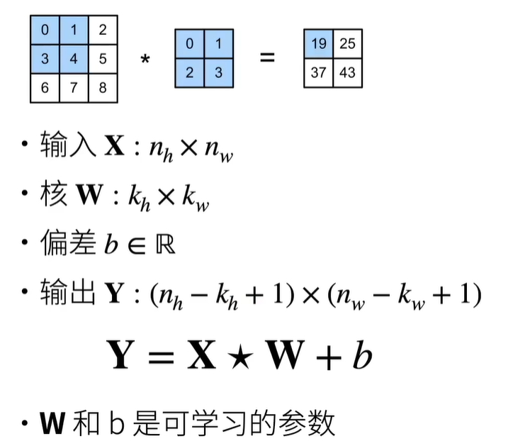

### 2.2 一维和三维交叉相关

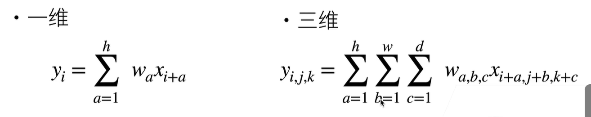

- 一维可以做文本、语言和时序序列
- 三维可以做视频、医学图像和气象地图

### 2.3 代码实现

见 [李沐学ai对应章节]([6.2. 图像卷积 — 动手学深度学习 2.0.0 documentation](https://zh-v2.d2l.ai/chapter_convolutional-neural-networks/conv-layer.html#id4))


## 3. 填充(Padding)与步幅(Stride)

### 3.1 Padding

​	在应用多层卷积时，我们常常丢失边缘像素。 由于我们通常使用小卷积核，因此对于任何单个卷积，我们可能只会丢失几个像素。 但随着我们应用许多连续卷积层，累积丢失的像素数就多了。 解决这个问题的简单方法即为填充（padding）：在输入图像的边界填充元素（通常填充元素是0）。

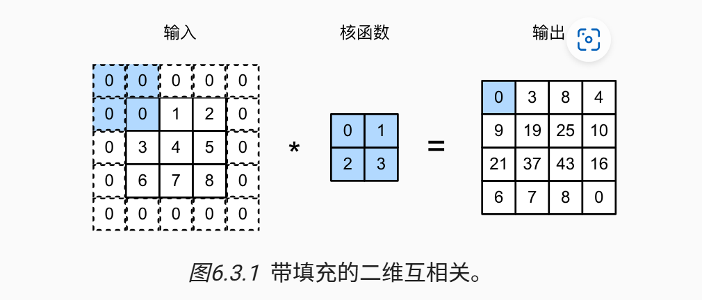

如果添加 $P_h$ 行填充（一半顶部一半底部），$P_w$列填充（一半左侧一半右侧），那么输出大小为：


$$
(n_h - k_h+p_h+1)\times(n_w-k_w+p_w+1)
$$


所以，为了使得输出不丢失边缘像素，我们设置 $p_h = k_h-1$ 和 $p_w = k_w-1$，使输入和输出具有相同的高度和宽度。

- 假设 $k_h$是奇数，我们将在高度的两侧填充 $p_h/2$ 行
- 如果 $k_h$ 是偶数，则一种可能性是在输入顶部填充 $⌈p_h/2⌉$ 行，在底部填充 $⌊p_h/2⌋$ 行。同理，我们填充宽度的两侧。

### 3.2 Stride

步幅用于减少输出大小。

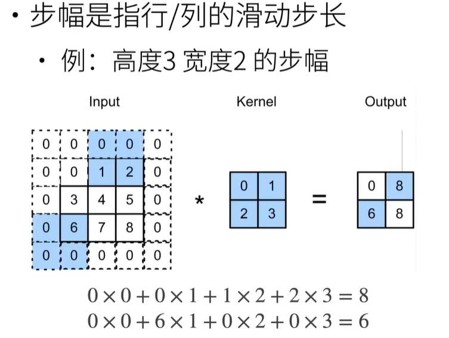

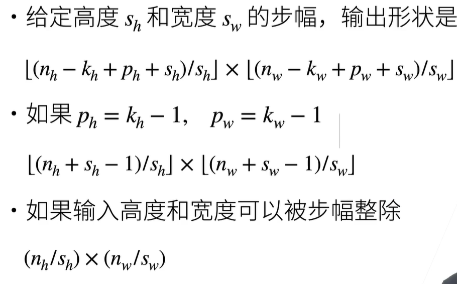

​	上面两种情况是为了向上取整。

### 3.3 代码实现

```python
import torch
from torch import nn


# 为了方便起见，我们定义了一个计算卷积层的函数。
# 此函数初始化卷积层权重，并对输入和输出提高和缩减相应的维数
def comp_conv2d(conv2d, X):
    # 这里的（1，1）表示批量大小和通道数都是1
    X = X.reshape((1, 1) + X.shape)
    Y = conv2d(X)
    # 省略前两个维度：批量大小和通道
    return Y.reshape(Y.shape[2:])

# 请注意，这里每边都填充了1行或1列，因此总共添加了2行或2列
conv2d = nn.Conv2d(1, 1, kernel_size=3, padding=1)
X = torch.rand(size=(8, 8))
comp_conv2d(conv2d, X).shape
```

结果为：`torch.Size([8, 8])`，因为8-3+1+2 = 8

当卷积核的高度和宽度不同时，我们可以填充不同的高度和宽度，使输出和输入具有相同的高度和宽度：

```python
conv2d = nn.Conv2d(1, 1, kernel_size=(5, 3), padding=(2, 1))
comp_conv2d(conv2d, X).shape
```

结果同上，因为8-5+1+2x2 = 8，8-3+1+1x2 = 8.


我们将高度和宽度的步幅设置为2，从而将输入的高度和宽度减半：

```python
conv2d = nn.Conv2d(1, 1, kernel_size=3, padding=1, stride=2)
comp_conv2d(conv2d, X).shape
```

结果为 `torch.Size([4, 4])`，(8-3+1+1*2)/2 = 4.

接下来是一个稍微复杂的例子：

```python
conv2d = nn.Conv2d(1, 1, kernel_size=(3, 5), padding=(0, 1), stride=(3, 4))
comp_conv2d(conv2d, X).shape
```

答案为 `torch.Size([2, 2])`，(8-3+1+0*2)/3 = 2, (8-5+1+1x2)/4 = 2（向上取整）


## 4. 多输入多输出通道

### 4.1 多输入通道

​	当输入包含多个通道时，需要构造一个与输入数据具有相同输入通道数的卷积核，以便与输入数据进行互相关运算。

​	假设通道数为 $c_i$，那么卷积核的大小为 $c_i \times k_h\times k_w$

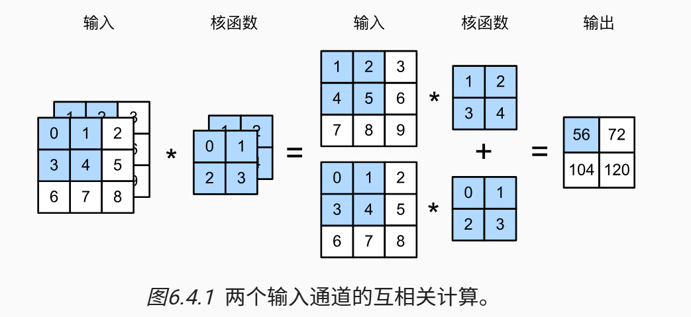

### 4.2 多输出通道

​	到目前为止，不论有多少输入通道，我们还只有一个输出通道。在最流行的神经网络架构中，随着神经网络层数的加深，我们常会增加输出通道的维数，通过减少空间分辨率以获得更大的通道深度。直观地说，我们可以将每个通道看作对不同特征的响应。

​	用 $c_i$ 和 $c_o$ 分别表示输入和输出通道的数目，为了获得多个通道的输出，我们可以为每个输出通道创建一个形状为 $c_i \times k_h\times k_w$ 的卷积核张量，最终：

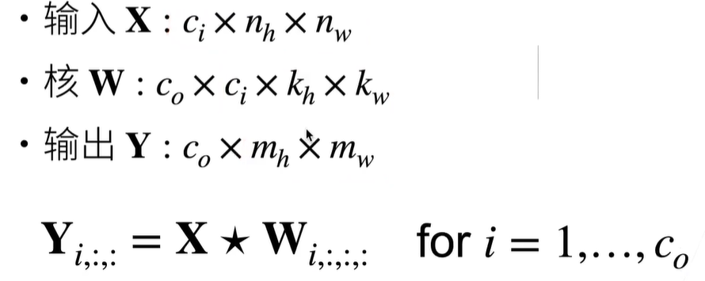

### 4.3 1 $\times$ 1卷积层

​	不识别空间模式，只是融合通道：

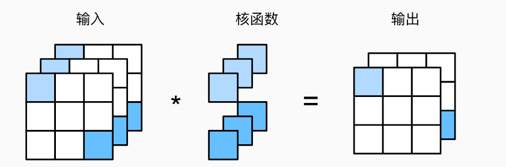

### 4.4 代码实现

实现多输入通道互相关运算，即对每个通道执行互相关操作，然后将结果相加。

```python
import torch
from d2l import torch as d2l

def corr2d_multi_in(X, K):
    # 先遍历“X”和“K”的第0个维度（通道维度），再把它们加在一起
    return sum(d2l.corr2d(x, k) for x, k in zip(X, K))

X = torch.tensor([[[0.0, 1.0, 2.0], [3.0, 4.0, 5.0], [6.0, 7.0, 8.0]],
               [[1.0, 2.0, 3.0], [4.0, 5.0, 6.0], [7.0, 8.0, 9.0]]])
K = torch.tensor([[[0.0, 1.0], [2.0, 3.0]], [[1.0, 2.0], [3.0, 4.0]]])

corr2d_multi_in(X, K)
#output：
#tensor([[ 56.,  72.],
#        [104., 120.]])
```

实现计算多个通道的输出的互相关函数：

```python
def corr2d_multi_in_out(X, K):
    # 迭代“K”的第0个维度，每次都对输入“X”执行互相关运算。
    # 最后将所有结果都叠加在一起
    return torch.stack([corr2d_multi_in(X, k) for k in K], 0)

K = torch.stack((K, K + 1, K + 2), 0)
K.shape
#K从3个维度变成4个维度：输出是3，输入是2，宽高为2*2
#torch.Size([3, 2, 2, 2])
corr2d_multi_in_out(X, K)

#tensor([[[ 56.,  72.],
#         [104., 120.]],

#        [[ 76., 100.],
#         [148., 172.]],

#        [[ 96., 128.],
#         [192., 224.]]])

```

使用全连接层实现$1\times1$卷积:

```python
def corr2d_multi_in_out_1x1(X, K):
    c_i, h, w = X.shape
    c_o = K.shape[0]
    #变成c_i个大小为h*w的向量
    X = X.reshape((c_i, h * w))
    K = K.reshape((c_o, c_i))
    # 全连接层中的矩阵乘法
    Y = torch.matmul(K, X)
    return Y.reshape((c_o, h, w))

#验证
X = torch.normal(0, 1, (3, 3, 3))
K = torch.normal(0, 1, (2, 3, 1, 1))

Y1 = corr2d_multi_in_out_1x1(X, K)
Y2 = corr2d_multi_in_out(X, K)
assert float(torch.abs(Y1 - Y2).sum()) < 1e-6
```

## 5. 池化层

pooling具有双重目的：降低卷积层对位置的敏感性，同时降低对空间降采样表示的敏感性

### 5.1 最大汇聚层和平均汇聚层

池运算是确定性的，我们通常计算汇聚窗口中所有元素的最大值或平均值.

- maximum pooling：获取每个窗口中最强模式信号

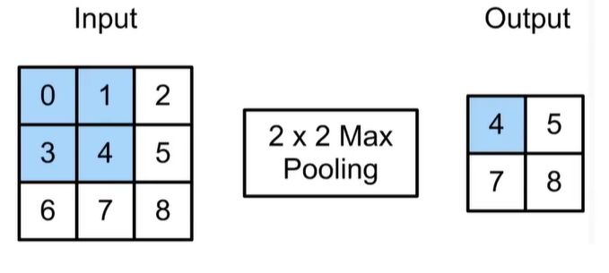

- average pooling：获取每个窗口中平均模式信号

### 5.2 填充与步幅

与卷积层一样，汇聚层也可以改变输出形状。和以前一样，我们可以通过填充和步幅以获得所需的输出形状。

但是池化层没有可学习的参数，kernel是固定的；且不可融合通道，输入通道数 = 输出通道数

### 5.3 代码实现

