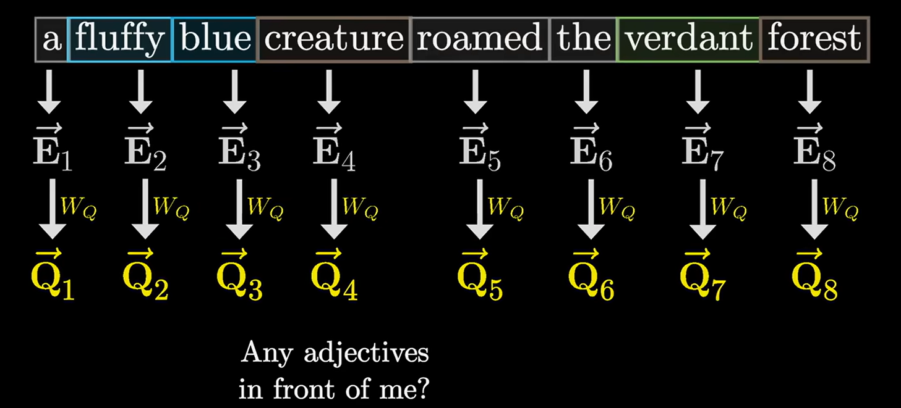
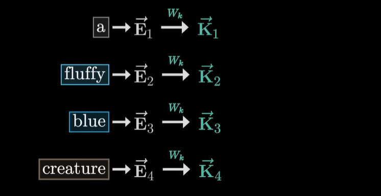
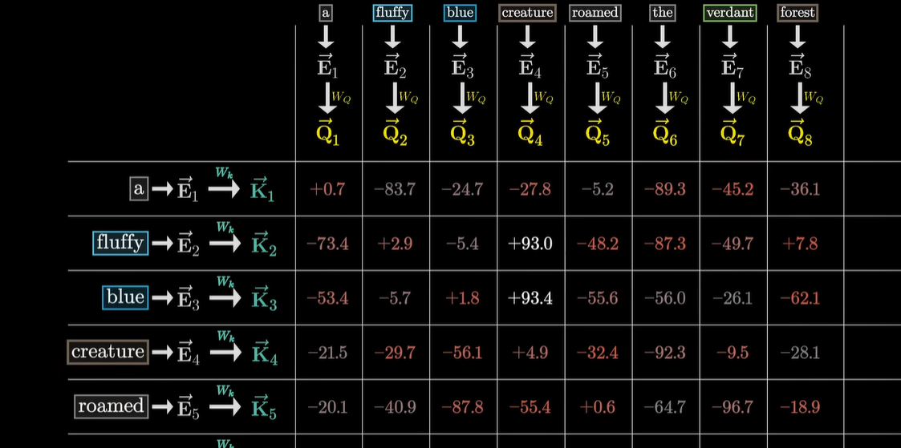
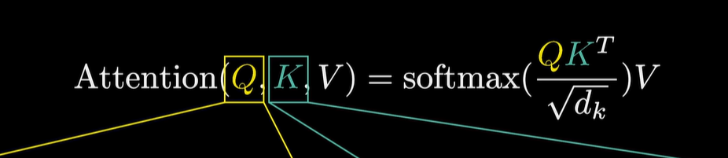
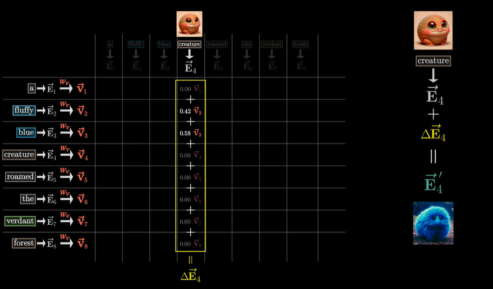
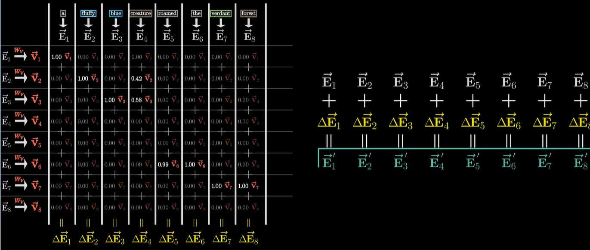
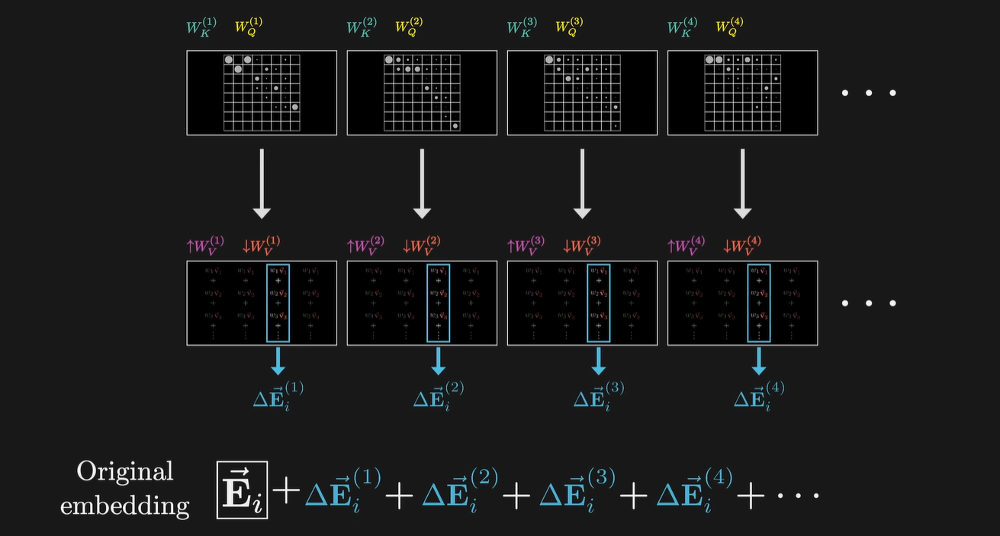

# Transformer

输入的sentence中，每个词会转化为词向量 $\vec{E_n}$ ，代表词在无上下文介入情况下的一个原始含义。在下例中，我们只关注名词被修饰的情况

- 权重矩阵 $W_Q$ 将词向量转化为 query $\vec{Q_n}$ （实际上将Embedding 降维了，映射到一个更低维的空间），query 代表的含义是名词 询问前面是否有形容词来修饰自己，以得到该名词在上下文语境中的真实含义

- 权重矩阵 $W_k$ 将词向量转化为 key $\vec{K_n}$ （映射到与query相同的低维空间），视其为“想要回答query”，当key与query的方向对齐时，就认为它们相匹配。例如 `fluffy` 和 `blue` 对应的key就会与 `creature` 对应的query相匹配。

  

- 因此，将所有的key与query作点积，得到的分数代表每个词与更新其它词含义有多相关，越大说明越相关，如下面的矩阵：

  

- 得到的分数需要逐列进行 softmax 归一，其中，为了消除下文对词义的影响（在transformer中只考虑上文），矩阵下三角全部设为 $-\infty$ ，在softmax中会归一化为0（masking）。这样，矩阵本身就成为一个权重矩阵：

  

- 权重矩阵 $W_V$ 将词向量转化为 value $\vec{V_n}$ （不是降维，value与embedding处于同一个维度空间），value与key对应，将value与得到的权重矩阵对应列向量相乘，再加上原始词向量，得到更新后的词向量，代表该词在句子中的含义

  

  

上述讨论的是 one-head attention，下面来介绍 multi-head attention. 多头注意力中，存在多个 $W_K,W_Q,W_V$ 矩阵，分别生成不同的注意力模式(可以并行)，表示对每个输入token的不同处理：

