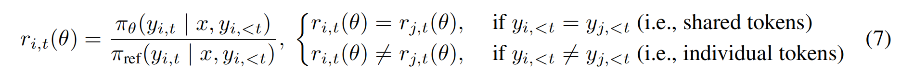

# ARPO

ARPO 主要用于需要与外部环境（如搜索引擎、代码解释器、编译器等工具，被称为  Tool-Integrated Reasoning(TIR)）进行复杂连续多轮交互的 LLM。其核心在于：如何有效地训练LLM智能体，使其能够在动态的“智能体-环境”互动循环中做出最优的序贯决策。

## 介绍

GRPO & DAPO 的局限：将 agent 与环境交互的整个多步骤、多工具调用的轨迹——从接收问题到输出最终答案——视为一个单一、不可分割的样本单元，并基于最终结果为其分配一个整体性的奖励信号 。这忽略了 agent 与工具交互后的关键时刻，模型需要根据新的外部信息做出精准的下一步判断。

agentic RL : 训练目标公式为：

其中 T 表示可用工具集，r 为奖励函数。

在推理过程中融入了工具调用反馈，推演采样可分解为：

其中 R 为推理轨迹，与工具调用反馈交织在一起，y是最终生成答案。

初步实验：引入 token entropy 以量化模型在生成下一个 token 时的不确定性，公式如下：

其中 V 是词表，$p_{t,j}$ 是在时间步 t 生成第 j 个词的概率。高熵值意味着模型对下一步的预测分布非常分散，即不确定性高。

通过可视化LLM在执行任务过程中的 token entropy ，研究人员观察到了一个一致且显著的现象：每当LLM调用外部工具并接收到返回信息后，其紧接着生成的初始 token 序列会表现出熵值的急剧飙升 。

、

## method

### Entropy-based Adaptive Rollout

如何将熵信号转化为具体采样动作？

- Rollout Initialization : 设 global rollout size 为 M，其中，N 个名额用于初始的全局轨迹采样，而剩余的 M−N 个预算则保留给后续的自适应分支 。模型首先根据给定问题生成 N 条完整的推理轨迹。对于每条轨迹，计算其前 k 个 token 的初始熵，形成一个基准熵矩阵 $H_{initial}\in R^{1\times k}$

- Entropy Variation Monitoring : 按照公式2的定义，借助工具进行能动性推理。允许模型在拼接工具调用的响应后再生成 k 个额外标记。对于 tool-call step t，计算一个 step-level 的entropy matrix，记为 $H_t\in R^{1\times k}$ ，再量化其相对初始状态的归一化熵变化(归一化指将 $\Delta H$ 所有值求和后除以词汇表大小 V，正值表示工具调用后不确定性增加，赋值反映不确定性降低)：

  

- Entropy-based Adaptive Beaming : 为了鼓励模型沿着展现出有益熵变的工具使用路径进行自适应探索，定义 partial sampling probability at the tool-call step t：

  

  

  利用 $P_t$ 来决定其分支行为：超过阈值，模型启动 Branch (Z)，从当前节点分支产生 Z 条部分推理路径；否则，模型沿着当前轨迹继续推进。

- Termination : 当分叉路径总数 $\hat{Z}$ 达到 M-N 个，停止branch，继续采样直至生成最终答案；如果所有路径在达到 M-N 个之前就已终止，补充 M-N- $\hat{Z}$ 个额外  trajectory-level samples

### Advantage Attribution Estimation

由上一步骤中的 adaptive rollout，我们得到一组既包含共享前缀、又包含不同分支的轨迹集合。应当如何设置奖励函数，能够对共享部分和分支探索都作公正的奖励？

**Hard Advantage Estimation**

- Individual token Parts: The advantage is calculated from its own final reward.

  

- Shared token Parts: The advantage is the average advantage of all its resulting branches.

  

**Soft Advantage Estimation**

在 GRPO 的公式表述中，其数学含义是：策略更新由每组内标记的平均优势引导，而这种平均优势充当着损失信号的角色。

最后设计 **Hierarchical Reward Design** ：

当模型生成正确答案、遵循正确的工具调用格式，并且在推理过程中使用多种工具（即<search>和<python>）, 获得额外奖励 $r_M$ 

### Theoretical Foundation

定义 Micro Action MA 为被 adaptive rollout 部分动态分割的K个片段中的一个片段，$MA_i = <OT_m,OT_{m+1},...,OT_{m+n}>$ ，相应的 micro state $MS_i = <MS_{i-1},MA_{i-1}>$ ，即在该片段之前的所有历史信息。

由此，定义 Generalized Policy Gradient 为：

其中，T 表示宏步骤，$A_T$ 表示优势。

算法总体流程：

- 从数据集中采样一批问题。
- 对于每个问题，首先执行 N 次初始的全局部署，并计算初始熵 H_initial。
- 进入一个 `while` 循环，模拟多轮工具交互过程。
- 在每个工具调用 step t：模型执行工具调用，接收返回结果，并计算熵变化 ΔH_i,t。
- 根据采样概率 Pi,t 决定是否从当前节点进行分支。
- 当满足终止条件（如达到部署预算 M）时，结束部署过程。

- 使用奖励模型为所有 M 条生成的轨迹计算奖励。
- 采用软性优势估计（基于GRPO），为每个令牌计算其优势值 A^i,t。

- 通过最大化GRPO目标函数，对策略模型 πθ 进行多次迭代更新。

重复上述过程，直到模型收敛。

