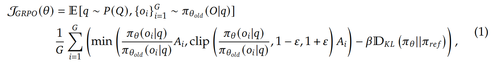
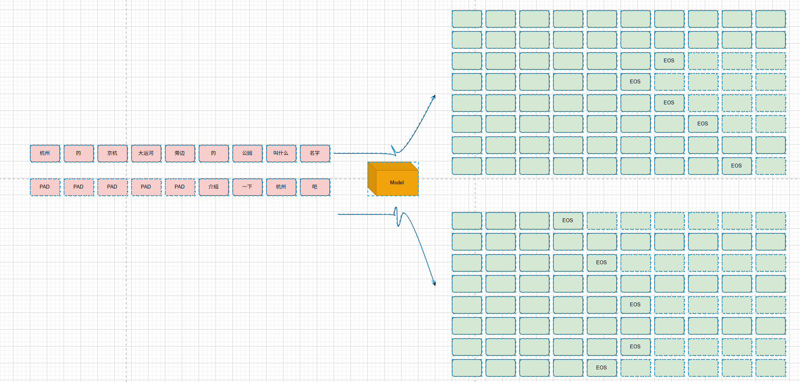
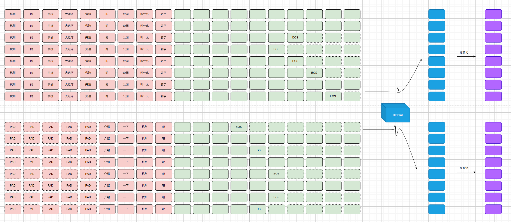
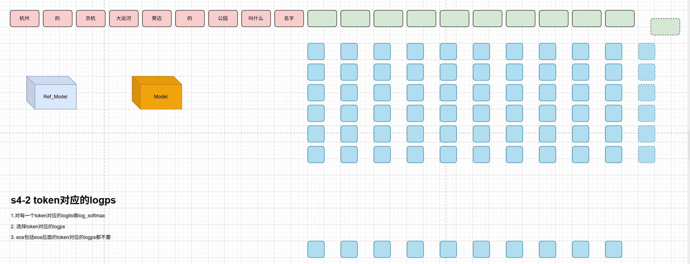
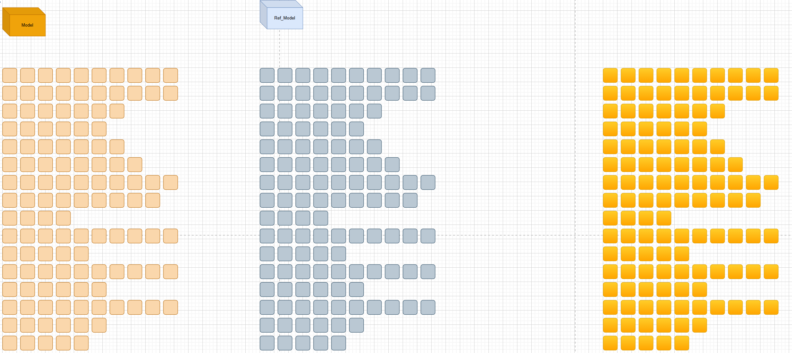
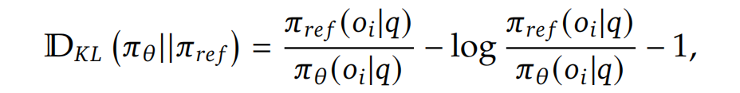
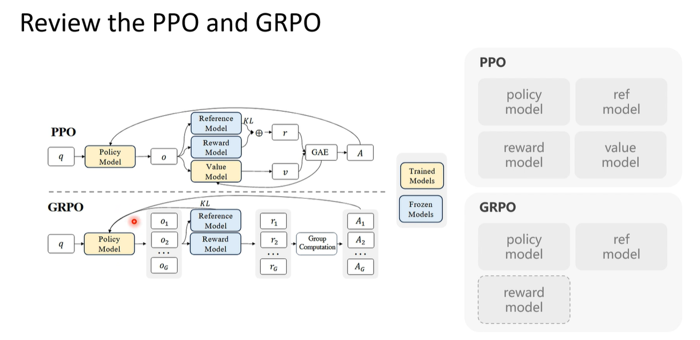

# GRPO

学习视频：[图解deepseek的grpo原理、以debug形式阅读grpo的源码](https://www.bilibili.com/video/BV1wFNCehERn/?share_source=copy_web&vd_source=8bc4361a58e512a692f8a4f137f4154d)

公式(来自 DeepSeek-R1)：

## Completions

Group 意指：同一个问题（prompt 长度要一致，短的 prompt 需要填充），输入 policy model 生成多个回答（回答数量由 rollout 参数决定），形成组。如图，两个问题，分别生成 8 个回答，2 个 group，共 16 个 responses：

## Advantage computation

不再使用 GAE 计算优势，减少了一个 value model 的加载。如图，将每个 group 中的 responses 输入 reward model，得到各自奖励 $r_i$，计算平均值 $mean$，将每个 response 的奖励标准化为 $\frac{r_i-mean}{std}$

##  KL 散度计算

首先将 prompt+response 分别输入 policy model 和 reference model 以获取相应 token 的 logits

然后根据公式计算：

最后对比一下 PPO 与 GRPO 的区别，PPO 需要 value model 以计算 GAE 评估状态优势，而 GRPO 通过 Group Computation 来计算优势：

