# PPO

## 前置知识

### GAE

已知：

$$
Q_\theta=r_t+\gamma*V_\theta(s_{t+1}) \\
$$

$$
A_\theta(s_t,a)=r_t+\gamma*V_\theta(s_{t+1})-V_\theta(s_{t})
$$

$$
V_\theta(s_{t+1}) \approx r_{t+1}+\gamma*V_\theta(s_{t+2})
$$

对优势函数进行多次采样（t 步采样即执行 t 步 action），采样 T 次后：

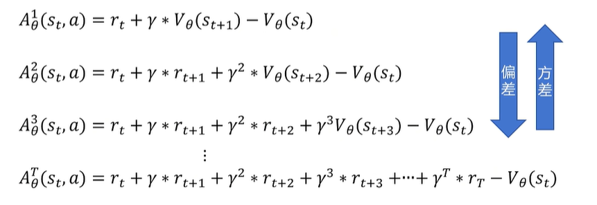

定义 $\delta_t^V=r_t+\gamma*V_\theta(s_{t+1})-V_\theta(s_{t})$ ，表示在第 t 步采取特定动作带来的优势

$\delta_{t+1}^V=r_{t+1}+\gamma*V_\theta(s_{t+2})-V_\theta(s_{t+1})$ ，在第 t+1 步采取特定动作带来的优势

那么将会有：

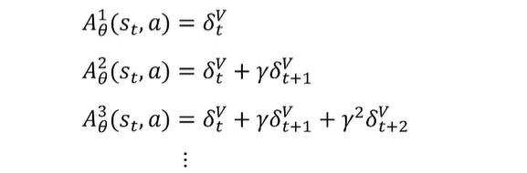

那么采样的时候采样几步好？ Generalized Advantage Estimation(GAE) 的选择是无论采样几步的优势函数全都要（只是会乘权重 $\lambda$ ）：

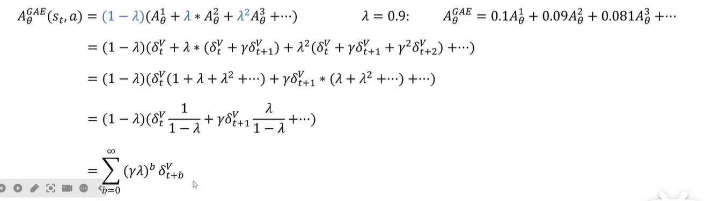

这平衡了采样不同步带来的方差和偏差。

公式变为：$\frac{1}{N}\sum_{n=1}^{N}\sum_{t=1}^{T_n}A^{GAE}_\theta(s_n^t,a_n^t)\nabla logP_\theta(a_n^t|s_n^t)$ , 我们需要最大化该策略梯度，以更新网络参数。

## PPO算法

将 $x\textasciitilde p(x)$ 分布的期望转化为 $x\textasciitilde q(x)$ 的分布的期望，并进行采样：

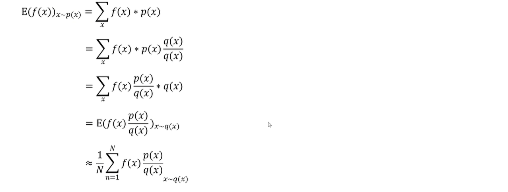

利用 **重要性采样** ，我们可以将 on-policy 的训练变为 off-policy 的训练

> Behavior Policy: 和环境互动产生数据的策略，即在训练过程中做决策
>
> Target Policy: 在行为策略产生的数据中不断学习、优化，即学习训练完毕后拿去应用的策略
>
> 从人类的角度看，为了解决学习中的exploration和exploitation，我们可以利用一个策略（行为策略）来保持探索性，提供多样化的数据，而不断优化另一个策略（目标策略）
>
> On policy：边实践边学习，如 policy-gradient，采样的数据来自更新后的策略，数据不能重复利用（采样数据-更新模型-丢弃旧数据-从新模型采样数据……）简单，但没法同时很好保持即探索又利用
>
> Off policy：算法可以利用其他策略生成的数据来优化目标策略。数据可以复用，可以在保持探索的同时求到全局最优值。如 PPO/GRPO

公式更新（将对 $\theta$ 的分布转化为对 $\theta'$ 的分布）：

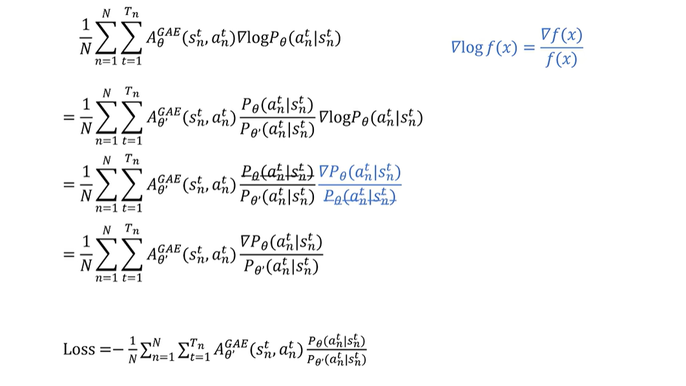

得到 PPO 的 loss 函数，$\theta'$ 为参考策略的网络参数，$\theta$ 为目标训练策略的网络参数，这样我们就可以用参考策略进行数据采样，并且采样数据可以多次训练policy网络，实现 off-policy 算法

但是两个策略相差不能太大，不然就没有参考价值，KL散度用于衡量两个策略的差异，越大则差异越大，我们希望KL散度相对小：

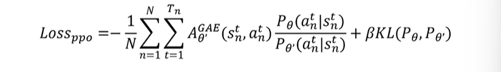

PPO2 通过 clip 函数来调整策略差异：

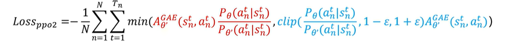

-  $clip(x,a,b)$ ：如果x的值在 [a,b] 区间之间，那么返回 x，小于 a 则返回 a，大于 b 则返回 b

## 大模型强化学习PPO

流程：Pre-Train -> SFT -> **Reward model训练** -> **PPO**

大模型的能力在 Pre-train 时被决定，强化学习尽力将能力激发出来。

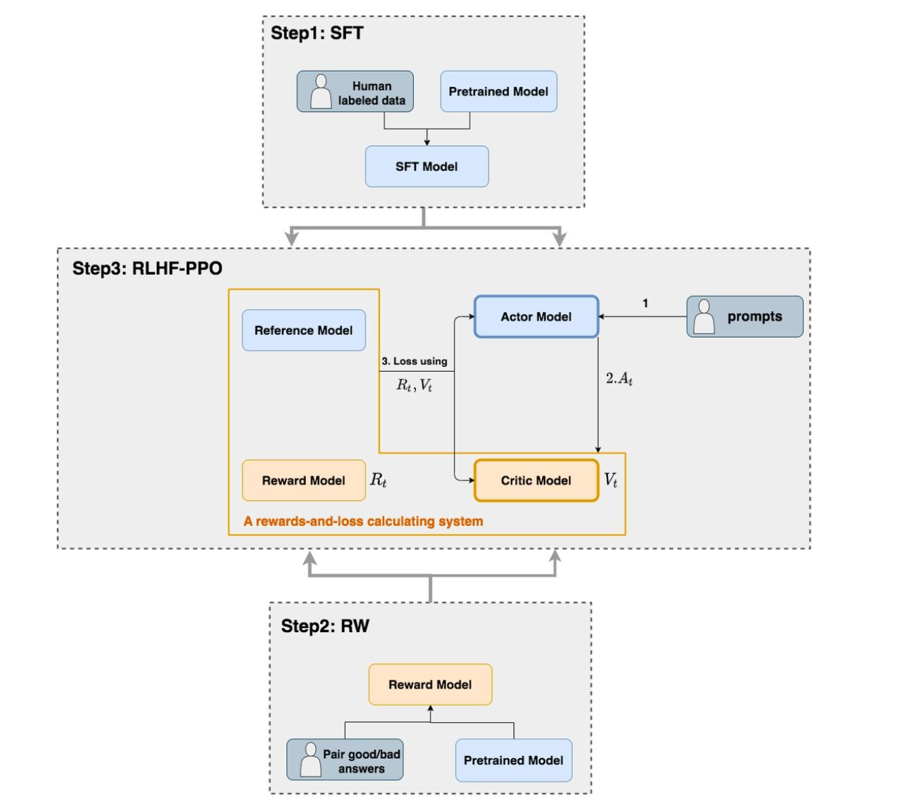

RLHF-PPO阶段共有四个模型：

- **Actor Model：** 这就是我们想要训练的目标语言模型(policy model)
- **Critic Model：** 它的作用是预估总收益 $V_{t}$ , 给 Actor model 打分(value model)
- **Reward Model：奖励模型**，它的作用是计算即时收益 $R_{t}$
- **Reference Model：参考模型**，它的作用是在RLHF阶段给语言模型增加一些“约束”，防止语言模型训歪（朝不受控制的方向更新，效果可能越来越差）

### Reward model训练

用户偏好数据：给定一个 question ，在回答中选择最好的回答作为 chosen，其它为 rejected，chosen就是用户偏好的。人工收集好相应数据，整理成数据集对 reward model 进行训练。

reward Model 选择：和需要训练的大模型差不多或者能力更强的模型。

loss：可以看到当 chosen得分低于rejected，loss指数级上升，而高于时loss接近0

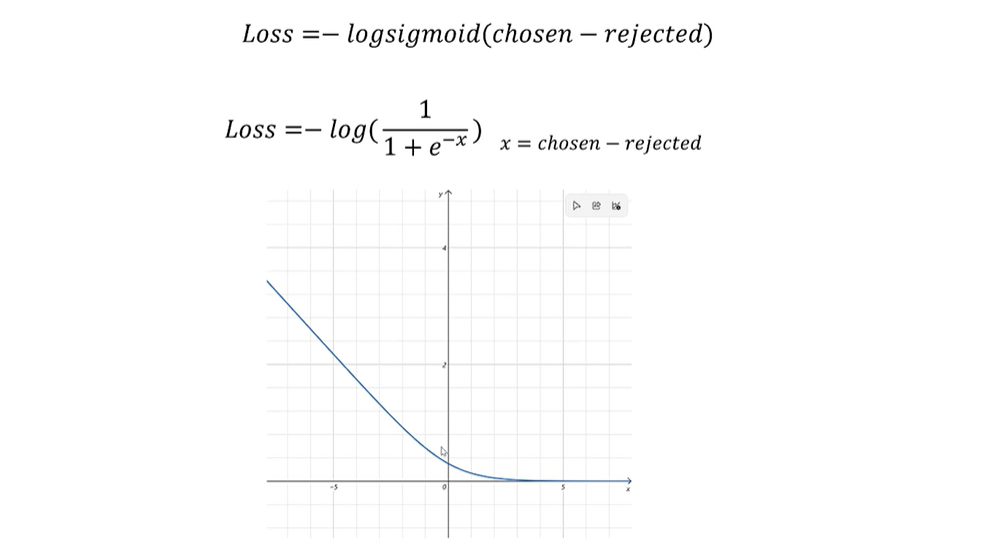

奖励模型需要提前训练好，一般使用 LoRA 微调。

### PPO

**Actor/Critic Model** 在RLHF阶段是 **需要训练** 的。

流程：

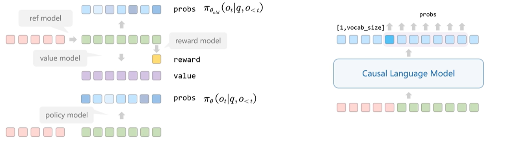

- 红色方块为 prompt, 输入 old model，绿色部分为response；将两者拼接起来输入 Casual Language Model 可以得到token的概率值(logits_probs)
- 所以，将两者拼接输入 reference model ，获取token概率分布记为 $\pi_{\theta_{old}}(o_t|q,o_{<t})$ (q为question，o为回答)；输入 policy model ，获取概率分布记为 $\pi_{\theta}(o_t|q,o_{<t})$ 
- 将 response 输入奖励模型，获取得分（通常是给最后一个token打分，以评估整个答案）
- 将 response 输入 critic 模型，获取每个状态（每生成一个token就是一个新状态）的 value 

Reward 计算：

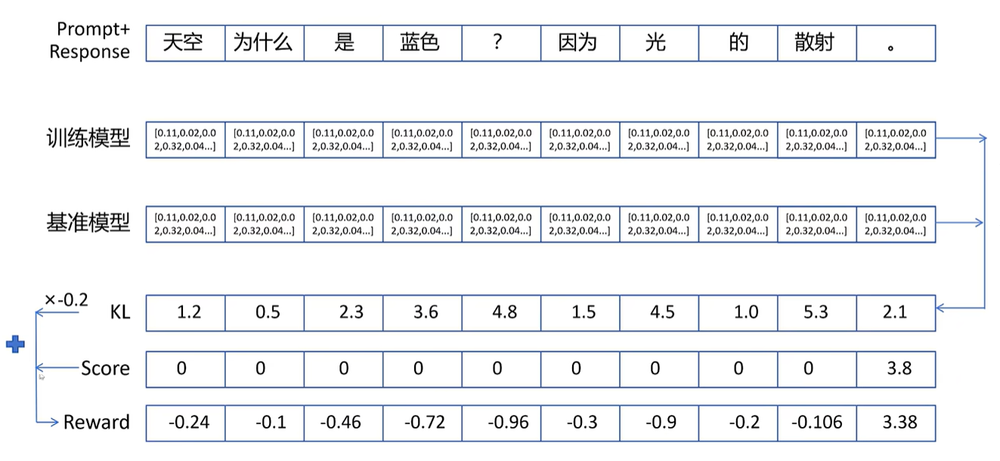

- KL散度计算：$\beta ln \frac{\pi_{\theta}(o_t|q,o_{<t})}{\pi_{\theta_{old}}(o_t|q,o_{<t})}$ 
- $r_t=r_\varphi (q,o_{\leq t})-KL$ ，$r_t$ 是计算出的reward（每个token都有）， $r_\varphi (q,o_{\leq t})$  是奖励模型打的分数，除最后一个token都赋0。

得到 $r_t$ ，就可以计算优势函数，接着计算GAE：

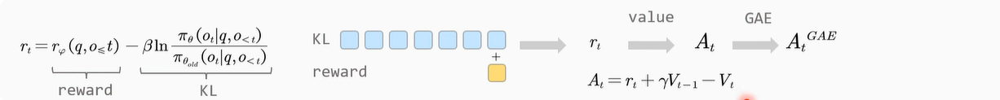

最后得到 PPO 的损失函数（来自deepseek-r1）：

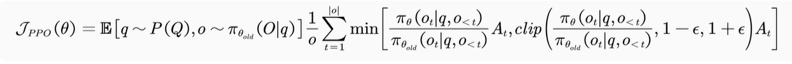

