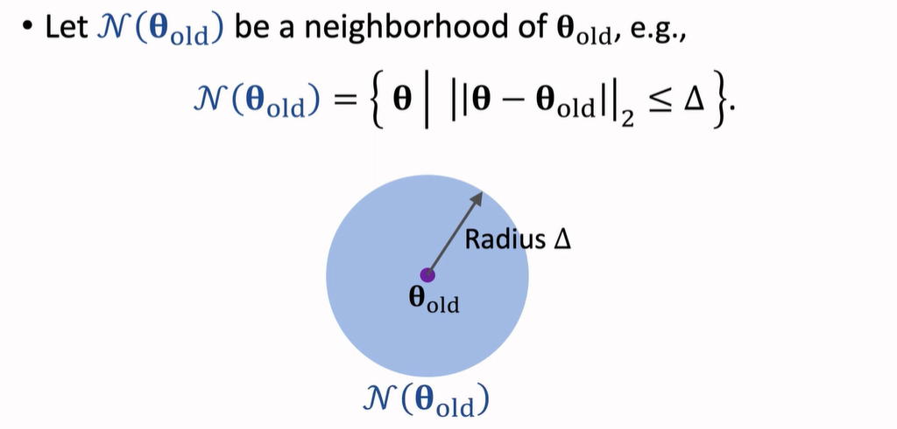
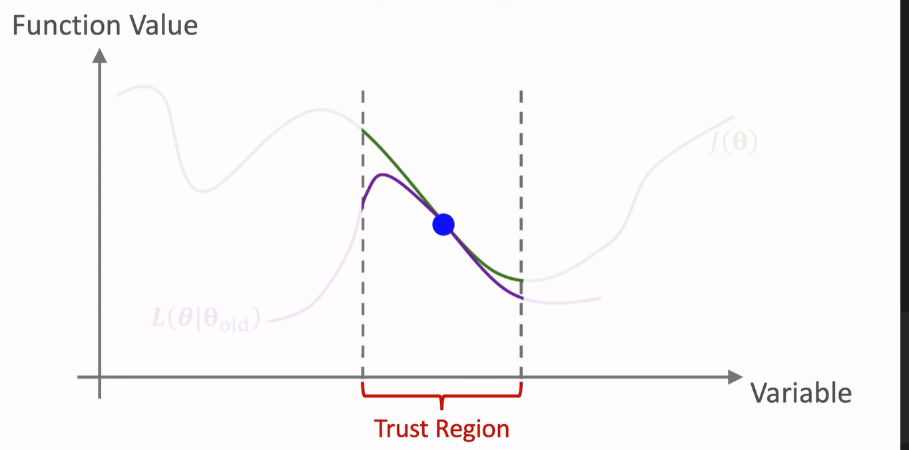
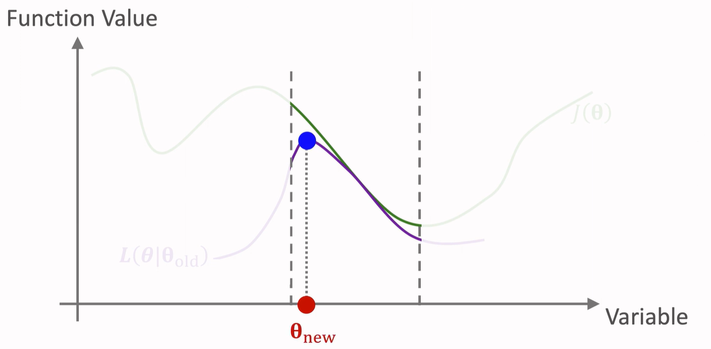
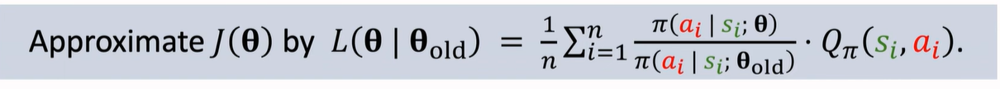
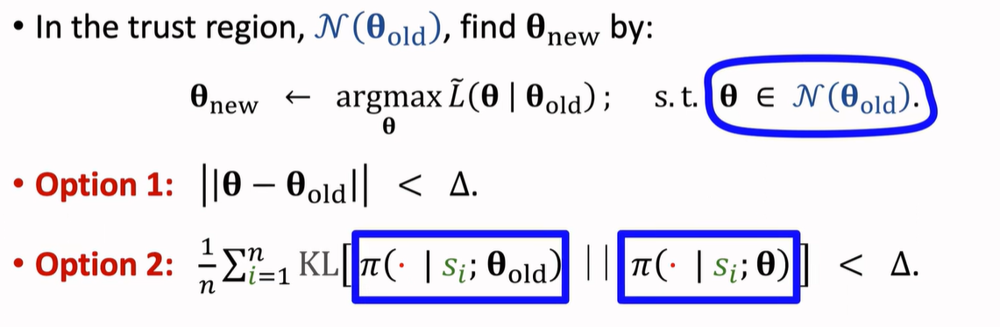

# TRPO

## Trust Region

$\theta_{old}$ 是当前网络参数的值，定义：

如果存在函数 $L(\theta|\theta_{old})$ 能够在 $N(\theta_{old})$ 内很好的近似 $J(\theta)$ ，那么称 $N(\theta_{old})$ 为置信域(trust region)。

算法内容：

1. 近似：给定 $\theta_{old}$ ，构造函数 L 以在  $\theta_{old}$ 的邻域（trust region）近似函数 J

2. 最大化：在置信域内寻找 L 的最大值，从而得到 $\theta_{new}$

## TRPO

重复 Approxination 和 Maximization 两步。

### Approximation

已知：$J(\theta)=E_{S,A}[\frac{\pi(A|S,\theta)}{\pi(A|,S;\theta_{old})}·Q_\pi(S,A)]$ 

- S 通过环境的 state transition 来抽样
- A 通过 Policy $\pi(A|s;\theta_{old})$ 来抽样

通过蒙特卡洛近似来获取 $L(\theta|\theta_{old})$ 函数(i为trajectory中的第i步):

将 $Q_\pi(s_i,a_i)$ 替换成 $u_i=r_i+\gamma r_{i+1}+\gamma^2 r_{i+2}+...+\gamma^{n-i}·r_n$ (蒙特卡罗近似)

### Maximization

两个 Option 用于确保 $\theta$ 在 trust region 内。

更新参数需要多轮。