# 基本概念

基本过程：agent 观测到当前 state `s1` ，会根据 policy 函数选择一个 action （随机采样），环境由此生成下一状态 `s2` 并生成奖励 `r1` （有随机性）……如此重复最后得到 trajectory。

- 动作随机性： $P[A=a|S=s]=\pi(a|s)$ , 由于policy function而有随机性
- new state 随机性： $P[S'=s'|S=s,A=a]=p(s'|s,a)$ ，state transition
- reward $R_i$ 取决于 $S_i,A_i$

Experience : agent 可与 environment 交互多次，进行多个实验，形成多个 trajectories，trajectories 的集合被称为 “experience”。即 $E=\{\tau_1,\tau_2,...,\tau_K \}$

Return ： $U_t = R_t + R_{t+1}+R_{t+2}+...$

Discounted return : $U_t = R_t + \gamma R_{t+1}+{\gamma}^2R_{t+2}+...$ ，回报是一个累积的概念，它考虑了从当前时刻开始到未来某个时刻（可能是一个完整的回合结束）的所有奖励

Action-Value function : $Q_{\pi}(s_t,a_t)=E[U_t|S_t=s_t,A_t=a_t]$ ，评价当前状态下的当前动作好坏

Optimal Action-Value function : $Q^*(s_t,a_t) = max_\pi Q_\pi (s_t,a_t)$ , 通过最大化消除 policy function 对该函数影响，得到基于当前状态的当前动作的最高分，不会有更高的分数了

State-value function : $V_\pi (S_t)=E_A[Q_\pi(s_t,A)]$ ，评价当前状态是好是坏，并评价policy（因为状态函数越大，说明胜算越大，所以策略越好）

Advantage Function : $A_\theta(s,a)=Q_\theta(s,a)-V_\theta(s)$ ，表示在 state s 下，做出 Action a，比其他动作能带来多少优势。

rollout : 特指利用当前 policy model 在环境中生成一段轨迹的过程。这段轨迹可以是完整的，也可以只是部分数据。Rollout更侧重于“展开”策略执行的具体过程，用来评估策略或计算优势等。

## value-based 

通过 Optimal Action-Value function 来决定下一步动作 --- 选择得分最高的 action。

实现：Deep Q Network 。训练好该神经网络，使得输入 state，其可以输出得分最高的 action

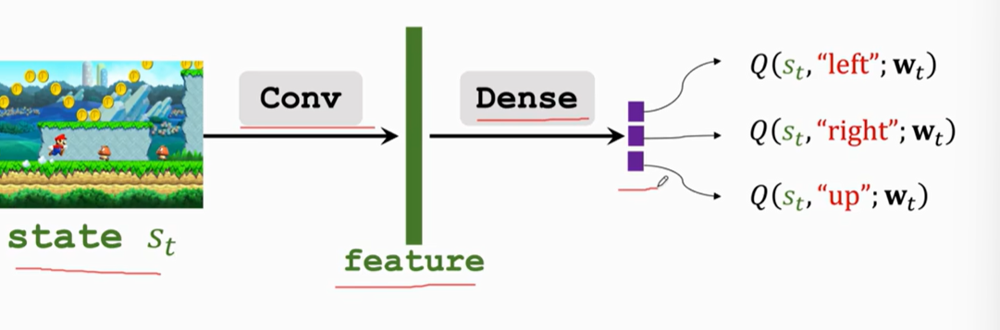

训练算法：Temporal difference

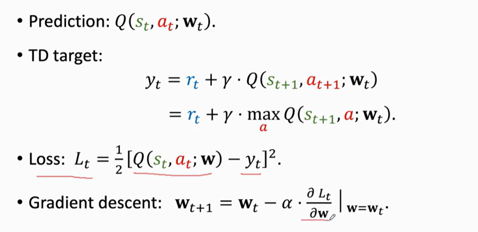

## Policy-based

如果存在一个很好的 policy function $\pi$ ，那么 agent 可通过 policy 来运动：在当前状态 $s_t$ 时，根据策略函数随机采样得到下一步动作 $a_t$ ：$a_t \textasciitilde \pi(·|S_t)$ 

使用一个神经网络来近似 policy $\pi(a|s)$ ，将神经网络写作  $\pi(a|s;\theta)$ 

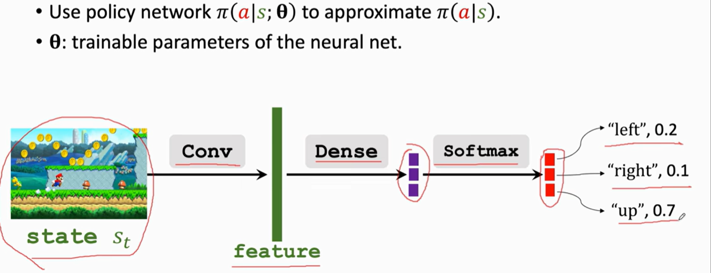

 由此定义 Approximate state-value function : 

$$
V(s;\theta)=\sum_a\pi(a|s,\theta)·Q_\pi(s,a)
$$

我们需要通过学习参数 $\theta$ 使 $J(\theta)=E_S[V(S;\theta)]$ 最大化。使用 Policy gradient ascent 最大化。

Form 1 推导，适用 discrete action：

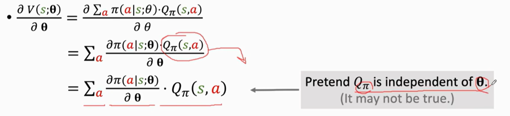

Form 2 推导（链式法则，简化推导），适用 continuous action：

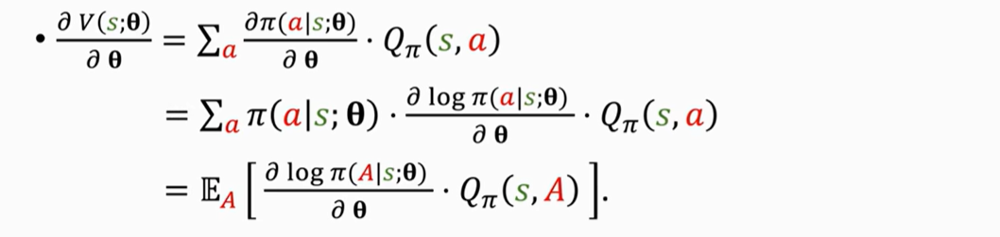

- 利用蒙特卡洛近似来计算连续动作情况：

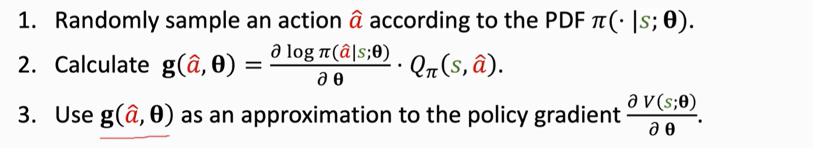

接下来用算出的梯度更新网络.

## Actor-Critic Method

$$
V(s;\theta,w)=\sum_a\pi(a|s)·Q_\pi(s,a) \approx \sum_a\pi(a|s;\theta)·q(s,a;w)
$$

其中，policy network $\pi(a|s;\theta)$ 为 actor ，负责 agent 的运作，更新该网络用于提升 state-value，以使表现更好。使用 policy gradient 训练。

Value network $q(s,a;w)$ 为 critic，负责给 agent 的运作打分，更新该网络使裁判打分更加精准（接近 return 值）。使用 TD learning 训练。

总体流程：

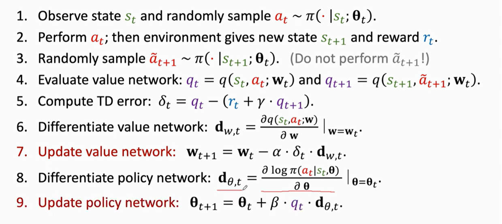

- 在 Policy Gradient with Baseline 中，Update policy net 时 $q_t$ 可被替换为 $\delta_t$ . 很多时候这样效果更好。

## Monte Carlo Algorithm

Monte Carlo refers to algorithms that rely on repeated random sampling to obtain numerical results. 当一个问题的解空间过于庞大或复杂，无法进行穷举或精确计算时，可以通过**大量随机样本**来模拟这个过程，并根据这些样本的结果来推断整体的性质或解。

蒙特卡洛估计的基本原理是**大数定律**：当重复一个随机过程足够多次时，其平均结果会趋近于期望值。因此，通过生成大量的随机样本，我们可以用这些样本的统计特征（如平均值、频率）来近似表示我们想要计算的量。

通过近似得到的结果通常是错误的，但是在统计和机器学习中，一个近似正确答案的答案就够用了。

函数 $f(x)$ 期望：$E_{X\textasciitilde p}[f(X)]=\int_{R^d}{f(x)·p(x)}{\rm d}x$

近似过程：

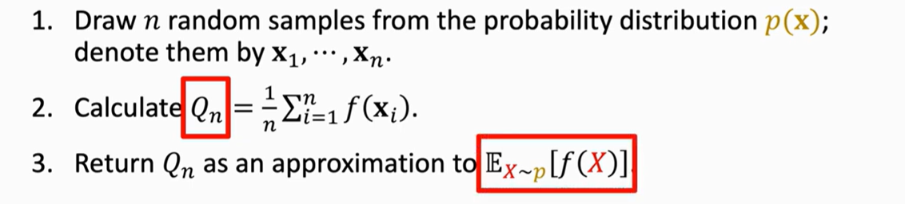

## Policy Gradient

按照 policy model 执行出 trajectory $\tau=\{s_1,a_1,r_1,s_2,a_2,r_2...\}$ , 其概率为：

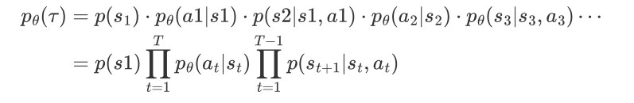

我们希望利用神经网络的概率决策玩了很多局游戏之后，获得的总回报期望最⾼（ $R(\tau)$ 表示轨迹最终的discounted return）

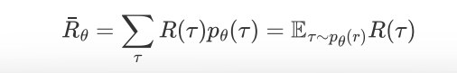

求梯度，然后使用蒙特卡罗近似来采样，得到期望估计值：

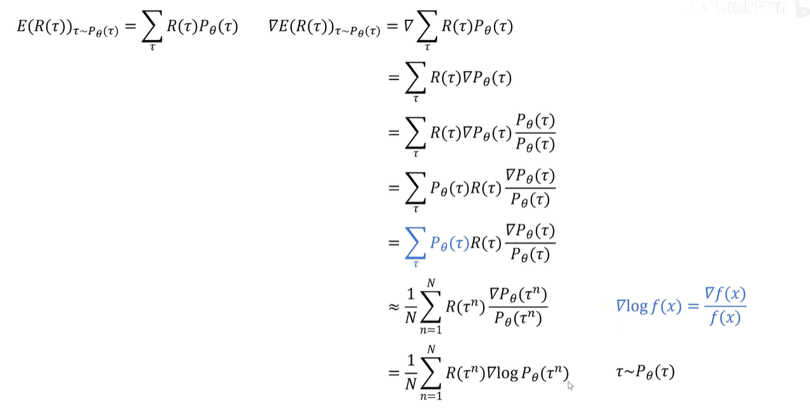

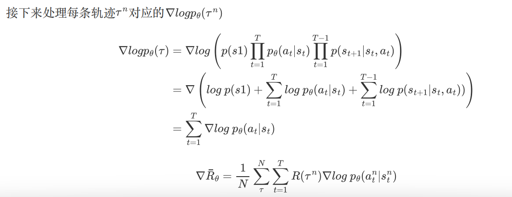

- t表示每条轨迹中的第t步
- n表示第n次采样得到的轨迹

给所有动作的 reward 都减去一个 baseline，以分辨在当前局势下，哪个动作相对较好：

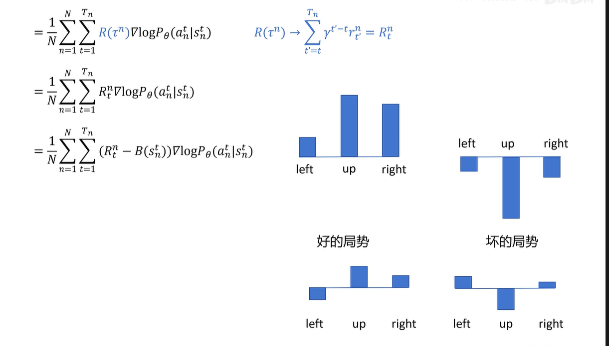

用 action-value function 代替 $R_t^n$ ，state-value function 代替 baseline （可以理解成 actor-critic架构），那么公式变为： $\frac{1}{N}\sum_{n=1}^{N}\sum_{t=1}^{T_n}A_\theta(s_n^t,a_n^t)\nabla logP_\theta(a_n^t|s_n^t)$

