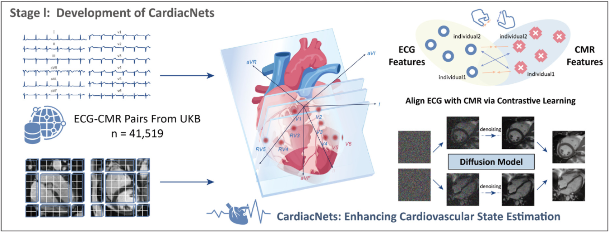
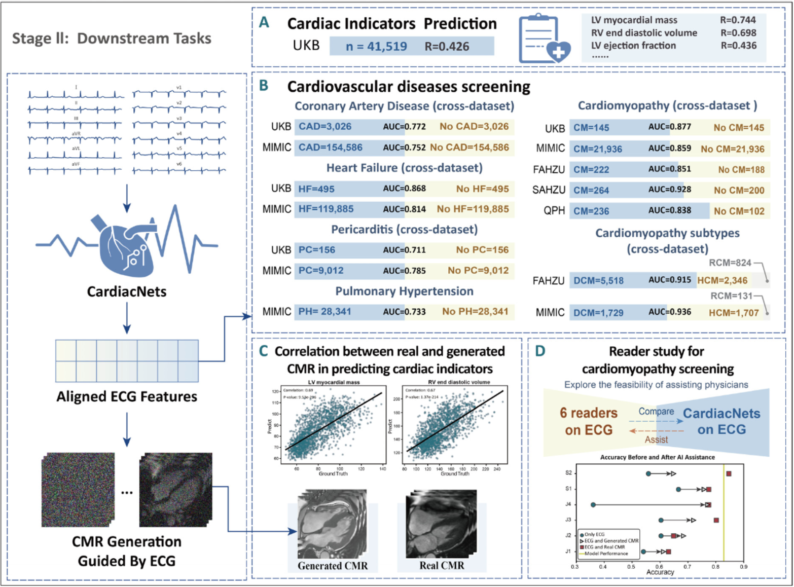

# 2411.13602

## Abstract

`CardiacNets` 通过跨模态对比(Cross-modal contrastive learning)和生成式预训练(generative pretraining)来利用CMR的diagnostic strength增强ECG的分析。提供两个基础功能：

- 使用心电图输入来评估详细的心脏功能指标，并筛查潜在的心血管疾病，包括冠心病(coronary artery disease)、心肌病(cardiomyopathy)、心包炎(pericarditis)、心力衰竭(heart failure)和肺动脉高压(pulmonary hypertension)
- 它通过从心电图数据生成高质量的心脏磁共振图像来提高可解释性

## Main

large-scale multimodal datasets 大规模多模态数据集: UK Biobank(UKB) & MIMIC

CLIP(Contrastive Language-Image Pre-training)：一种代表性的跨模态对比学习方法。它能够通过创建一个共享的嵌入空间，使来自不同模态的潜在表征实现对齐(aligning latent representations)。这种创新能力支持高精度的任务，包括零样本分类 zero-shot classification，这使得模型无需针对特定任务进行训练就能做出准确的预测。

Stable Diffusion model: 利用 CLIP 的文本编码器作为条件引导而生成与文本描述高度契合的高度逼真的图像。

`CardiacNets`不像传统方法一样专注于 aligning text-image pairs with similar informational content，而是强调一种 robust modality(convey rich,comprehensive info) 与 weaker madality之间的关系，后者从前者获取insights来提升自身能力。方案由两个部分组成：

- implement contrastive learning to align ECG data with theircorresponding CMR images. 利用每种模态的优势
- ECG encoder, trained through contrastive learning, is subsequently
  frozen and employed as a conditional encoder within a diffusion model. 这种对齐后的心电图表征有效地引导潜在video diffusion model 生成与心电图输入相对应的高质量心脏磁共振成像序列

实施阶段：

- cross-modal contrastive learning utilizing ECG and CMR data and ECG-based CMR Image Generation Model

  

- comprehensive evaluation of downstream tasks

  

在第一阶段，跨模态预训练使心电图能够捕捉相应的心脏磁共振成像信息，并生成心脏磁共振图像。第二阶段表明，在所有评估的后续任务中，经过**跨模态预训练**的心电图模型优于仅依赖心电图数据的传统单模态监督学习模型。

## Method

### 1. Dataset for Model Development and Evaluation

数据源于UKB，目前最大的公开可用数据集。

专注于参与者首次进行成像检查时收集的心电图和心脏磁共振成像的成对数据，最终得到总共 41,519 组成对数据集。

心电图数据包括 12 条导联记录，每条记录持续 10 秒，采样频率为 500 赫兹；而心脏电影磁共振成像数据则包括短轴和四腔长轴视图short-axis and four-chamber long-axis views，每个视图都捕捉了一个包含 50 帧的single cardiac cycle。

按照 7:1:2 的比例将数据集划分为训练集、验证集和测试集。

后续研究中又加入了MIMIC-IV-ECG49数据集、以及来自三家医院的私有数据集：浙江大学医学院附属第一医院（FAHZU）、浙江大学医学院附属第二医院（SAHZU）和衢州市人民医院（QPH）。

### 2. Data processing and augmentation

1. baseline drift 基线漂移问题的解决：通过 seasonal decomposition，从而能够有效地分离并校正趋势成分
2.  apply wavelet transform denoising using the “db6” wavelet along with soft thresholding. 使用 “db6” 小波并结合软阈值法进行小波变换去噪
3. employ a Savitzky-Golay filter来平滑信号。该滤波器通过 polynomial fitting within a sliding window to refine the ECG waveform further.

short-axis CMR 图像原始数据有4个维度：length、width、slice and time. slice 维包含 3 到 10 层切片，选择middle basoapical slice，将图像简化为三个维度length、width and time，其中时间维度包括50帧。

为了让模型专注于心脏区域，使用一个pretrained segmentation model 来生成一个 heart region mask.以包含掩码非零区域的最小边界框为中心，将图像裁剪为 80×80 像素。

long-axis 图像由长度、宽度和时间维度组成，时间维度同样包含 50 帧。使用与短轴图像相同的分割方法，我们将长轴图像裁剪为 96×96 像素。

Data augmentation:

对于ECG data，使用 crop resizing、time reversal and sign inversion，接着用 Min-Max scaling within a range of -1 to 1 on a channel-wise basis通道层面.

对于CMR data，random rotation(up to 30 degrees), random horizontal and vertical flips and random resized cropping with a scale range of 0.8 to 1.0 and an aspect ratio宽高比 of 0.9 to 1.1.  之后使用bilinear interpolation将图像调整大小为256 x 256 pixel。对短轴和长轴图像的所有 50 帧都进行了归一化处理，使用的均值为 0.5，标准差为 0.5。

### 3. Self-supervised method for CMR

采用 Swin Transformer base作为backbone，GreenMIM进行掩码自监督训练，

> Masked self-supervised training（掩码自监督训练）是一种自监督学习方法，通过对输入数据进行掩码操作，让模型学习恢复原始数据或提取数据特征，以解决监督学习中数据标注成本高的问题。在医学图像分析领域，该训练方法可有效利用未标注数据学习图像特征，为后续任务提供有力支持。

encoder patch size 为4 x 4, window size 为7.

