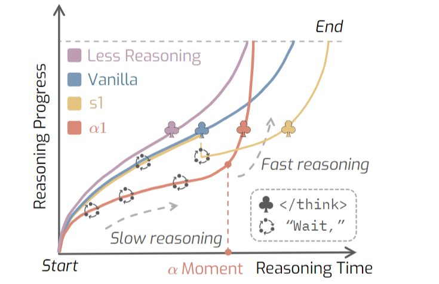
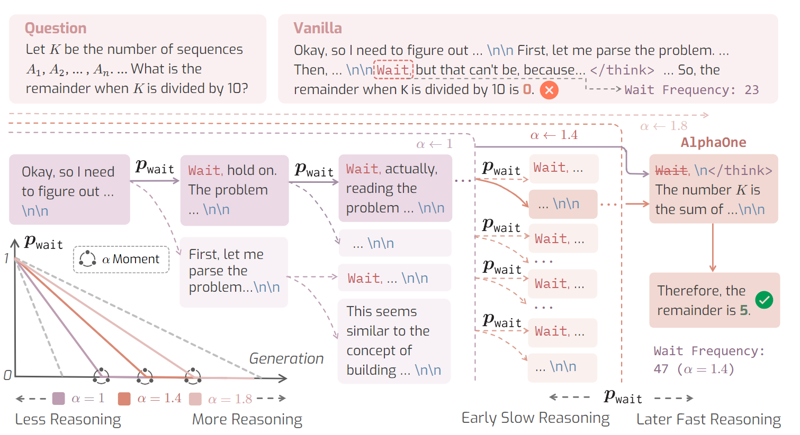
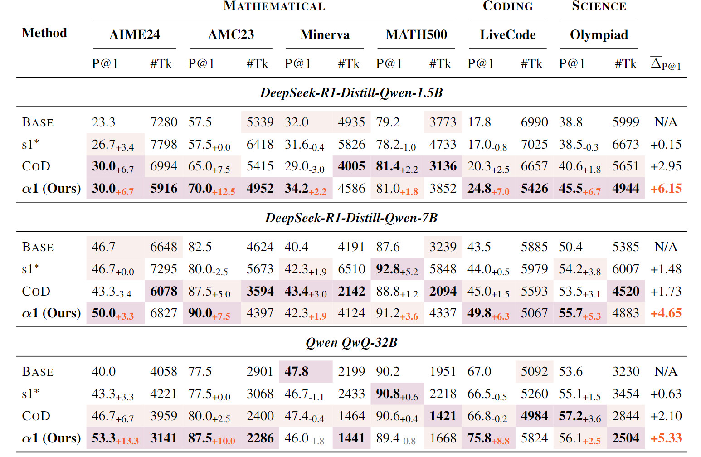

# AlphaOne

传统推理模型(o1 & deepseek)：慢思考，但模型无法主动调控推理节奏(使用 self-reflection 在慢思考与快思考之间转换)，导致 overthinking 和 underthinking. 

- `wait hmm alternatively` 是转向慢思考的 slow thinking transitioning tokens
- `\think` 代表慢思考结束

Reasoning Process : $P\in[0,1]$ ，0和1分别表示推理的起始与结束。定义推理速度 reasoning velocity $v_t = \frac{dP}{dt}$ ，假设慢思考的推理速度小于快思考。

关于 Modulation，有两个需要考虑的 component：

- thinking phase budget: 预算高就更多慢思考，预算低就更多快思考
- Slow thinking scheduling: 遵循 scheduling 进行慢思考转换（多或少）

## $\alpha$ Moment for Universal Modulation

为调节 thinking phase budget ，将思考阶段至少按 $\alpha \times$ 比例进行缩放 ($\alpha \gt 1$ ) . 给定大型推理模型（LRM）生成的平均思考阶段 token 长度 $N_{think}>0 $，我们将思考阶段的 token 长度缩放至 $αN_{think}$，而当生成的 token 长度达到$αN_{think}$ 的时刻被称为 “α  Moment”。 

##  Pre-α Moment Modulation

之前的研究：在 $\alpha$ moment 之前，通过遵循用户制定的 schedule 来激活慢思考，激活方式为在 ‘\n\n’ 后加 `wait` 。

$\alpha 1$ : 慢思考激活调度为伯努利随机过程。按照 Bernoulli ($p_{wait}$) 在特定位置添加 `wait` . 其中 $P_{wait} := S(t), t=0,1,...,T_m$ , t 是timestamps of generated tokens before α moment。S(t) 是一个 user-specified scheduling function. $\alpha1$ 选择了 linear annealing 线性退火作为 S(t) .  

## Post-α Moment Modulation

在 pre-$\alpha$ modulation 中，慢思考显著增加，使得模型思考产生惯性，难以切换回快思考。

Deterministic Reasoning Termination：禁用进一步的慢思考，将所有 `wait` 替换成 `<\think>` ，强化向快思考的转换。

## Experiment

选择线性退火是因为效果好。$p_{constant}$ 那个实验不太懂：p 为某个值时，benchmark准确率最高，但也没有和线性退火策略比较（应该是有的benchmark在p固定时表现更好）。so线性退火应该还是有点僵化的

这个方法好像还减少了 overthinking （输出token数变少了），这有点神奇诶，明明慢思考变频繁了，为什么呢？

