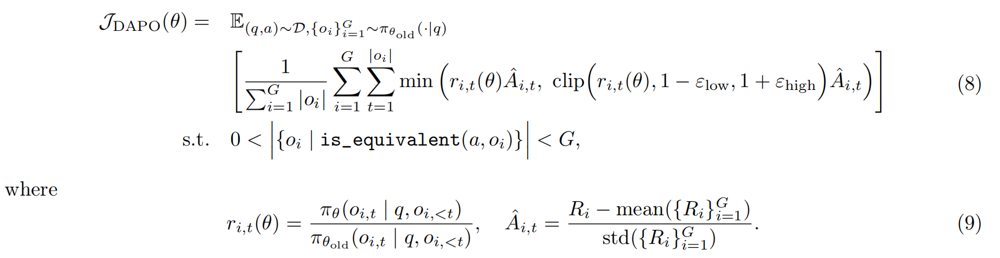
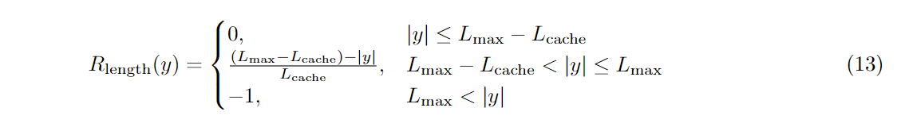
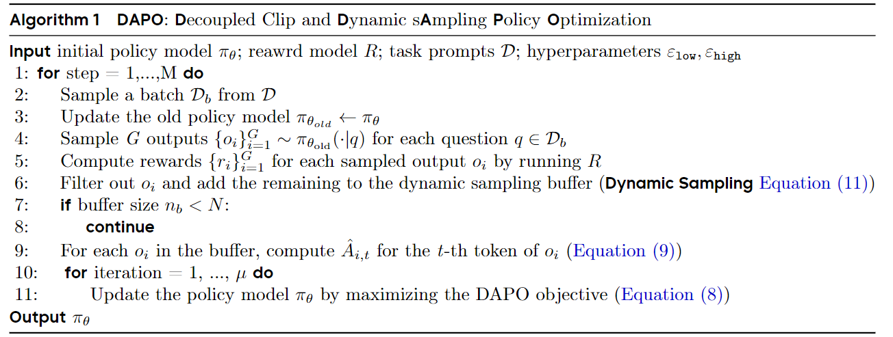

# DAPO

在训练 long-CoT 推理模型时，模型分布可能会与初始模型产生显著差异，KL散度约束并无必要，所以 DAPO(**D**ynamic s**A**mpling **P**olicy **O**ptimizatio) 算法排除了 KL 散度。Reward 采用可验证任务的最终准确率。

DAPO 公式如下：与 GRPO 区别在于 clip 函数的 $\epsilon$ 参数变化，以及 KL 散度项的删除

## Clip-Higher

在用 naive PPO or GRPO 训练时，观测到了 entropy collapse phenomenon，即过早收敛，说明模型探索能力有限。于是论文提出 “Clip-Higher” strategy 来解决该问题。${\pi_{\theta_{old}}}(o_i|q)$ 较小，说明该答案模型“探索较多”（高探索答案的 token 出现概率会较低，因为其非简单利用已有知识），这就会导致 $r_{i,t}(\theta)$ 较大，超出上界。上界剪辑阈值制约了系统的探索能力，因此提高 $\epsilon_{high}$ 的值，保持 $\epsilon_{low}$ 值不变。

## Dynamic Sampling

对于 GRPO 算法，如果某个特定 prompt 的所有输出都是正确的，且获得相同的奖励，那么该组的 advantage 将为零，从而导致策略梯度为 0。由此，对准确率为 1 和 0 的 prompt 进行 over-sampling（每次采样时生成超过实际所需数量样本，dynamic，这样过滤后的样本数量还能保持相对稳定） 并过滤，使批次中的所有提示都具有有效梯度，并保持提示数量的一致性。

在公式中的表现为 prompt 的正确 responses 个数大于 0 小于 G。

## Token-Level Policy Gradient Loss

GRPO 算法损失计算是 sample-level 的，即损失是从 response 开始计算的，每个样本在最终的损失计算中被赋予同等权重。token 个体的 loss 贡献被忽略了，尤其对于 token 数量更多的 long-CoT 模式，token 对整体损失的贡献可能会不成比例地降低。

所以，在公式中引入 token 级的 policy gradient loss，在这种情况下，与较短序列相比，较长序列对整体梯度更新的影响更大。

## Overlong Reward Shaping

RL 训练中，overlong samples 会根据最大长度相应被截断。但是，对截断样本的奖励塑造不当会引入 reward noise，并显著干扰训练过程。论文首先采用 Overlong Filtering strategy 以掩盖截断样本造成的损失，发现其可显著稳定训练过程并提升性能。

于是提出 Soft Overlong Punishment. 当响应长度超过预先设定的最大值时，定义一个惩罚区间。在该区间内，响应越长，所受的惩罚就越重。

最终，算法流程如图示：

