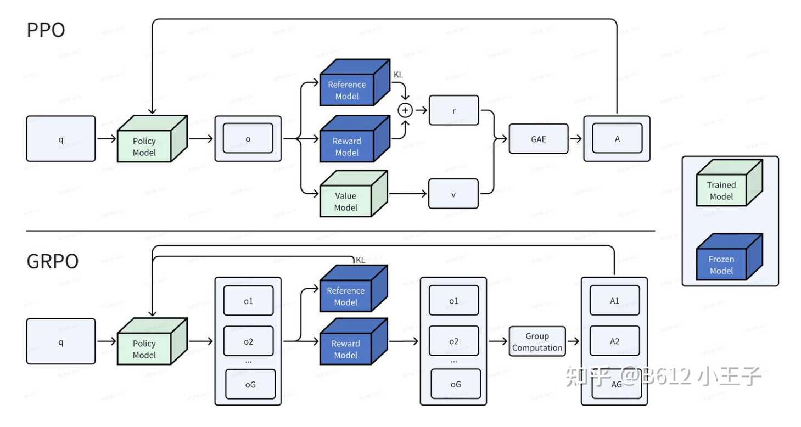

# DeepSeek-R1

- R1-zero 不将SFT(论文：instruct-GPT RLHF)作为初始步骤，但推理效果良好，不过会有可读性差、语言混杂等问题，故引入R1

> SFT(supervised fine-tuning)监督微调，为了使LLMs生成符合人类偏好的答案，利用大量包含输入与对应正确输出的标注数据对预训练模型进行微调，缺点：依赖大量人为标注数据，且难以覆盖长链、多步推理场景

- R1 通过采用multi-stage training and cold-start data before RL，进一步提高了推理性能。

一些前置知识：

- Post-training后训练：可提高推理任务准确性，且使模型符合社会主义价值观并适应用户偏好。与pre-training相比所需计算资源相对较少
  - OpenAI的o1通过增加CoT的长度来引入 inference-time scaling(推理时缩放？)，使得模型在推理任务中取得显著改进，但目前无人复现成功

- 提示词工程：

  - Zero-Shot Prompting: One Foundation Model -> Prompting -> Different tasks. 只问问题，不提供例子

  - Few-Shot Prompting: By providing few examples, the LLMs can perform a new task even it is not trained on it (in-context learning). 给例子，使得大模型可以参照

  - Chain-of-Thought Prompting: enable complex reasoning capabilities through intermediate reasoning steps. 通过在例子中体现思维链来提高大模型准确性

- 强化学习？


### R1-zero:

- ------

  验证：能否仅通过强化学习（无需监督微调）激励LLMs的推理能力，self-evolution through a pure PL process
- V3-base 作为 base model，采用GRPO作为 RL framework 来提高推理性能

#### RL算法

------

通过强化学习直接对基础模型进行训练，采用 Group Relative Policy Optimization(GRPO Shao et al.,2024) 作为强化学习算法。GRPO算法的核心思想是通过采样一组输出，计算这些输出的奖励，并根据奖励的相对值来更新模型参数。以group score来估计baseline(公式看不懂……)



推理过程和答案分别在 <think></think> 和<answer></answer>标签内。

#### Reward Modeling

------

首先，什么是奖励模型？-- 用于打分评估大模型的回答，据此更新策略。例如在RLHF中：


- step 1: 从数据集中采样 prompt，同时人工写出希望的答案作为 ground truth，微调
- step2: 采样 prompt，送到 SFT 后的模型进行生成，得到多个答案。由人工标注，对生成的答案进行排序，训练一个 reward model。
- step3: 采样 prompt，采用 PPO 进行强化学习，模型生成答案并得到 reward model 的打分，以此更新。

为了训练R1-zero，采用 rule-based reward system ，该系统主要由2种类型的reward构成：

- Accuracy reward: 评估回答是否正确
- Format rewards: 强制要求模型将其思考过程置于 “<think>” 和 “</think>” 标签之间

不采用 outcome or process neural reward model ，因为 neural reward model 在large-scale RL过程中可能受 reward hacking影响，而重新训练耗费大量资源

#### Training Template

------

设计一个简单模板（Table 1），用于引导 base model 遵循指定指令。模板要求 R1-zero 首先生成一个 **推理过程** ，然后给出最终答案。该模板避免了任何的 content-specific biases（mandating reflective reasoning or prompting particular problem-solving strategies），以确保我们能够在强化学习过程中准确观察到模型的自然演进过程。

#### Performance

------

……

无需任何监督微调数据的情况下获得强大的推理能力

同时通过 majority voting 进一步提升性能

#### Self-evolution Process

------

在训练过程中，通过 extended test-time computation ，获得了解决越来越复杂的推理任务的能力。computation中，生成数百到数千个推理tokens，使模型能够更深入地探索和完善其思维过程。

这种自我进化最显著的特点之一，就是随着 test-time computation 的增加，复杂行为开始出现。例如 reflection（模型重新审视并重新评估之前的步骤，以及自发探索解决问题的替代方法），这些行为是模型与RL环境互动的结果，而非编程设定。

#### Aha Moment

------

在训练 DeepSeek-R1-Zero 的过程中，一个特别有趣的现象是 “顿悟时刻” 的出现。在这个阶段，DeepSeek-R1-Zero 通过重新评估其初始方法，学会为一个问题分配更多的思考时间。

它凸显了强化学习的强大力量和魅力：我们无需明确教导模型如何解决问题，只需为它提供正确的激励，它就能自主开发出先进的问题解决策略。


### R1

------


- 首先收集 thousands of cold-start data to fine-tune the V3-base model
- 接着像R1-zero一样执行reasoning-oriented RL，在接近收敛时，通过在 RL checkpoint 进行 rejection sampling ？来创建新的SFT data，并结合 V3 在写作、事实性问答和自我认知等领域的supervised data，接着retrain V3-base
- 用新数据微调以后，该 checkpoint 会再经历一次强化学习过程，同时考虑来自所有场景的prompt。
- 最后得到的 checkpoint 就是 R1 ，表现与o1-1217相当


#### Cold start

------

构建并收集少量 long CoT data 用于微调模型，使模型作为 intial RL actor. 收集数据策略：

- few-shot prompting with a long CoT as an example，使模型生成带 reflection 与 verification 的详细答案
- 以可读格式收集 DeepSeek-R1-Zero 的输出，并通过人工标注员进行后处理来优化结果

优势：

提高可读性，通过在cold start数据的每个回复末尾加入一个summary，并过滤掉非 reader-friendly 的回复，来设计一个易读模式：

```
special_token|<reasoning_process>|special_token|<summary>
#reasoning_process 是针对query的CoT
```

由此认为 iterative training 对推理模型而言是一种更好的方式


#### Reasoning-oriented RL

------

微调以后，采用与R1-zero 相同的大规模强化学习训练过程，这一阶段专注于提升模型的推理能力，特别是在编码、数学、科学和逻辑推理等推理密集型任务中，这些任务涉及定义明确、有清晰解决方案的问题。

训练过程中，观察到CoT 出现语言混杂的情况，尤其当RL prompt 涉及多种语言时。引入 language consistency reward during RL training ，通过计算思维链中目标语言词汇的比例来得到reward。ablation experiments(消融实验)表明，该调整会导致性能下降，但使得输出更符合人类偏好，使输出更具可读性。

最后将推理任务准确性和language consistency reward相加，形成 final reward ，然后对微调模型进行RL直到其在推理任务上达到收敛。


#### Rejection Sampling and SFT

------

当 reasoning-oriented RL 收敛后，我们利用结果 checkpoint 来收集用于下一轮训练的监督微调（SFT）数据。不过这部分的SFT数据主要聚焦于整合来自其他领域的数据，以增强模型在写作、角色扮演及其他通用任务方面的能力，不像初始 cold-start data 聚焦于推理。生成数据并微调模型步骤如下：

- for reasoning data，构建 reasoning prompts，并对从上述 RL 训出的 checkpoint 进行 **拒绝采样** 以生成推理轨迹(trajectories)。在之前的阶段，仅使用了基于规则的奖励来评估数据(?)。然而，在这个阶段，通过添加其他数据来丰富数据集，其中部分数据使用 **生成奖励模型** (generative reward model) by 将 ground-truth 和模型预测输入 DeepSeek-V3 进行判断。此外，由于模型输出有时混乱且难以阅读，我们过滤掉了语言混杂的思维链、长篇段落和代码块。对于每个提示，我们采样多个回复，只保留正确的回复。我们总共收集了约  600k 个与推理相关的训练样本。

- for Non-reasoning data，如写作、事实性问答、自我认知和翻译等，我们采用 DeepSeek-V3 的流程，并复用 DeepSeek-V3 的部分监督微调（SFT）数据集。对于某些非推理任务，在通过提示回答问题之前，我们会调用 DeepSeek-V3 生成一个潜在的思维链。然而，对于像 “你好” 这样简单的查询，我们不会提供思维链作为回复。最终，我们总共收集了大约 200k 个与推理无关的训练样本。

使用上述精心整理的约 800k 个样本的数据集，对 DeepSeek-V3-Base 进行了两个 epoch 的 SFT。


#### RL for all Scenarios

------

这是第二阶段的强化学习，目的是为了使模型进一步符合人类偏好、提高模型实用性和无害性，并优化推理能力。具体过程：结合 reward signals and diverse prompt distributions 来训模型。 对于推理数据，我们遵循 R1 - Zero 中概述的方法，利用基于规则的奖励来指导数学、编码和逻辑推理领域的学习过程。对于一般数据，我们借助奖励模型来捕捉复杂微妙场景中的人类偏好。我们以 DeepSeek - V3 的流程为基础，采用类似的偏好对和训练提示分布。


### Distillation

------

为了让更高效的小模型具备像 DeepSeek-R1 那样的推理能力，我们按照 2.3.3 节所述，使用通过 DeepSeek-R1 整理的 80 万个样本，直接对 Qwen 和 Llama 等开源模型进行微调。这种直接的蒸馏方法显著提升了小模型的推理能力。

蒸馏过程只进行SFT，不包括RL。大模型在 RL 阶段可能出现许多高阶推理模式。而小模型因为容量和表示能力有限，很难在无监督或纯 RL 情境下学到相似水平的推理模式。

蒸馏可将「大模型的推理轨迹」直接转移给小模型，小模型只需要模仿大模型相对完备的推理流程，可以在较小训练/推理开销下取得远胜于自身独立强化学习的效果。


### Discussion：Distillation vs RL

------

通过对 DeepSeek-R1 进行蒸馏，小模型能够取得令人瞩目的成果。然而，仍然存在一个问题：在不进行蒸馏的情况下，小模型能否通过本文所讨论的大规模强化学习训练达到与之相当的性能呢？

使用数学、编码和科学、技术、工程和数学（STEM）领域的数据，对 Qwen-32B-Base 模型进行大规模的强化学习训练，训练步数超过 10k steps ，得到 DeepSeek-R1-Zero-Qwen-32B 模型，该模型明显性能比不过从 DeepSeek-R1蒸馏出来的 DeepSeek-R1-Distill-Qwen-32B 模型。

由此，得到结论：

1. 将更强大的模型进行蒸馏以得到较小的模型能产生出色的效果，而较小的模型依靠本文中提到的大规模强化学习则需要巨大的计算能力，甚至可能都 **无法达到** 蒸馏所带来的性能水平
2. 虽然蒸馏策略既经济又有效，但要突破智能的界限，可能仍需要更强大的基础模型和更大规模的强化学习。


