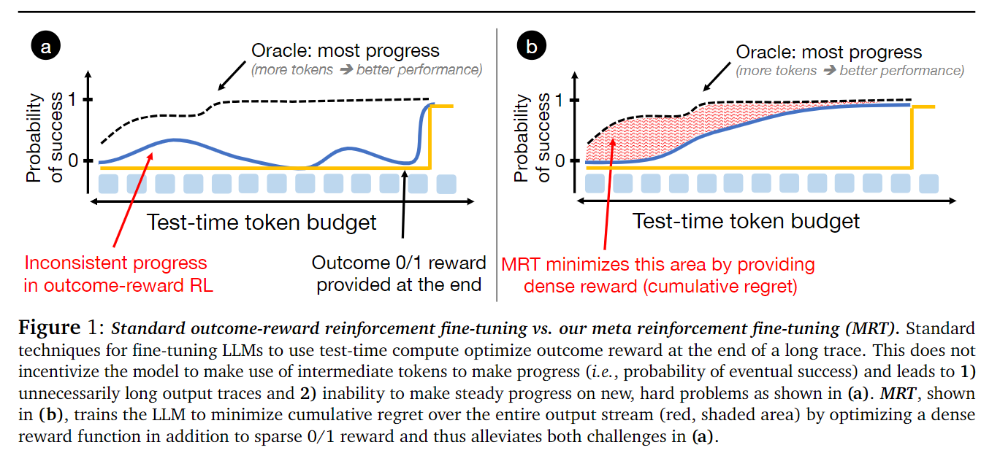
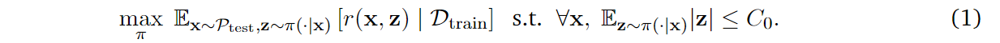
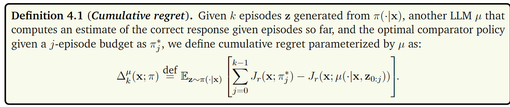
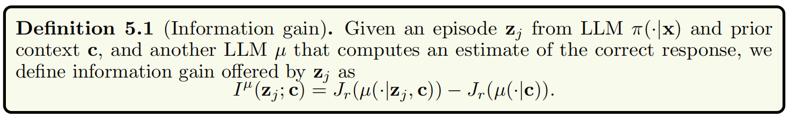
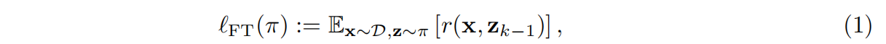
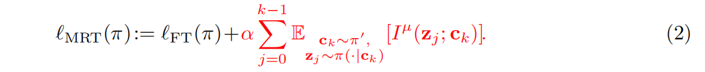
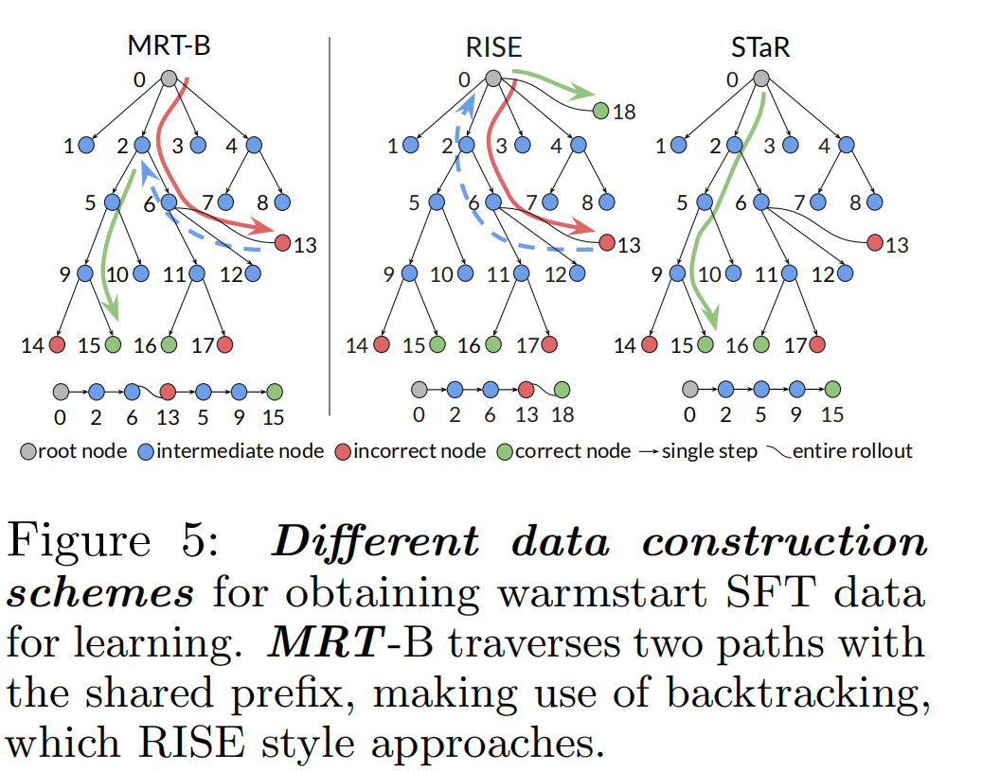
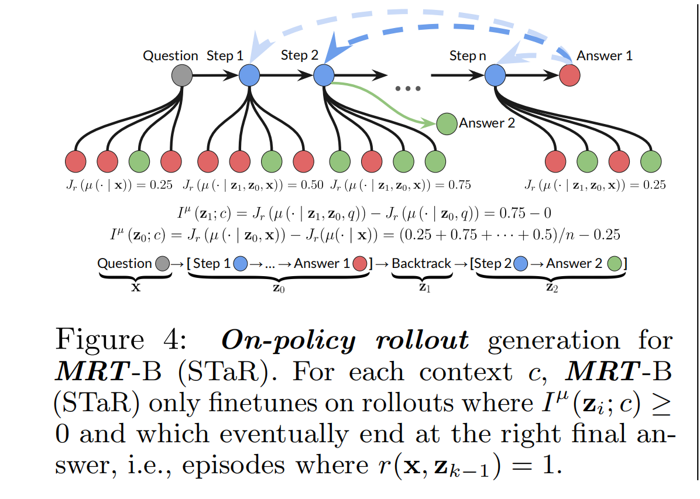

# Test-Time Compute via Meta RT

模型在生成长推理链时，可能无法充分利用每一步的计算资源，导致冗余推理和探索与利用的失衡。

A desired "meta" behavior 是在过早选定一种方法（an "exploitation" episode）与尝试 too many high-risk strategies (an "exploration episode") 之间取得平衡。这等同于在输出 token 预算范围内 minimizing **cumulative regret** 。regret 衡量的是LLM成功可能性与一个理想化参照对象之间的 cumulative difference:

## Preliminaries and Background

- Problem setup: 论文的目标是优化 LLM，使其有效利用 test-time compute 来解决难题。定义奖励模型 $r(x,.):Z->{0,1}$ 与数据集，利用数据集训 LLM，将其建模为一个强化学习策略 $\pi(.|x)$ ，希望训练策略，使其在测试问题 x 上的输出 token 流 z 在奖励模型中得到的分数较大。训练时不会提供 token 数的上限，以此来模拟不同的部署预算情况。
- Meta RL primer：assumes access to a distribution of tasks with different reward functions and dynamic。目标是在来自训练分布的任务上训练一个策略，以便它能在测试任务上表现良好。通过在测试时执行 **自适应** episodes来调整性能。

## Problem Formulation: Optimizing Test-Time Compute as Meta RL

### Optimizing Tets-Time Compute

我们希望一个大语言模型（LLM）在测试阶段预算 $C_0$ 范围内，在测试问题分布 $P_{test}$ 上达到最佳性能:

不过，$C_0$ 大于正确答案的典型长度，这意味着 LLM 能够将一部分 token 预算用于执行那些实际上并不能直接解决问题，但却能间接帮助模型最终找到正确答案的操作。例如一个数学证明问题，其输出由一系列步骤组成。如果策略能够 “即时” 确定它应该回溯几步并重新开始尝试，这不仅可能增加其成功的机会，还能让大语言模型自信地识别出哪些步骤应该避免以及需要谨慎对待。

但有个问题是 compute budget $C_0$ 不一定和 deployment budget 相等，导致一系列问题。训练模型以最少的 token 数获得成功，可能会在部署时错误地导致模型过早地 “敲定” 一个答案，尽管这并非最佳策略。此外，仅使用结果奖励进行训练同样不是最优的，因为如果两个解决方案都成功或者都不成功，那么这种训练方式无法区分那些仍在朝着正确方向推进的解决方案和那些偏离正轨的解决方案。

因此，提出 **Budget-agnostic LLMs** , which use test-time compute the most optimally. 其中，LLM $\pi$ 实现并不知道 test-time 预算，需要展现自适应行为最大限度利用可用的计算资源预算，以在所有足够大的预算情况下都能良好运行

### Characterizing Optimal Use of Test-Time Compute

将输出流明确分割为一系列有意义的 episodes，并将序列看作针对测试问题的某种“自适应”过程。$z = [z_0,z_1,..,z_{k-1}]$. 如果一个大语言模型能够利用之前的阶段 $z_{0:i−1}$来更新其在 $z_i$ 阶段的处理方式，我们就说这个大语言模型展现出了自适应行为。

希望 LLMs 可以在最后一个片段即 $z_{k-1}$ 取得成功，但是由于 LLMs 并不知道测试阶段的部署预算，要确保 LLm 可以持续取得进展并在“exploration”和“exploitation”间保持平衡。在测试时标记流中执行的自适应过程可以被看作是针对测试问题运行一个强化学习算法，在这个纯粹的上下文过程中，之前的阶段起到了 “训练” 数据的作用. 可以使用强化学习中的累积遗憾度量来量化这一过程的最优性。

定义 Cumulative regret ：

$J_r$ 表示以 $z_{0:j-1}$ 为条件时，LLM $\mu$ 所获得的期望的 0/1 结果奖励，$J_r(\pi^*)$ 表示在 j 个片段的 test-time budget 内，比较策略 $\pi^*$ 获得的奖励……

如果 cumulative regret 值很大，甚至可能随着片段数量*k*的增加而增大，那么我们就认为这些片段*z*实际上并没有取得有意义的进展。当 cumulative regret 增长速率越低，随着 budget 增加，budget-agnostic LLM 取得的有意义的进展就更多。

这种机制迫使模型在生成每个中间步骤时，都必须对解题产生实质性贡献，从而减少无效计算。

## MRT Paradigm

抽象层面来讲，MRT 对 LLM 进行微调，以直接优化累积遗憾。

考虑每个阶段对 output 所作贡献，直接针对 cumulative regret objective 进行优化。

定义 value function 来量化每个阶段取得的进展（用另一个策略 $\mu$ 的 $J_r$ 代表该价值函数），将来自阶段 $z_i$ 的 information gain 定义为：有这个阶段和没有这个阶段时，由元证明策略*μ*所获得的平均奖励的变化量。

MRT 通过在强化学习训练中引入密集奖励信号，激励模型在生成每个中间结果时都取得进展.

定义标准微调损失函数（基于最后一个 episode 得到的奖励）：

扩展（ 红色部分代表 reward bonus， $\pi'$ 代表之前 LLM 的检查点，从 $\pi'$ 生成的前缀中采样得到的上下文 $c_k$ 的分布下，给出 reward bonus）：

## MRT 实例化

目的是 被训的模型可在 token 输出流中实现基于回溯的搜索，即 LLM 识别在解决问题过程中自身所犯的错误，并回溯以找到更好的解决方案同时还能重新利用在先前尝试中取得的成果。

首先需要从 backtracking traces 的输出流中构建 episodes，一种简便的方法是在指示回溯操作开始和结束的 markers 处分割整个轨迹。

对于每个提示 x，从基模中采样得到初始响应 $z_0$，然后添加一个回溯episode $z_1$ ，在该 episode 中模型明确回退到 $z_0$ 中的前一个步骤，然后是 new attempt $z_2$，episode 0与2 只有在回溯步骤之前的前缀是相同的（回溯到 Step2 的可能性最大，为0.75）：

接着是强化学习：在该过程中最大化公式 2 中计算得出的奖励，而不是仅仅考虑 0/1 的结果奖励。实现方式为为所有 episode 设置一个最终奖励，该奖励等于经过 information gain 调整后的 0/1 结果奖励 。

基模对回溯操作采样能力较差，所以需要进行一个 warmstart 监督微调，以便赋予大语言模型一定的回溯行为基础

