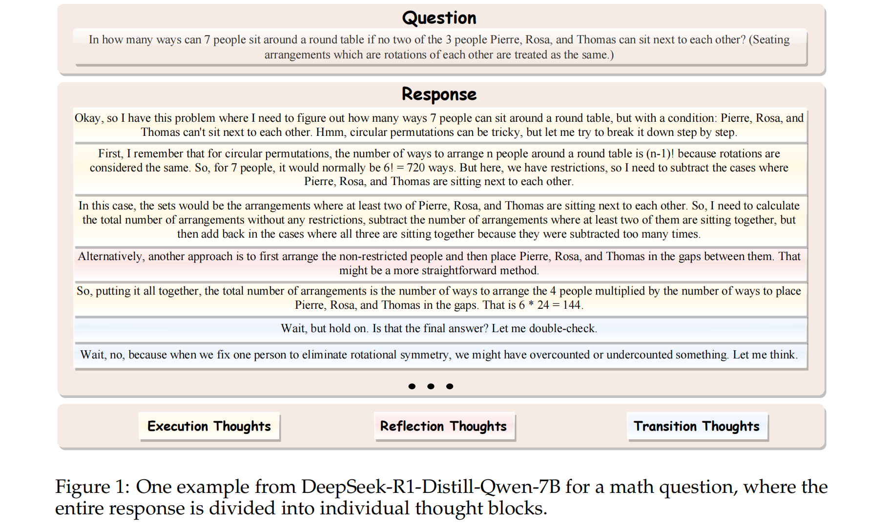
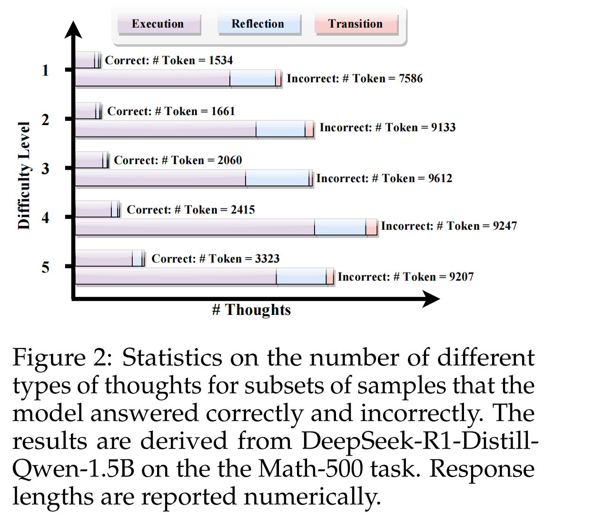
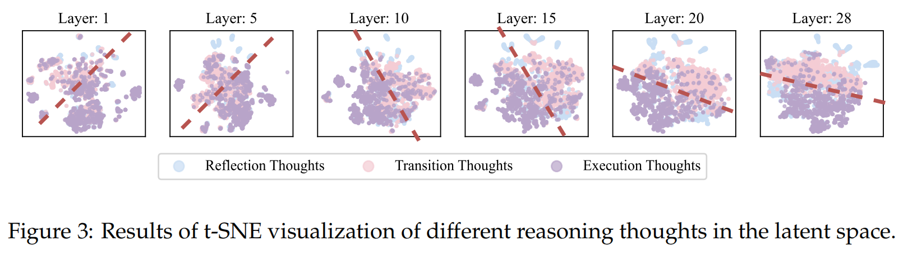
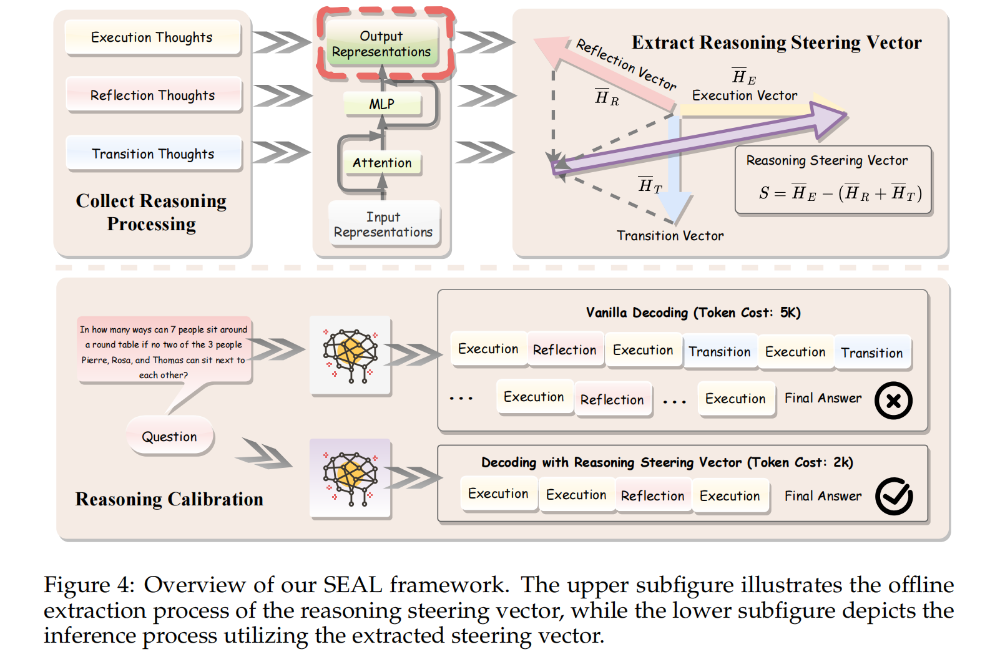
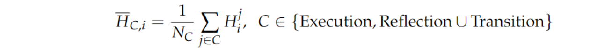

# SEAL

extended CoT 推理模型在回复时经常使用 “\n\n" 来分隔步骤，因此，将生成输出 O 分解成 a sequence of interconnected thoughts ，并用两个换行符分割，使得 $O = (T_1,T_2,...,T_N)$ 。将 Thoughts 分类，每种类型在推理过程中都发挥着独特作用，例：

有如下三种思维类型：

1. Execution thoughts: 模型对问题进行分析并逐步解决问题
2. Reflecting thoughts: 模型暂停推理过程以验证其推理步骤

3. Transition thoughts: 模型转变其推理流程并从不同的角度重新思考问题

如下是对模型回答中不同思维类型统计：可以发现思维链的 **冗余** 会使得模型回答错误，其中，reflection 和 transition thought 的增加很明显。

初步研究：不同推理模式在 latent space 中是如何构成的：

将每一层输出用 ”\n\n“ 分割为thoughts，记为 $H_i$，接着应用 t-SNE 将 $H_i$ 投影到二维空间：发现 execution thoughts 和 non-execution thoughts 明显可分，且在更深的层表现越明显（初始层较难区分），由此，不同的推理模式在 latent space 中从性质上是可区分的。

## 机制

核心思路是识别出可以控制 reflection thoughts 和 transition thoughts 比例的 steering vector，并利用该向量有效减少冗余 token 使用

### Extraction of Reasoning Steering Vector

分割思维内容，根据内容里的关键词给 thoughts 分类，接着计算 steering vector：对于每个 thought j，从第 i 个transformer块提取输出表征，记为 $H_j^i$ ，然后计算每个思维类别的平均值：

为实现保留必要的执行性思维的同时，减少不必要的反思性思维和过渡性思维，定义 steering vector：

### Decoding with Latent Space Intervention

使用 steering vector 对推理过程进行实时校准，即在 decoding 过程中，在每个 thought 末尾，应用由 S 得出的偏移量：$H'=H+\alpha \cdot S$ ,

疑问：steering vector 的获取是在推理阶段，那怎么实时校准思维链呢？

答：vector的获取是 offline 的，预先训好的，代表的是一种思维模式（数学题的、写代码的、任务性的……），将思维模式用于实时校准，是行得通的。且实验证明了 steering vector 具有迁移性（联想思维模式是共通的）。

