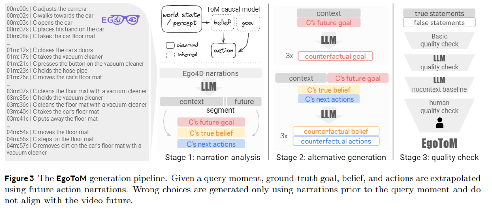
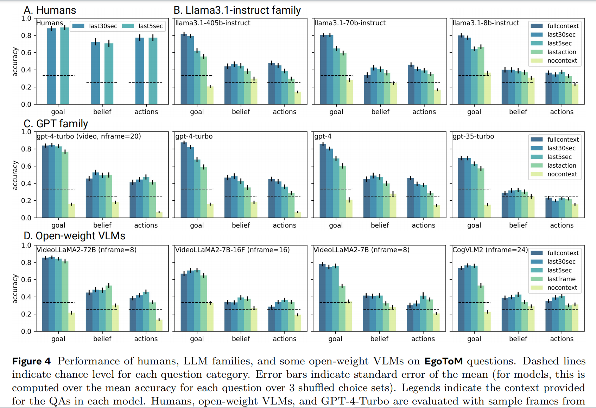
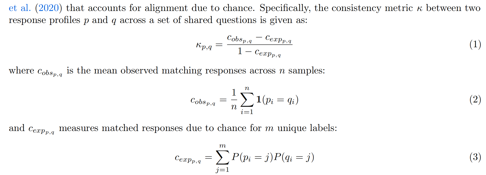
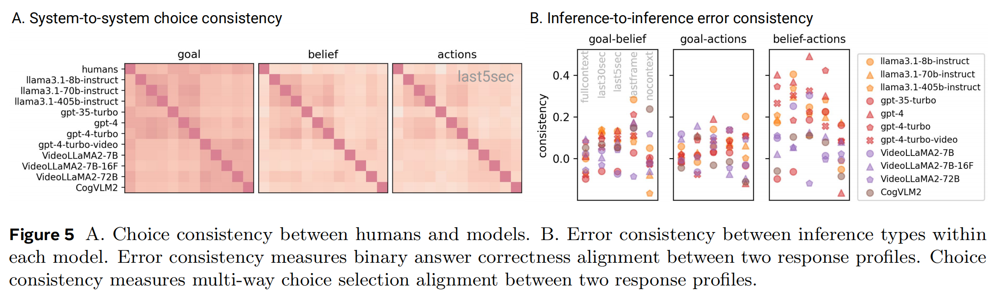

# EgoToM

Code: https://github.com/facebookresearch/EgoToM

Theory of Mind : The ability to infer unobserved mental states that reflect what others want, think, or believe, and use these states to predict others’ future behavior.

EgoToM：A benchmark to evaluate first-order ToM reasoning of naturalistic human behavior in egocentric video.

Related Work:

- Benchmarking Theory-of-Mind ：下述两个benchmark都是基于文本故事的心理推理
  - ToMi, 2019
  - BigTOM，2024

- Understanding and predicting human behavior in videos ： 基于视频理解并预测人类行为
  - 视频理解能力
    - ActivityNet，2015
    - MVBench，2024，视频理解能力
  - 推断视频中行动背后的intention的能力
    - NExT-QA，2021
    - IntentQA，2023，
  - 长视频推理
    - EgoSchema，2023
    - EventBench，2024

## 创建

挑战性在于缺乏对未被观察到的心理状态的准确文本描述。关键思路为：将 “ToM based causal behavioral template ” 应用于 Ego4D 数据集中现有的对真实世界人类行为的密集注释，并结合一个LLM-powered, structured, multi-stage QA generation pipeline: (C指代camera wearer)

**Source**

首先从 Ego4D 中获取一批时长为 5 min 的视频片段（基于每个 #summary tag 的起始结束标记），根据一系列关于 density、diversity and certainty 的 criteria 筛选掉了7000个原视频片段。选取了时长至少300秒、包含 60 到 180 行解说内容且没有标注为 “# unknown” 或 “# unsure” 的不确定注释，并且最终至少 60% 的解说内容是关于摄像头佩戴者的视频片段。

**QA generation**

3个 target ToM variables: **goal, belief, and actions** , 利用 LLMs 按照 a structured, multi-stage QA generation pipeline 为3个目标变量生成潜在选项。用GTP-4T 生成 QA statement。

- **Narration analysis** ：指示GPT-4T进行深入的对解说的分析，在上下文中提供了每个视频片段的完整时间戳列表和文本解说内容，要求 GPT-4T 识别：

  1. an interesting moment in the video, and based on this moment,
  2. a brief statement of C’s future goal
  3. a summary statement of three key actions C takes after this moment, and finally
  4. a statement about C’s belief that led C to these particular next actions

  生成的陈述将作为最终选项集中的 ground-truth choices

- **Counterfactual generation** : 在Narration analysis阶段生成的对三个目标变量的陈述，会被用在这一阶段，来系统地生成反事实陈述（或称替代陈述），作为选项集中的错误选项。其中，alternative statements 的生成同样遵循 ToM 的因果模板：对于 Counterfactual proposals ，仅提供阶段1中划分时刻的 narration list 作为上下文条件，指示 GPT-4T 提出与 C 可能有的并且与实际 goal, belief, and action 不同的 goals, beliefs, and actions。（由于以真实的目标陈述为条件，所以该生成是符合因果模型的）

通过 one-shot pair of the original sentence and a simplified version in the context 提高风格上的一致性。 最终生成的陈述在风格上与 Ego4D 的人工解说非常契合。

**Quality filtering**

- **Keyword-based filtering** ：GPT-4T 在 Counterfactual goal proposal 中会 collapsed to a few notable modes ，类似：To do something for a tutorial/demonstration/class/competition 。所以使用Keyword-based filtering 移除这些 unlikely goals ，并将目标推断限制为三选一的问题
- **Automatic quality check** ：使用一组编写好的质量检查规则来剔除以下情况的测试样本：
  1. trials where the segmentation point occurred before 2m30s or after 4m30s
  2. trials where the ground-truth statement is more than 1.4x longer than all three wrong choices or if all three wrong choices were more than 1.4x longer than the ground-truth, and
  3. 使用all-mpnet-base-v2 ，发现 trials where any pair of choices exceed a sentence embedding similarity of 0.94 的情况，剔除。

- **LLM nocontext baseline** ：进一步确保这些问题涉及基于视觉的上下文，方法是筛选出无需任何与视频片段相关的上下文，仅依靠语言先验知识 LLMs 就能正确回答的问题。收集 GPT-4-Turbo 和 Llama3.1-405b-instruct 在没有任何基于视频或解说的文本上下文情况下对所有问答的回复。以涵盖各种语言先验知识。只剔除 GPT-4-Turbo 和 Llama3.1-405b-instruct 在三次打乱顺序的测试中答对次数超过两次的问题，以避免过度排查。
- **Human quality check** ：在完成自动质量检查和大语言模型无上下文筛选后，所有剩余的问题都根据既定的评分标准接受了人工质量检查。

## 测评

一些结论：

- Goal inference is easy; belief and action inferences are hard （人类与模型都符合）

- The context effect × context modality ：增加相关上下文信息，模型准确率总体上有所提升。这种上下文效应在通过文本提供上下文时最为显著。视频上下文效应则弱很多，因为模型接受到的等距帧数量是一样的（模型从更长的视频上下文中以更稀疏的方式采样得到了相同数量的信息）。不过在低上下文条件下，模型使用几帧视频所达到的准确率明显高于使用几行人工解说文本（即，比较图 4 中 “最后一帧” 条件和 “最后一个动作解说” 条件）。反映出 **人工解说本质上是对视频中丰富视觉信息的一种有损压缩。视频较弱的上下文效应可能源于在整合多帧视觉信息或随着时间推移整合视觉信息方面存在的不足** 。

- (Language) Model scaling generally helps ：扩大模型规模通常能提高在目标、信念和行动推理方面的准确率。对于 VLMs 而言，测试那些 **视觉编码器规模不同但大语言模型组件规模相同的模型变体的规模扩大效应** 也会很有意思，作者希望在未来的研究中开展这方面的工作

- Choice consistency across humans and models ：

  

  对于 error consistency ：the response profiles are the binary correct vs. incorrect score of the selected choices。

  

  可以发现，模型与人类在推断 C 的未来目标时的选择一致性最高，而在信念和行动推理方面的一致性较低（两者在信念和行动推理方面的性能差距较大）。而模型与模型之间，与信念和行动推理相比，我们观察到目标推理的一致性较高。

## 想法

EgoToM 数据集创建过程大量缩减了人工劳动，更多依赖于 LLM，这是一个很好的创新点；在测评部分，得出的关于人工解说和视频帧信息的作用的结论也比较有借鉴意义。

