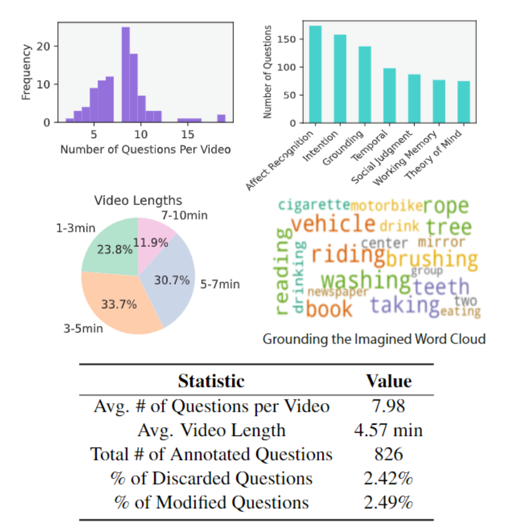
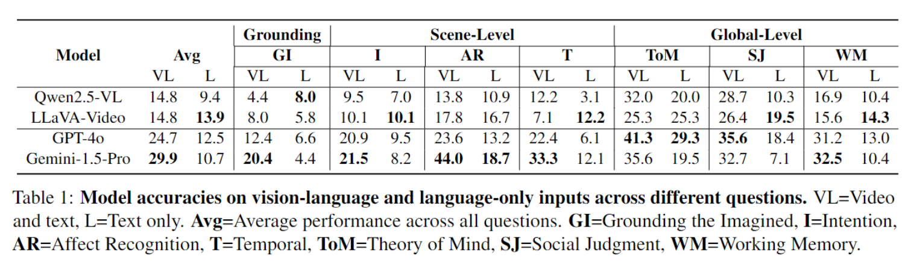

# MiMeQA

目前在人工社交推理领域的研究都依赖于仅使用语言或语言主导的方法来进行模型的基准测试和训练，这就导致相关系统在言语交流方面有所进步，但在非言语社交理解方面却困难重重。

为了克服这一局限，我们利用了一种富含非言语和社交互动的全新数据来源 —— mime video (默剧)

dataset resource：https://github.com/MIT-MI/MimeQA

## Dataset

### Question Hierarchy

在时间尺度上划分为三个层次，从低层次的视觉识别逐步过渡到场景层面解读以及全局层面的认知推理。

**Grounding the Imagined** 

首先是感知层面。模型需要了解默剧中的抽象手势或身体动作的引申意义（拍打翅膀的动作可能代表一只正在飞翔的鸟。这些手势基于人类的具身体验，理解它们的含义对于模仿式交流至关重要）。故该层问题主要涉及识别默剧表演中的基本视觉元素，例如物体和活动。

**Scene-Level** 

examine social interactions within a short video segment. 定义三个类别来评估：

- Temporal reasoning : 要求将事件构建成由逻辑必然性和传递性相连接的因果链。这一类别涉及识别场景中事件的序列及其时间因果关系，而不仅仅是事件的排序。
- Affect recognition : 通过非语言线索识别和分析情感状态。除了静态的情感分类之外，这一类别还需要检测细微的情感变化、群体情绪以及表情的变化。
- Intention and behavior understanding : 涉及推断行为背后的动机，并解释所观察到的行为如何反映未被观察到的内在目标和心理状态

**Global-Level**

Assesses the ability to synthesize and reason social information across multiple scenes

- Working memory : 在整个视频中检索、整合信息并对信息进行推理。除了单个事件之外，这些问题要求具备确定过往信息相关性的能力、回忆关键事件的能力，以及合成连贯叙述的能力。
- Social judgement : 评估行为、评判人格特质，以及识别诸如融洽关系、信任和合作等社会概念。这一类别要求将观察到的情况与社会规范以及反事实的其他情况进行比较，突出意外或异常行为。
- Theory of mind : 衡量推断信念、目标和观点的能力。这种能力使人能够换位思考，对未被看到的动机进行推理，并预测不同的人如何理解同一情况。

### Dataset Construction

- **Video collection** : 使用包含关键词 “mime” 在内的各种搜索词从 YouTube 上收集视频，每个关键词最多下载 50 个视频。视频时长1-10min，有 Creative Commons license。共得到221个视频
- **Video validation and annotation** ：对于每个问题，标注6个 scene-level 的问题，4个 global 的问题，不限数量与视频的相关 grounding question。grounding 和 scene-level 问题要提供问题所涉及片段的起始和结束时间戳。使用VGG图像标注工具进行标注工作。
- **Annotation verification** ：验证者被要求观看视频，回答这组问题，并将自己的答案与最初标注的真实答案进行比较。然后，验证者标记这两个答案是否一致，或者给出完善问题的建议。人工审核验证结果，剔除答案不一致的问题，并根据建议完善问题。

### Statistics

共806个问题，大多视频对应5个以上问题，每个global类问题超过70个，每个local类问题超过100个：

## 实验

采用 LLM-as-a-judge 方法使用 GPT-4o 根据真实答案自动验证模型生成的回复。如果模型生成的回复在语义上与每个问题标注的任一真实答案等效，我们就将其定义为正确答案。

- 所有模型在该数据集上的表现都不佳：开源模型的平均准确率约为 15%，而 GPT-4o 达到了 24.7%，Gemini-1.5-Pro则为 30%。
- 模型在依据层面问题上的表现尤其糟糕，这表明模型在对源自人类具身体验的想象物体进行抽象视觉认知方面存在显著局限。
- Gemini-1.5-Pro 表现突出

Source errors：

- Story hallucination from missing language grounding ： 由于视频中缺乏语言依据而产生的幻觉，之后的多模态model需要解决模型对语言的over-relying
- Failure to interpret imagined objects ：模型难以感知想象中的（视频中没有出现）物体
- Lack nuanced understanding of social signals ： 视频大语言模型在处理复杂社会推理时有很大局限性，实验也强调了开展关于细粒度社会推理研究的必要性。
- Language bias over video content ： 模型更依赖于基于问题提示来推断答案，而非依据视频内容。

个人觉得默剧有夸张化日常动作的嫌疑，对是否能促进大模型对日常社交的非言语动作的理解能力存疑？

