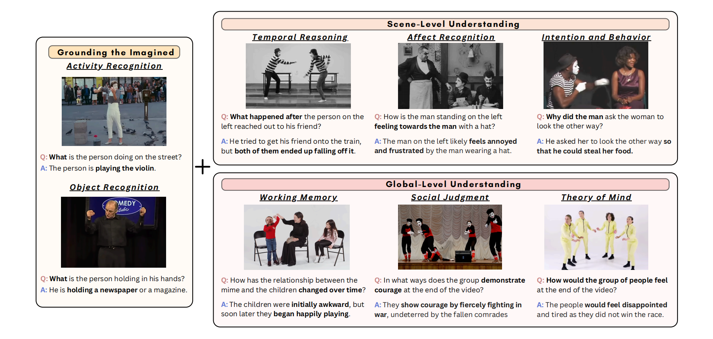

# MiMeQA

目前在人工社交推理领域的研究都依赖于仅使用语言或语言主导的方法来进行模型的基准测试和训练，这就导致相关系统在言语交流方面有所进步，但在非言语社交理解方面却困难重重。

为了克服这一局限，我们利用了一种富含非言语和社交互动的全新数据来源 —— mime video (默剧)

dataset resource：https://github.com/MIT-MI/MimeQA

## Dataset

### Question Hierarchy

在时间尺度上划分为三个层次，从低层次的视觉识别逐步过渡到场景层面解读以及全局层面的认知推理。

**Grounding the Imagined** 

首先是感知层面。模型需要了解默剧中的抽象手势或身体动作的引申意义（拍打翅膀的动作可能代表一只正在飞翔的鸟。这些手势基于人类的具身体验，理解它们的含义对于模仿式交流至关重要）。故该层问题主要涉及识别默剧表演中的基本视觉元素，例如物体和活动。

**Scene-Level** 

examine social interactions within a short video segment. 定义三个类别来评估：

- Temporal reasoning
- Affect recognition
- Intention and behavior understanding

**Global-Level**

