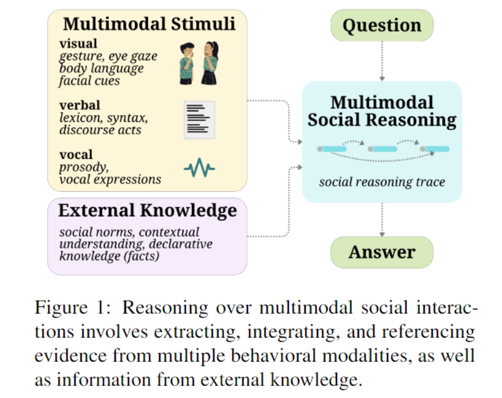
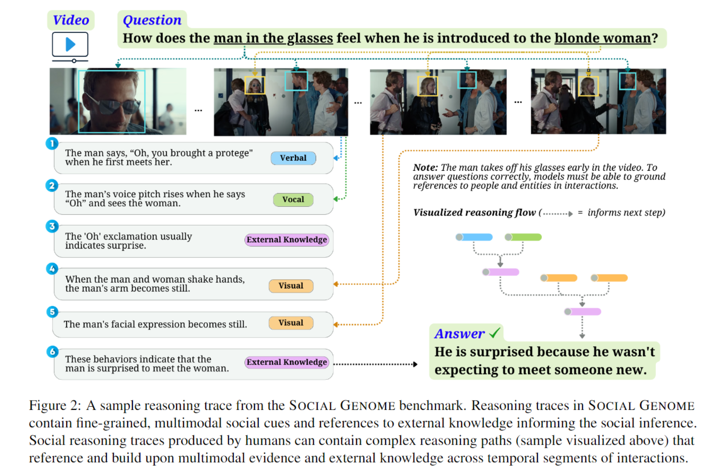
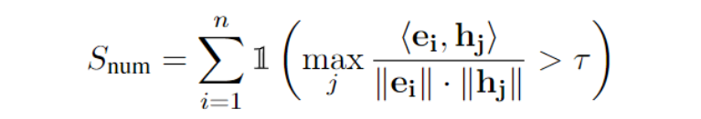
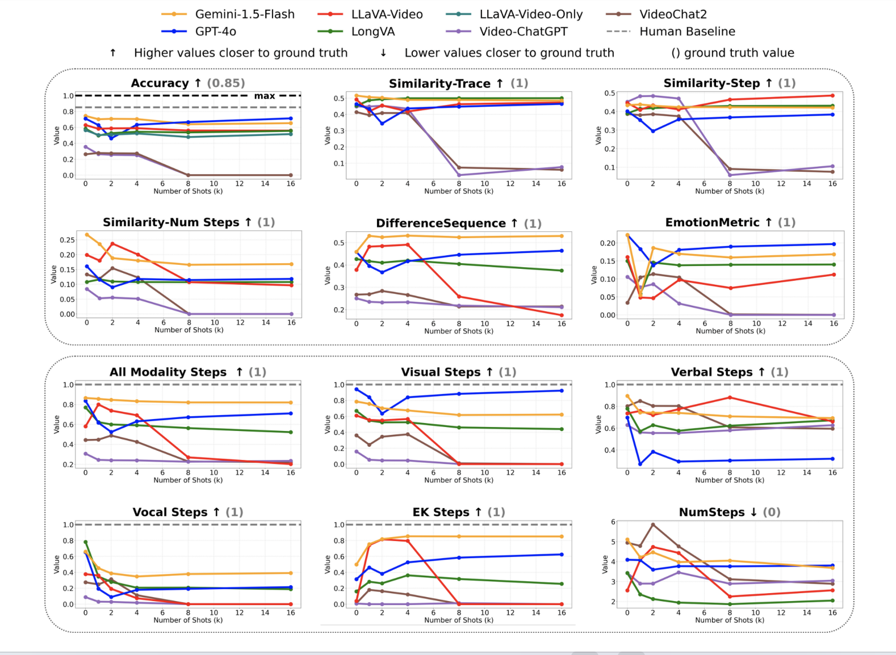
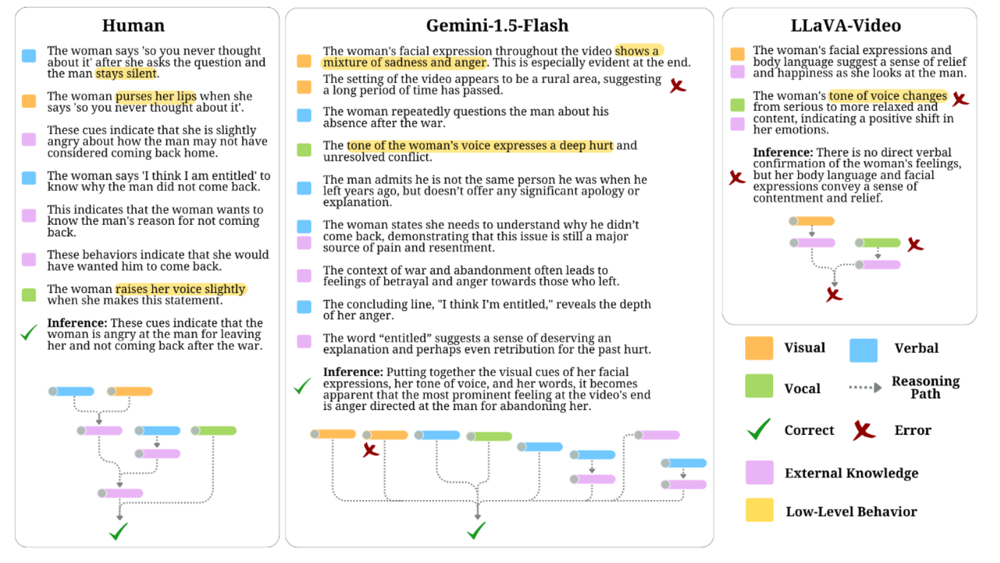

# SocialGenome

Social Genome，首个 benchmark for fine-grained, grounded social reasoning abilities of **multimodal models**.

- first modeling challenge to study **external knowledge** in social reasoning

- Multimodal cues are often fine-grained (e.g., a fleeting glance), interleaved (e.g., a shrug followed by a sigh), and context-dependent, requiring external knowledge of contextual information to be interpreted accurately

人工标注推理 trace 例：

## Building

Source：

- 272 seed videos and 1486 questions adapted from SOCIAL-IQ 2.0 dataset
- videos 内容包括 real-world face-to-face dyadic & multi-party interaction （每个视频 1 分钟，总计约 4.5 小时）
- questions 内容涉及 social dynamics, behaviors, emotions, and cognitive states of both individuals and groups

基于该 source，Social Genome 引入了 a new set of 1486 human reasoning traces with 5700+ steps that answer these questions

### Task Notation

video **V** ：描绘社交互动

question **Q** ：关于互动中的社交内容

 a corresponding set of answer options **A** ：$\{A_{correct},A_{incorrect1},A_{incorrect2},A_{incorrect3}\}$

执行任务的模型必须生成一个推理轨迹 **R** ：$\{e_1,e_2,...,e_n\}$ ，其中每个推理步骤代表一条有助于从 *A* 中选择一个答案的社交推理的 evidence，且必须标记有两个属性：

- a modality tag $m_i \in \{visual,verbal,vocal,n/a\}$ ，用于指示 evidence 的交流模态
- an external knowledge tag $k_i \in \{yes,no\}$ ，用于指示该 evidence 是否参考了情境信息的 external knowledge

生成 R 并回答 Q 的这项任务评估了模型提取和参考与社交推理相关的人类交流和知识的多模态方面的能力。

给定 input tuple $(V,Q,A)$ ，执行任务的模型生成 output tuple $(A_a,R)$

Metrics in SOCIAL GENOME 会研究答案的社交推理准确性，以及推理痕迹 R 中社交推理的语义和结构方面。

### Social Reasoning Trace Annotations

**Human Annotation**

给定  input tuple ，标注人员阅读问题和答案选项，观看视频，撰写推理痕迹。（这也太 dirty work了）

**Grounded and Fine-Grained Behaviors**

- low-level 观察：感知到的，基于细粒度的观察，例如，肢体语言的变化
- high-level 处理过程：自上而下的，例如，内隐的情境知识

注释人员被要求参考他们在回答问题时所依赖的任何 low-level 和 high-level 的证据：例如，low-level 的证据可能是 “这位女士后退一步，嘴巴大张（视觉线索）”，而解释该低层次线索的 high-level 证据可能是 “这位女士很惊讶（关于‘惊讶’可能如何表现的外部知识）”。对于每个推理步骤，注释人员会标记所参考的感知 modality tag（visual, verbal, vocal, n/a）

**Grounded External Knowledge** 

注释人员用 yes or no 标记每个推理步骤是否有参考 external knowledge，外部知识包括：

- contextual norms
- cultural expectations
- prior understanding of social commonsense

例如，如果一名男子举起手臂，而注释者将他的动作识别为 “击掌”，那么将该手势识别并解读为 “成功的表现” 则是基于社会规范方面的外部知识。

**Ensuring Annotation Quality**

专家验证，并对注释不完整或偏离说明的情况进行了修正。

### Dataset Statistics

包含 1486 条由人工详细标注的社交推理轨迹，总共有 5777 个推理步骤，每条轨迹平均有 3.89 ± 1.68 个步骤（最少 1 个步骤，最多 10 个步骤），每条推理轨迹平均有 43 ± 26 个单词，每个步骤平均有 11 ± 5 个单词。推理步骤借鉴了多模态证据，其中 44% 的步骤参考了视觉线索，27% 的步骤参考了语言线索，17% 的步骤参考了语音线索。总体而言，77% 的推理轨迹参考了至少一个视觉线索，63% 的推理轨迹参考了至少一个语言线索，47% 的推理轨迹参考了至少一个语音线索。

External knowledge 起着至关重要的作用：51% 的推理步骤参考了外部知识，每条推理轨迹平均参考了 2 条外部知识。通过使用 spaCy 命名实体识别（NER），我们发现提及了 11253 个实体（人物、物体、概念），每条推理轨迹涉及 7.6 个独特的实体以及 2.23 种情感，这表明注释的密度很高。

### Social Reasoning Metrics and Statistics

开发的 Metrics 用于揭示模型社交推理和多模态基础能力的优势与不足，以及模型推理轨迹与人类推理的差异程度。对于每个样本，计算模型推理轨迹 $R_M$ 与人类推理轨迹 $R_H$ 之间的如下指标：

- **Accuracy** ：通过将模型生成的答案与真实答案进行比较来衡量其准确性。

- **Similarity-Trace** ：衡量模型推理轨迹与人类推理轨迹的 high-level semantic similarity

  

  里面的 **$R_M$** 和 $R_H$ 分别是各自推理轨迹的 aggregate embedding of evidence steps，嵌入模型为 all-MiniLM-L6-v2。

  其它语义相似度指标也是如此。值越高，语义信息匹配度越强。

- **Similarity-Step** ：衡量模型推理轨迹与人类推理轨迹的 fine-grained semantic similarity. 对于 $R_M$ 中每个步骤 e_i ，找到 R_H 中语义最接近的步骤 h_j，最后算所有最大相似度的均值：

  

  其中*e_i*是证据步骤*e_i*的嵌入向量，*h_j*是证据步骤*h_j*的嵌入向量。数值越高，反映出*R_M*与*R_H*中细粒度证据步骤之间的语义信息匹配度越强（最大值为1）

- **Similarity-Num Steps** : 模型推理轨迹中，与人类推理轨迹中任意步骤相比，语义相似度高于阈值*τ*的推理步骤的数量。

  

  1(⋅)是指示函数。数值越高，表示两个痕迹之间在语义上对其的 evidence 越多

- **DifferenceSequence** : 根据两个推理轨迹各自模态序列 $S_M,S_H$ 相似性来衡量两轨迹的结构相似性。基于编辑距离（改编自莱文斯坦距离）计算。值越高，相似性越大
- **EmotionMetric** ：衡量情感内容一致性。提取情感集合，计算集合间重叠程度。
- **All Modality Steps** ：衡量 unique modalities 重叠数量
- **Visual Steps** :  衡量带有视觉证据的步骤数量，以此评估视觉 evidence 存在方面的契合程度
- **Verbal Steps** ：同上
- **Vocal Steps** ：同上
- **External Knowledge Steps ** ：同上
- **NumSteps** ：衡量推理步骤数量上的绝对差值。数值越低表明模型推理链与人类推理链在长度上的一致性越强

### SOCIAL GENOME ICL Training Set

为创建用于上下文学习实验 ICJ 的样本，从 SOCIAL-IQ 2.0 dataset 中的不同视频里随机抽取16个问题，按照 1.2 中的格式收集推理轨迹注释。先向模型提供不同数量的训练样本再让其执行任务。

## Experiment

模型：

- Gemini-1.5-Flash
- GPT-4o
- LLaVA-Video
- LLaVA-Video-Only : 回答了问题但未生成推理轨迹
- LongVA
- Video-ChatGPT
- VideoChat2

- ICJ 可能并非激发多模态社交推理能力的有效方法。（数学与代码问题具有明确的规则与形式结构，ICJ可提升该领域模型推理能力；但是社交推理通常依据隐性规则展开，其形式结构不那么正式，且前提中存在模糊性）
- 思维链提示并没有提高模型的准确性，并且模型在依靠隐性知识和情境知识进行推理时遇到了困难。

对模型的推理痕迹进行人工评估 -- 推理轨迹评分

