---

# ThoughtTerminator

引入 approximate measures of problem-level difficulty(问题层面难度的近似度量方法？)，并证明 a clear relationship between problem difficulty and optimal token spend exists，同时评估了各种推理模型在有效分配最优词元数量方面的校准程度如何。总体而言，推理模型的校准效果较差，尤其是在处理简单问题时。

其中 DUMB 500 是一个包含极其简单的数学、推理、代码和任务问题的数据集， jointly evaluate reasoning model on these simple examples and extremely difficult examples from existing frontier benchmarks on the same task domain。

最后引入 **ThoughtTerminator** ,a training-free black box decoding technique that significantly improves reasoning model calibration

Chen et al. (2024) define **overthinking** as the amount of times the model repeats the correct answer in its intermediate reasoning chain.

## Difficulty Calibration in Reasoning Models

This work is concerned with how **optimally** reasoning models allocate token spend Sp, or total number of tokens generated in a given sample to respond to an input

假设一个问题的 difficulty 难度与 optimal token spend 最优词元使用量相关是合理的。对模型 M 而言，给定问题 q 和其答案对的 **难度 D**，D 将被定义为该模型在关于问题 $q$ 与其标准答案 $a$ 的 n 个样本上的 simple inaccuracy rate:

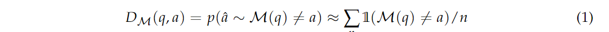

由此可以得出 $q$ 的 multi-model difficulty : 在一类模型 **M** 上的期望难度值：

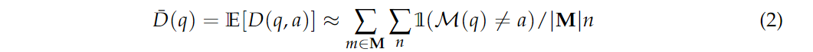

为了评估难度与词元使用量的关系，使用DeepSeek-R1-7B评估，下为每个答案 $a$ 对应的 $D_M$ 和 $Sp(a)$ 的散点图：

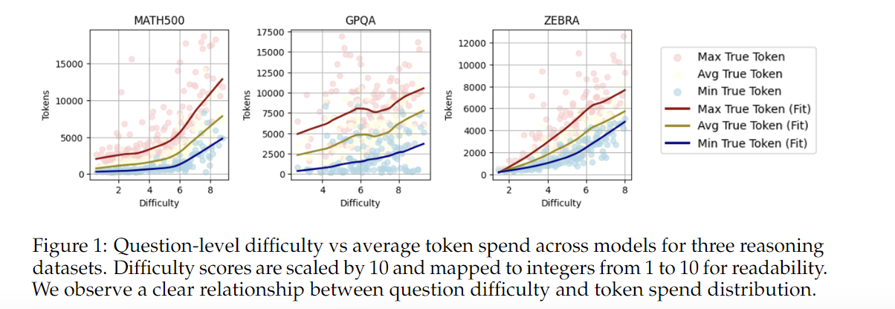

很明显的正比关系，但同时发现同一问题的不同答案样本在 token spend 上存在较大差异，引出两个问题：

1. How well-calibrated are reasoning models in consistently realizing their optimal token spend per-question?
2. Is it possible to improve the calibration of reasoning models in their token spend?

### Quantifying Overthinking

对 “ **observational overthinking** ” 进行形式化定义：the failure in consistency a reasoning model has at realizing the minimum possible token spend per question。

一个问题的 observed minimum spend 是该问题由模型生成的正确答案中最短的推理链对应的 token spend。根据模型的 typical token spend 和 observed minimum spend 之间的差异来衡量 observational overthinking 。

对于从数据集*D*中采样得到的问题，一个模型的 global overthinking score $O_g$ 是每个推理链长度和每个问题的  global observed minimum spend 的平均差值：

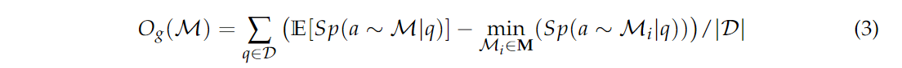

local envelope overthinking score $O_{env}$ 是每个模型针对每个问题的 maximum and minimum token spend 之间的平均差值：

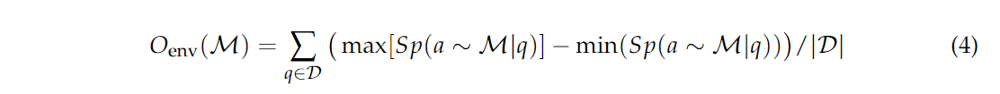

如表一 calibration scores （这些校准分数代表 expected 浪费词元数量）所示：和预期推理模型 overthinking 倾向更大假设一致

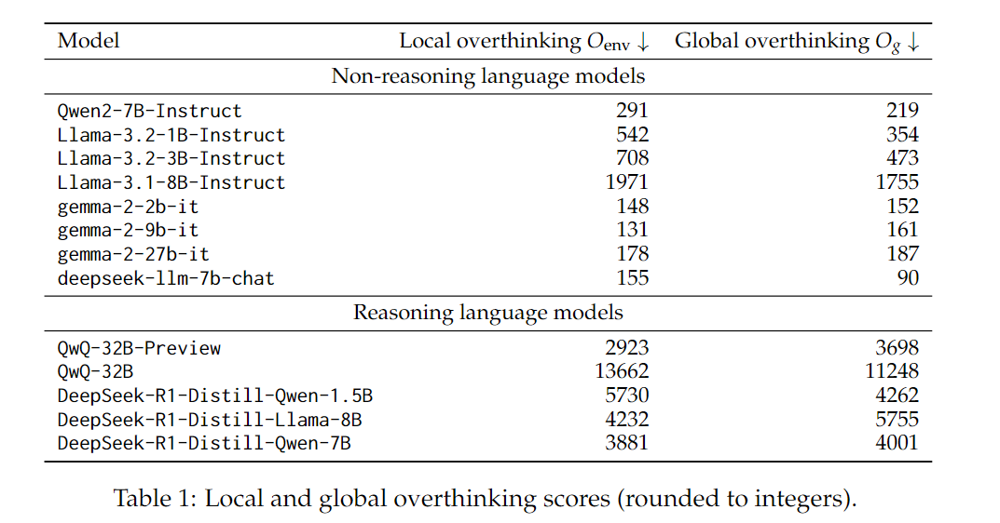

## Extending Overthinking Evaluation with DUMB500

**DUMB500** 的两个评估模型的关键维度：

- Accuracy：模型能否正确回答简单问题？
- Efficiency：模型能否在不进行不必要阐述的情况下给出简洁的答案？

数据集中问题类型分布情况、问题和答案示例：

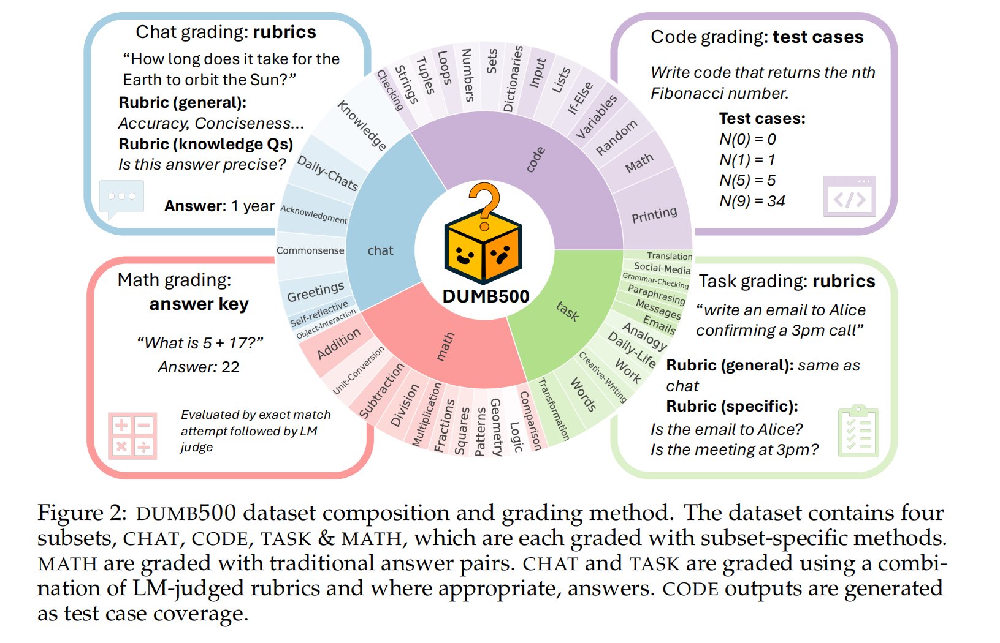

### Evaluation techniques for DUMB500

**DUMB500** 中的数学问题评估方式与 MATH500, GPQA, and ZebraLogic 中的一致，但由于引入了 CODE、CHAT、TASK question，需要更复杂的 evaluation 。

* **CODE** : 一个基于 Python 的自动评分程序会检查要求是否得到满足
* **CHAT**：所有的聊天回复都是根据一系列通用要求进行评估的，比如恰当性和简洁性。根据不同的子任务，还会检查诸如精确性和准确性等特定要求。当需要进行准确性评估时，也会给出一个参考答案。
* **TASK** : 聊天类和任务类问题的要求由一个语言模型（GPT-4o）作为评判者来进行检查。

### From Dumb to Hard Questions

通过 Table 1 的评估方式，得到 DUMB500 的difficulty，下图展示了个数据集 questions 的难度分布：可看出 DUMB500 填补了一个难度区间的空白

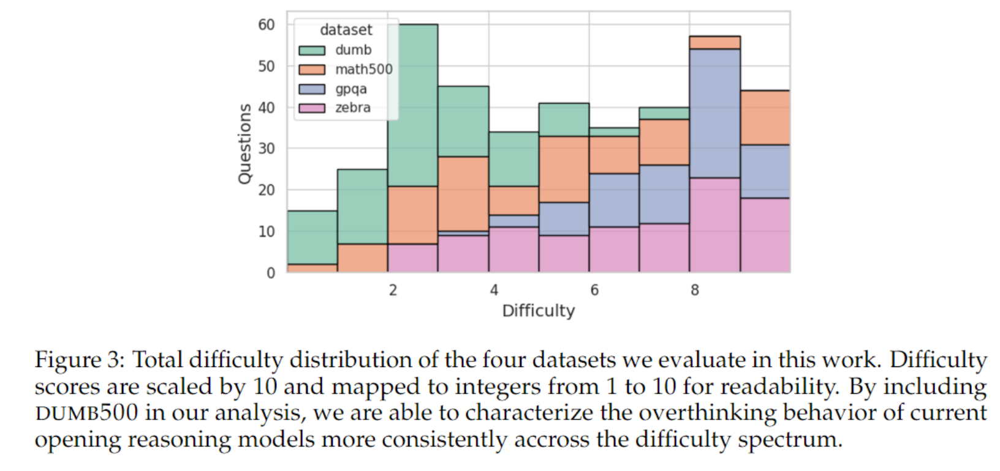

下图展示了利用 DUMB500 中的questions，所测试模型在模型层面的准确率与 token spend 之间的关系：对于简单的数学问题，token spend 和准确率之间不存在正相关关系。对于其他领域，我们观察到 token spend 与评估要求通过率（labeled accuracy）之间呈负相关关系。

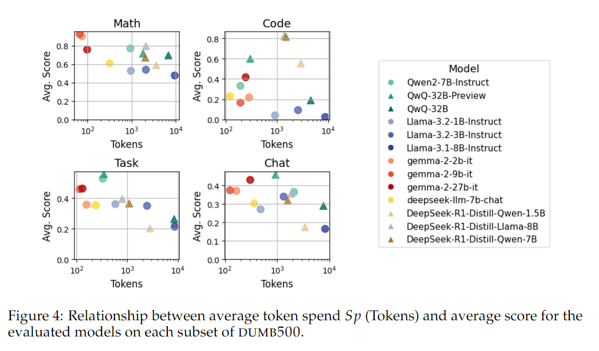

## ThoughtTerminator

通过在固定 token interval 中向 autoregressive stream 加入 a series of *interrupt messages*，来提醒模型已经用了多少个 token，还剩多少个 token 可以用。如果在时间限制内仍未给出答案， *terminating prompt* 和 constrained decoding 会迫使模型输出最终答案

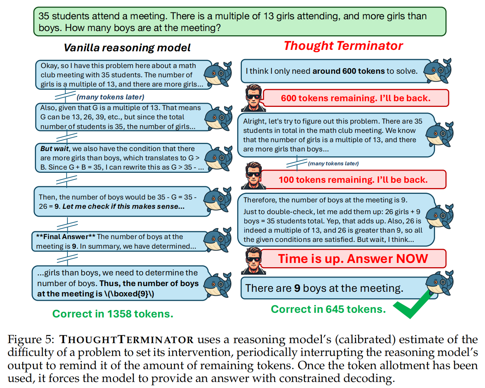

三个阶段：

* **Scheduling** ：给定输入问题，terminator 计算生成一个正确答案所需的 token 数量，以便设定其中断频率和终止时间。其中，token 数量将视问题难度而定。为了训练一个 difficulty estimator，根据训练集问题的难度分数，将它们分成 10 个均衡的类别。然后对一个 Llama-3-8B-Instruct 模型进行 **微调**，使其能够预测给定问题的难度等级。为了将预测的难度等级转换为合适的 token 数量，计算训练集中每个难度等级下成功的最短答案的 **平均长度**。
* **Running** ：一旦在 scheduling 中设定了 deadline，基础推理模型就开始运行，每 $n=min(250,deadline/2)$ 步就插入一条  interrupt message。每次中断，terminator 都会对预期最终答案格式进行正则检查，如果检测到了答案，终止推理链并返回答案？
* **Terminating** ：deadline之前未得到 final answer，发送 termination message，使用相同的正则检查 constrained decoding 生成的最终输出

## Results

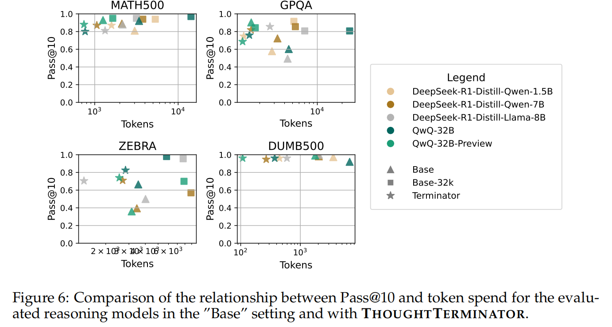

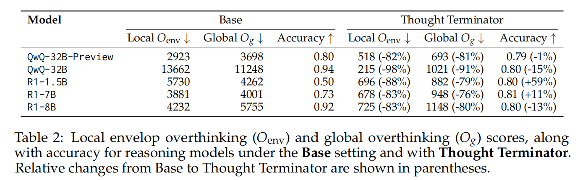

