# TokenSkip

**研究原因**：due to the autoregressive nature of LLM decoding, longer CoT outputs lead to a linear increase in inference latency, adversely affecting user experience, particularly when the CoT exceeds 10,000 tokens

**idea**： TokenSkip enables LLMs to skip tokens with less semantic importance (e.g., ) and learn shortcuts between critical reasoning tokens, facilitating controllable CoT compression

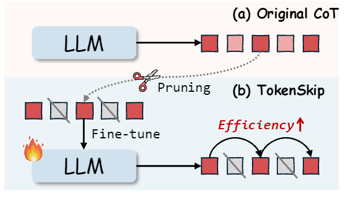

##  Preliminaries

### token Importance

启发问题：Does every token in the CoT output contribute equally to deriving the answer?” 

回答：no

**Selective Context** （measure the importance of tokens in a piece of text based on the semantic confidence of LLMs）方法：

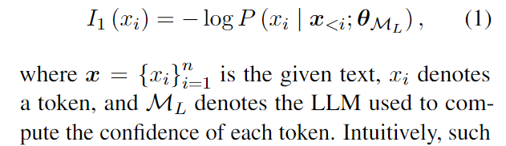

但是 Selective Context 方法存在局限性：

- 大语言模型困惑度的固有特性导致句子末尾的标记重要性度量值较低（即置信度较高）。Such position dependency impacts the factual importance measurement of each token
- 因果大语言模型中的 unidirectional attention mechanism 可能无法捕捉文本中 token 重要性所需的所有关键信息。

**LMLingua-2** 引入了利用类似 BERT 的 bidirectional LM 来测量 token重要性：利用GPT-4 to label each token as “important” or not and trains the bidirectional LM with a token classification objective

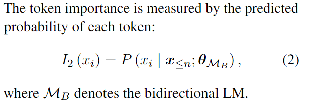

得到下图的可视化（上为 Selective Context，下为 LLMLingua-2）：

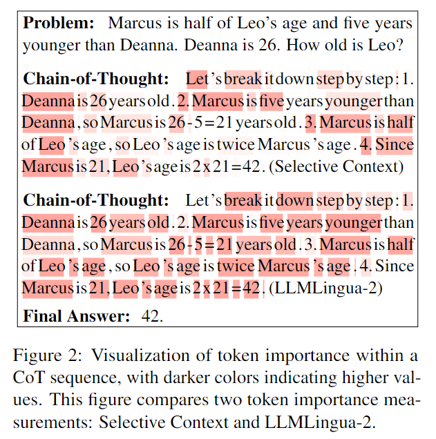

### CoT recovery

问题：Are LLMs capable of restoring the CoT process from compressed outputs?

答案是肯定的，如下图：

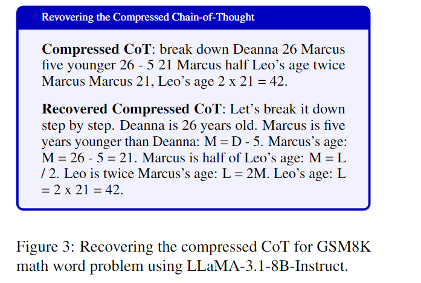

这种能力确保了压缩思维链的可解释性得以维持。

综上所述，上述实证分析强调了修剪冗余标记以提高思维链（CoT）效率的潜力，以及大语言模型（LLMs）从压缩输出中恢复思维链的能力。

##  TokenSkip

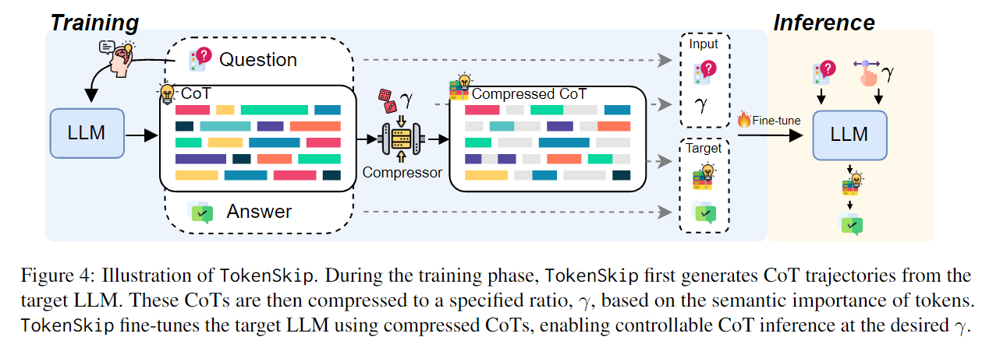

### Token Pruning

从大语言模型（LLM）的思维链输出中修剪掉冗余 token，并利用这些经过修剪的思维链轨迹对大语言模型进行微调。The token pruning process is guided by the concept of token importance.

过程：根据LLMLingua-2计算每个思维链token的语义重要性 $I(c)$，据此排序，给定期望压缩率 $\gamma$ ，代表修剪阈值（比如γ=0.6，保留60%的token）

###  Training

数据准备：

首先用包含 N 个样本的训练集 D 输入模型 M 得到 N 条思维链（过滤错误答案的trajectories），然后对其进行 pruning，得到三元组：⟨question, compressed CoT, answer⟩，最终输入格式为：

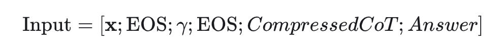

即[问题、分隔符、压缩比率、分隔符、压缩后的思维链、答案]，EOS为序列结束符，$\gamma$ 以数值形式嵌入[问题] [EOS] '压缩比例0.6' [EOS]. output sequence **$y$** 是压缩后的思维链和答案的拼接，损失函数如下：

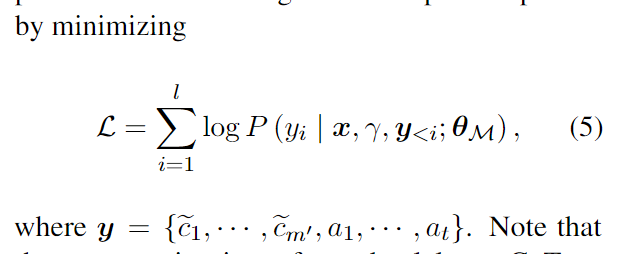

为了保留大语言模型的推理能力，还在训练数据中纳入了一部分原始思维链轨迹，将其压缩率*γ*设为 1。

将上述 Input 作为训练数据用来训练模型（loRA微调），使其学会跳过不重要的标记。

### Inference

推理时，prompt格式如下：

[question x, [EOS], $\gamma$ ,[EOS]]

输出序列包含压缩后的思维链和答案。

## Experiment

实验数据集： GSM8K & MATH-500；实验模型： LLaMA-3.1-8B-Instruct & Qwen2.5-Instruct series

评估指标：accuracy, the number of CoT tokens, and inference latency per sample，用来自DeepSeek-Math的脚本来评估模型性能。此外，CoT 的实际压缩率也会用于与指导压缩率比较。

#### 实验细节

LLMLingua2压缩 CoT，压缩率 $\gamma$ 从 {0.5, 0.6, 0.7, 0.8, 0.9, 1.0} 中随机选择，采用LoRA 微调（秩 r 设置为 8，缩放参数 α 设置为 16，仅调整0.2%的模型参数）

训练成本低，在 3090 GPU 上训练 70 亿参数模型大约需要 2 小时，训练 140 亿参数模型大约需要 2.5 小时。在推理时，对于 GSM8K 数据集，最大标记数 max_len 设置为 512；对于 MATH-500，则为1024. （$max\_len \times \gamma$）

Pytorch 2.1.0 on 2×NVIDIA GeForce RTX 3090 GPU (24GB) with CUDA 12.1, and an Intel(R) Xeon(R) Platinum 8370C CPU with 32 cores. 

#### Baseline

1. Prompt-based Reduction：通过prompt 指示大模型在CoT过程中减少固定比例的输出token
2. Truncation: 强制截断，即限制输出标记的最大数量，将思维链的输出压缩到一个固定的长度。

#### 实验结果

TokenSkip 在 GSM8K 数据集上使用 Qwen2.5-Instruct 系列模型的性能表现：可以发现，模型规模越大，压缩率对性能影响更小（Qwen2.5-14B-Instruct 在修剪掉 40% 的标记时，几乎没有性能下降（下降幅度小于 0.4%）。即使在压缩率为 0.5 的情况下，该模型仍保持着较强的推理能力，性能仅下降 2%）

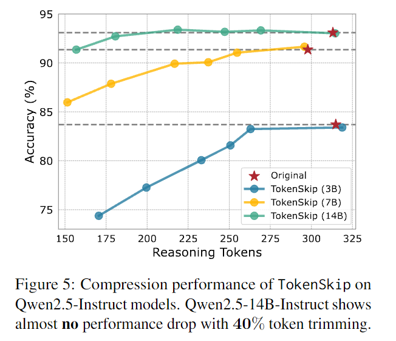

与baseline对比：

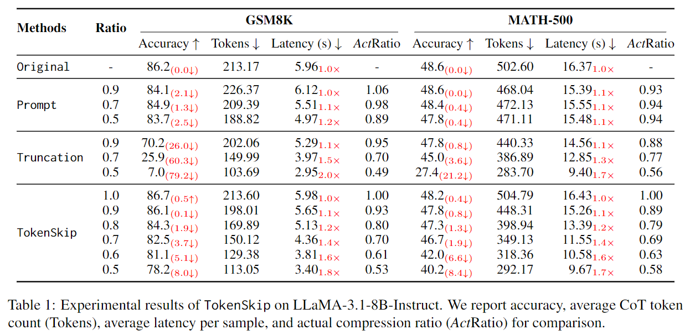

prompt-based reduction 方法中，实际压缩率与目标压缩率不符。在 Truncation 方法中，虽然实际与目标压缩率相符，但是性能显著下降（GSM8K 数据集上的准确率下降了 79%，在 MATH-500 数据集上下降了 21%）。而TokenSkip 法不仅实现压缩率相符、性能也没有出现显著变化，响应时间变快。

#### 分析

##### Compression Ratio

为了探究在 Compression Ratio 较低（压缩较多）情况下 TokenSkip 的性能表现，训练变体模型 'More Ratio'，用于测当 $\gamma = 0.3 ~and~ 0.4$ 的情况，发现符合程度大幅降低，且在整体上符合程度不如 TokenSkip：

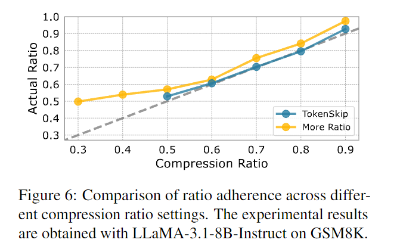

假设将其归因于对 reasoning tokens 的过度修剪，使得补全内容时关键内容丢失，阻碍模型有效训练。

#####  Importance Metric

不同模型给 token 重要性打分，其中，让GPT-4o 给出思维链轨迹的最佳压缩格式建议，这一情况被称为 GPT-4o-Optimal 。将所有由  GPT-4o 生成的训练数据用于训练 TokenSkip 变体，用 [optimal] token 来提示模型，得到 GPT-4o-Optimal 结果。

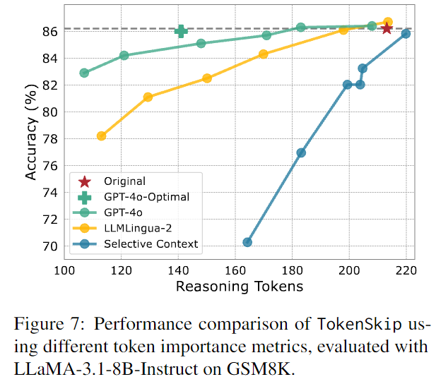

##### length Budget

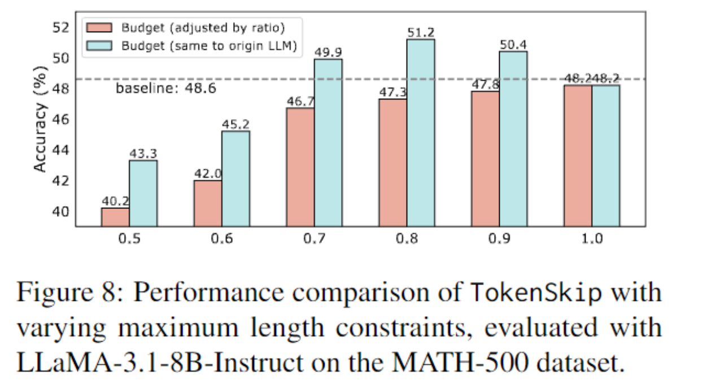

##### case

这些示例清晰地表明，TokenSkip 使得大语言模型能够学习关键推理标记之间的捷径，而不是从头生成更短的思维链（CoT）.

- 数值和数学方程式会被优先保留
- okenSkip 并没有减少推理步骤的数量，而是修剪了这些步骤中多余的标记

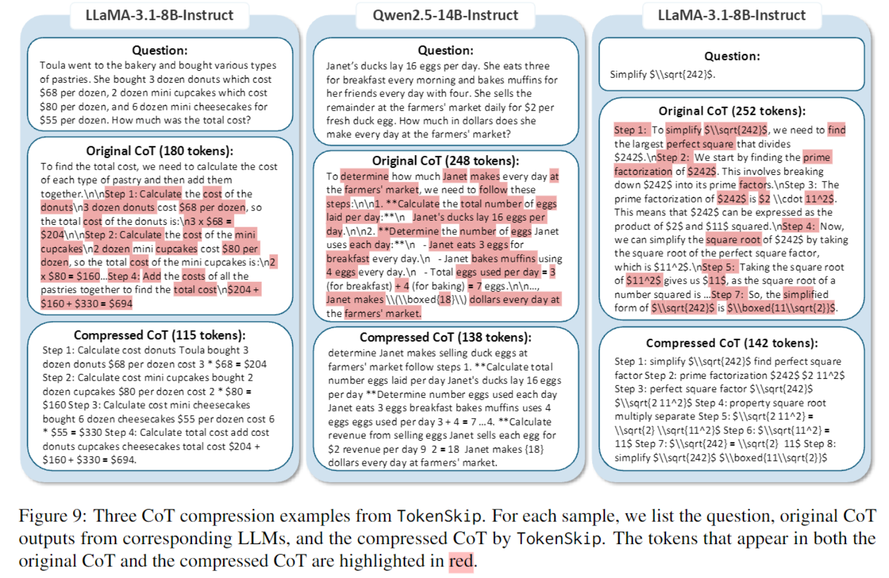

