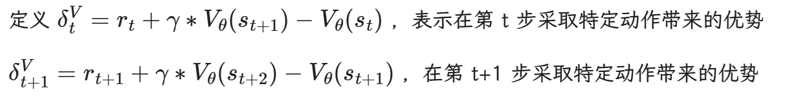
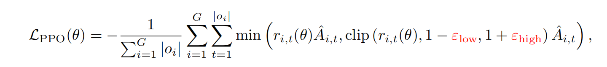
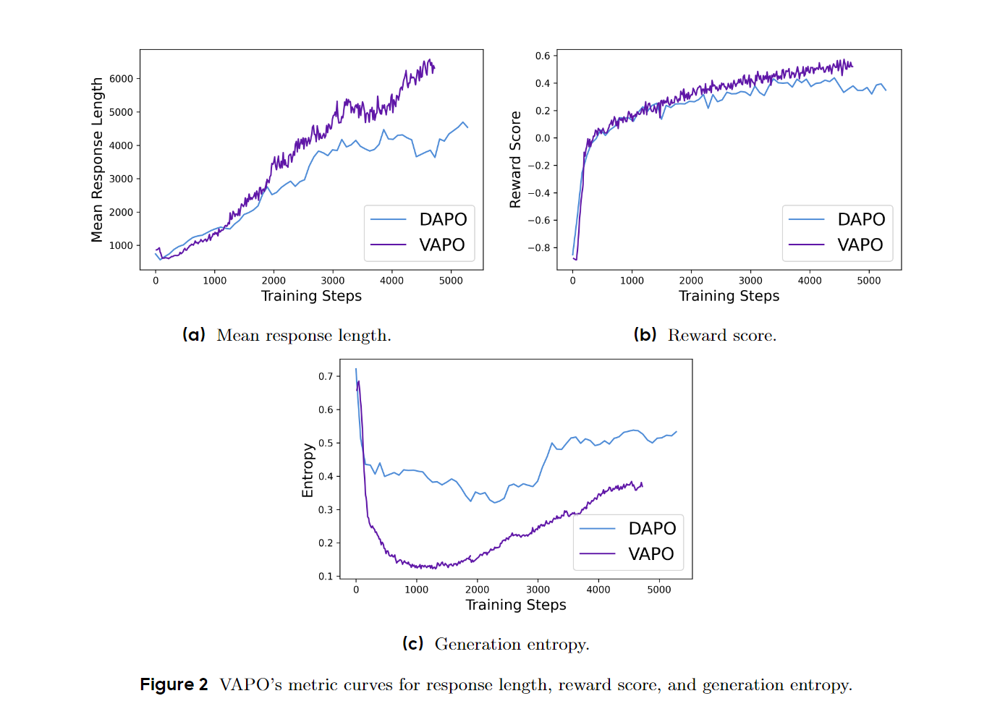

# VAPO

## Preliminaries

define the token-level Markov Decision Process as the tuple $M = (S,A,P,R,d_o,\omega)$

- S 是 state space, A 是 action space，P 为 Dynamics（deterministic transition model between tokens），$\omega$ 为 termination condition（一般是 EOS token），R 为 reward model，$d_0$ 为 Initial State Distribution（是关于 prompt 的token概率分布，初始状态 $s_0$ 由 prompt 中的 token 组成）

## Method

### Mitigating Value Model Bias over Long Sequences

VAPO 在 PPO 上进行改进，两者都是 value-model based. 在 PPO 中，value model 通常由一个奖励模型初始化而来。然而，这两者的目标存在不匹配。奖励模型被训练用于对**最终**答案打分，因此它天然地会给那些不完整的、中间的步骤打出较低的分数。而价值模型则需要从任何一个中间步骤开始，准确地估计**未来**所有奖励的总和。这种目标上的错位导致价值模型在训练之初就带有一种显著的正向偏差 (discovered by VC-PPO)

采用 value-Pretrain 策略，从一个 fixed policy 中采样持续生成奖励，利用 Monte-Carlo return 更新模型，接着训练 value model 直到训练指标达到足够低的值。

$$
A_\theta^{GAE}(s_t,a)=\sum_{b=0}^{\infin}(\gamma\lambda)^b\delta^V_{t+b}
$$

接着采用 Decoupled-GAE 策略：更新 value model 时设置 $\lambda=1.0$ 确保实现无偏梯度下降优化，解决长 CoT 任务中的 reward-decay 问题。更新 policy model 时，设置 $\lambda = 0.95$ 以加快策略收敛。

- 当$\lambda=1$时，优势估计等同于使用整个轨迹的 Monte-Carlo return，这具有**低偏差**但**高方差**的特点，因为它虽然使用了真实的、完整的奖励信息，但这个信息本身可能充满噪声。奖励信号在长推理链中不会衰减。
- 但是，使 $\lambda$ 固定的思想存在根本缺陷，应当使其自适应

### Managing Heterogeneous Sequence Lengths during Training

为解决不同长度序列在最优 λpolicy 值上的不一致问题，提出 Length-Adaptive GAE ：

左边是等比数列求和公式，求和结果要等于 $\alpha l$，其中 $\alpha$ 是超参，因此求出 $\lambda = 1-\frac{1}{\alpha l}$

同时，和DAPO一样，将 sample-level 的 policy gradient loss 换为 token-level

### Dealing with Sparsity of Reward Signal in Verifier-based Tasks

和 DAPO 一样 “clip-higher”。

在面向复杂推理任务的 RL 场景中，部分任务准确率极低，而且试错机制会产生大量计算成本，因此，当策略模型对正确答案进行采样时，充分发挥这些正确答案的效用就变得至关重要。采用模仿学习的方法，为强化学习训练过程中采样到的正确结果引入额外的负对数似然（NLL）损失：

其中 $\tau$ 表示 the set of correct answer。

最终 VAPO 公式：

## Experiment

VAPO 达到峰值性能所用 step 小于 DAPO，且没有发生崩溃。但是由于其要更新两个模型，对设备要求还是更高的，，，

